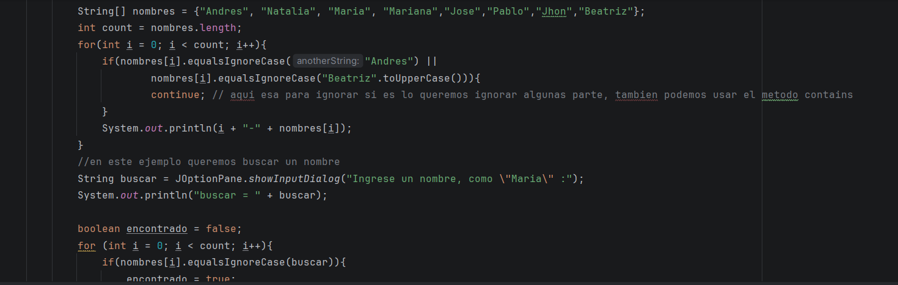
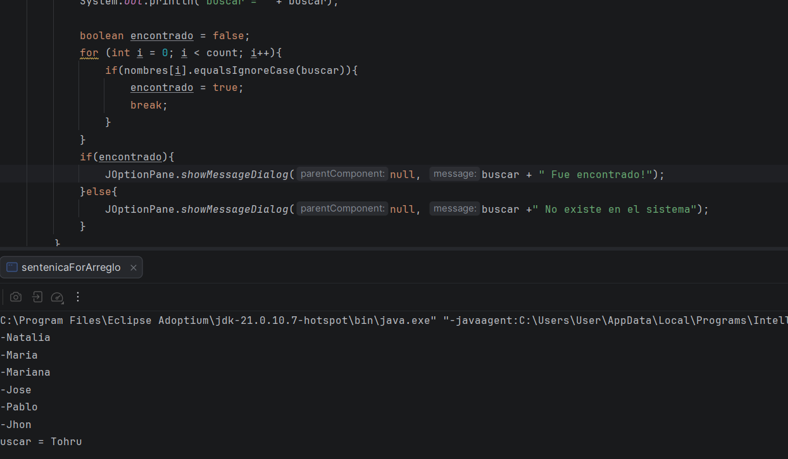
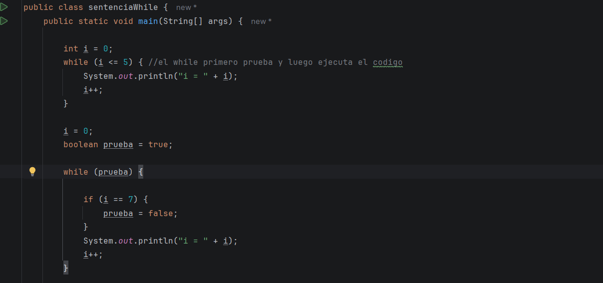
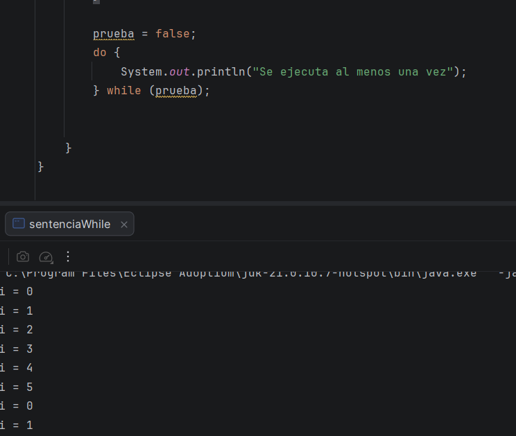
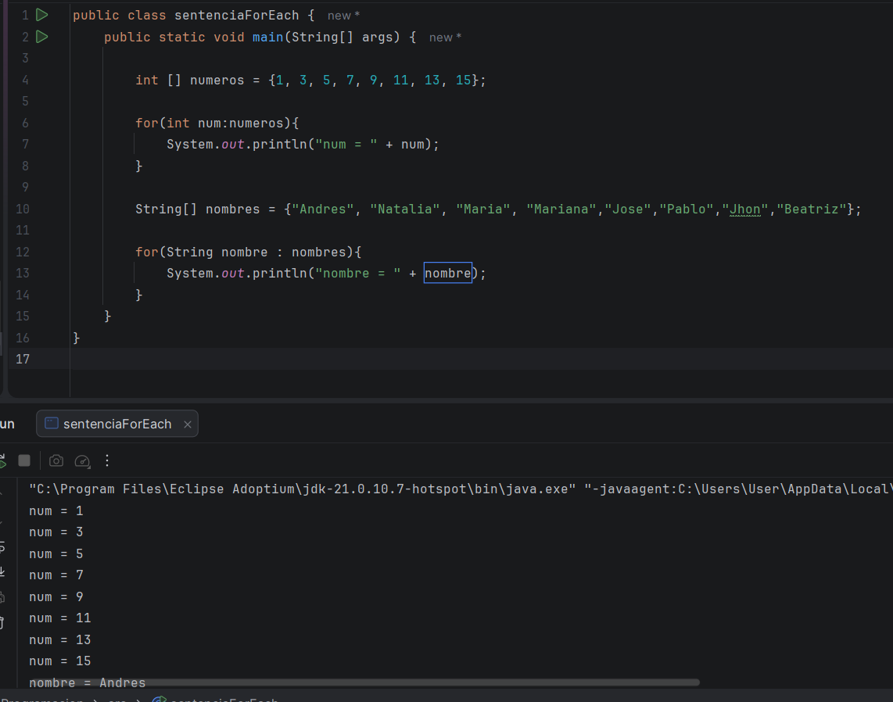

Hello, hoy es un nuevo dia, y uno dia de hacer mi respectivo reporte de lo que hice hoy, asi que bueno, no se que mas decir,
solo que me siento horrible y me duele ele stomago horrible, pero bueno, no es tan grave, o al menos eso espero 

## Video # 1 (largo)

Muy bien, en la clase de hoy estábamos viendo un ejemplo de for nuevamente, pero esta vez usando arreglos, nos enseño como 
ignorar algunos elementos de las listas, además de como buscar los elementos de las listas usando el if, y else 

## Video # 2

En esta clase vamos a ver una introduccion de los que es el While y do While, en ella hicimos unos ejemplos y nos enseñó 
algo muy clave de ambos, el while es pre-prueba, primero evalua y luego ejecuta e itera,  el do while es como post-prueba,
primero ejecuta al menos una vez, y luego evalua la condicion

## Video # 3 

en esta clase vimos una nueva sentencia, el for each (asi estaba escrito en la clase), es solamente para arreglos, para cada 
elemento del arreglo, básicamente hace lo mismo que for, pero solo que con arreglos 

