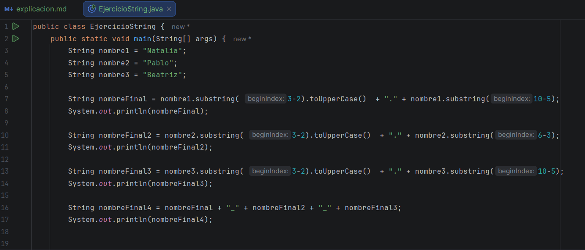
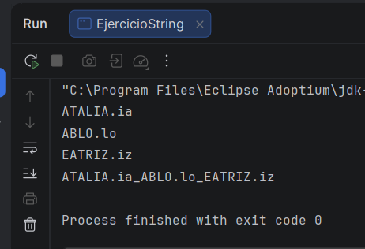
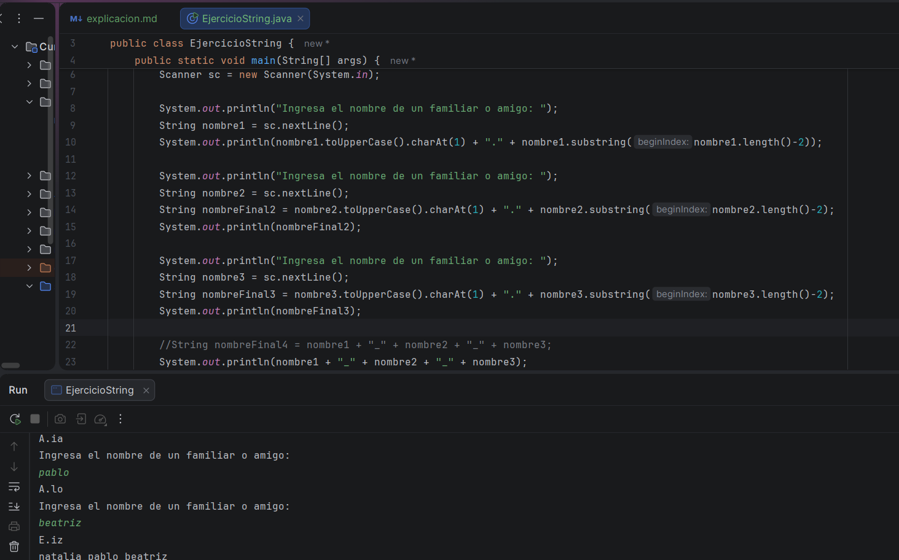
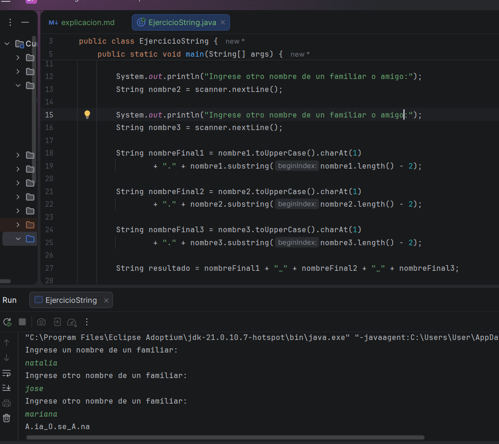

# Practica:

En esta parte tenemos otra práctica como final de módulo, para reforzar nuevamente lo que aprendimos, por ello, se nos pidió 
los siguientes parámetros: 

La tarea consiste en crear una clase llamada ProgramaManejoDeNombres de la siguiente manera:

Se requiere desarrollar un programa que reciba los nombres de 3 integrantes de tu familia o amigos como argumentos de línea de comandos.

Se pide por cada nombre de la persona una nueva variable del tipo String al tomar el segundo carácter pero convertido en mayúscula 
y se le concatena un punto y los dos últimos caracteres de la persona. Por ejemplo para Andres debe quedar como N.es

Debe imprimir como resultado los tres nuevos nombres separado con guion bajo (como una única variable).

Ejemplo, un resultado final esperado para los nombres Andres, Maria y Pepe podría ser:

    N.es_A.ia_E.pe

claramente, al principio, me dio una crisis de no entender un carajo los parámetros que me habían pedido en el ejemplo, 
luego lo intente, entendí lo que me pidieron y me puse a trabajar, la verdad mejore bastante que en el anterior, porque
en el anterior de verdad no supe como hacer muchas cosas, pero en este solo me faltaba una cosa, para tener el código final 
lo cual era quitar las otras letras del nombre 

Por lo que decidí buscar la manera de como resolver esa pequeña parte que no sabía como, cuando estaba viendo un ejemplo del 
profe, vi QUE TENIAMOS QUE PEDIRLE AL USUARIO EL NOMBRE DE SUS FAMILIARES O AMIGOS, y eso claramente, cambio por completo 
el código que llevaba, por loque eso me hizo demorarme más de lo que tenía esperado

Aquí, ya estaba lográndolo, me toco con un poco de ayuda del ejemplo del profe, pero casi todo lo hice yo, y estuve 
siempre en todo momento mirando y buscando la lógica del código que hacía, pero para este código por alguna razón, que incluso
con la ayuda del profe, ¿no me estaba dando, las variables, por alguna razón como que no conectaban si me hago entender?

, y 
busque muchas maneras, cambie las variables, hice nuevas, incluso cambie la manera de imprimir, pero nada me daba, seguía
apareciendo los nombres completos, como si las variables anteriores no existieran, por lo que me puse a investigar cuál 
podría ser la causa de esto, y bueno era porque estaba nombrando las antiguas variables y no las nuevas, las que ya se habían
creado, ese el problema, luego de mi cuenta, de otros pequeños problemas del código, pero gracias al cielo eran minúsculos
y los pude resolver 

y con eso, concluí mi día 