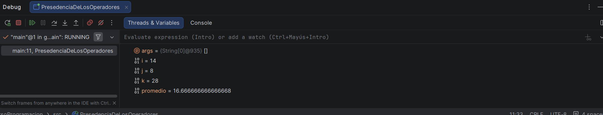
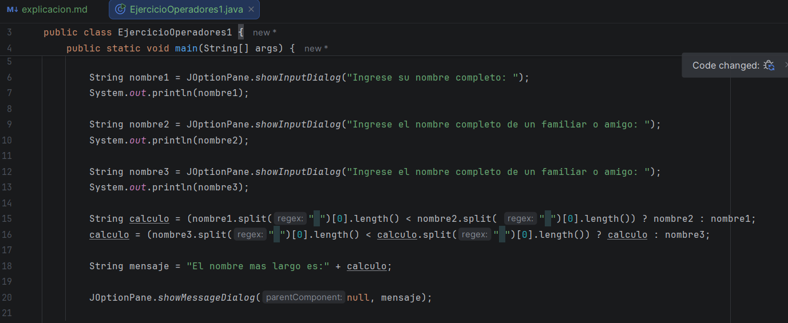

# Primer video:

En esta clase vimos como correr el código con el modo deputation, no tenía idea de que era eso, asi que antes de continuar 
la clase me puse a investigar que era, aquí una pequeña definición

**El modo depuración (o modo debug) en Java es un entorno de ejecución controlado que te permite pausar el código línea por línea.
Es una herramienta fundamental para encontrar errores lógicos, entender el flujo de tu programa y observar cómo cambian las variables
en tiempo real sin tener que modificar el código fuente.**

Para usar este método, primero se debe seleccionar cualquier línea del código, luego, se selecciona la casilla de debut (es la
que tiene un símbolo de insecto) allí, observas los diferentes componentes de esa línea de código, donde puedes mostrar o usar 
otras líneas y poder ejecutar esas líneas en la consola y en la consola puedes modificar el código o ver como sería antes de ejecutarlo con el código en general 

# Ejercicio # 1

Aquí volvimos a tener varios ejercicios de código, para el final del módulo de operadores, este es el primero;

Obtener el nombre más largo de tres personas, según los siguientes requerimientos

Mediante el teclado pedir el nombre completo (nombre + apellido) de tres miembros de la familia o amigos usando la clase JOptionPane y método showInputDialog().

Calcular e Imprimir el nombre de la persona que tenga el nombre más largo (en cantidad de caracteres) (Imprimir sólo uno de los tres, el de más caracteres en el nombre.)

Podría usar .split(" "); del objeto String para separar nombre y apellido en un arreglo, y con el indice cero accedemos al nombre de la persona.

Restricción no usar loops en el desarrollo de la tarea.

Ejemplo del resultado: "Guillermo Doe tiene el nombre más largo."

Bueno, en este ejercicio, claramente lo más complicado de todo fue la comparación de quien era más grande, y creo que puedo 
observar la falta de práctica que tengo, que veo mucho, pero casi no práctico, asi que comenzaré a hacerlo más seguido, avenue 
si hice varias cosas sola, la parte más importante tuvo sus complicaciones, aun asi el código funciono perfectamente, y ese 
es el objetivo

