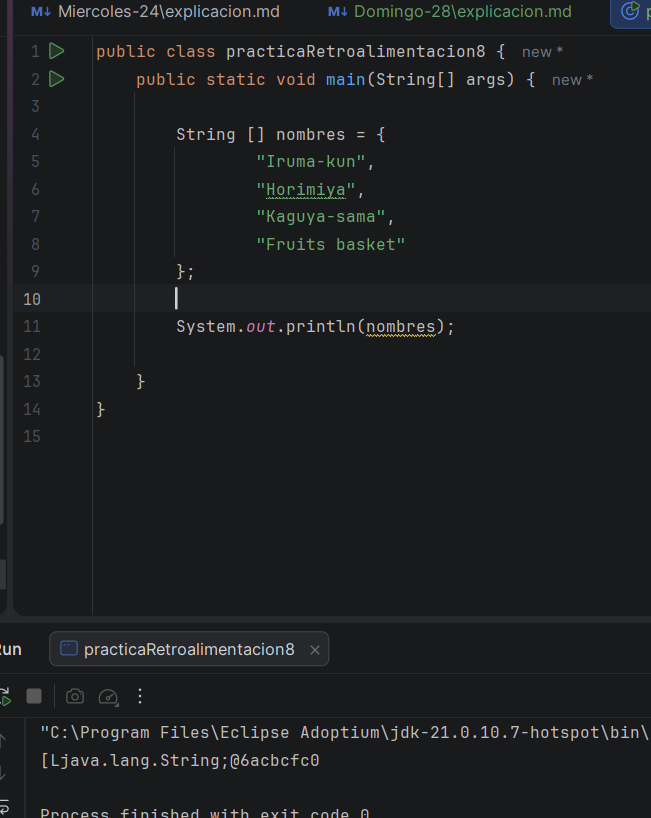
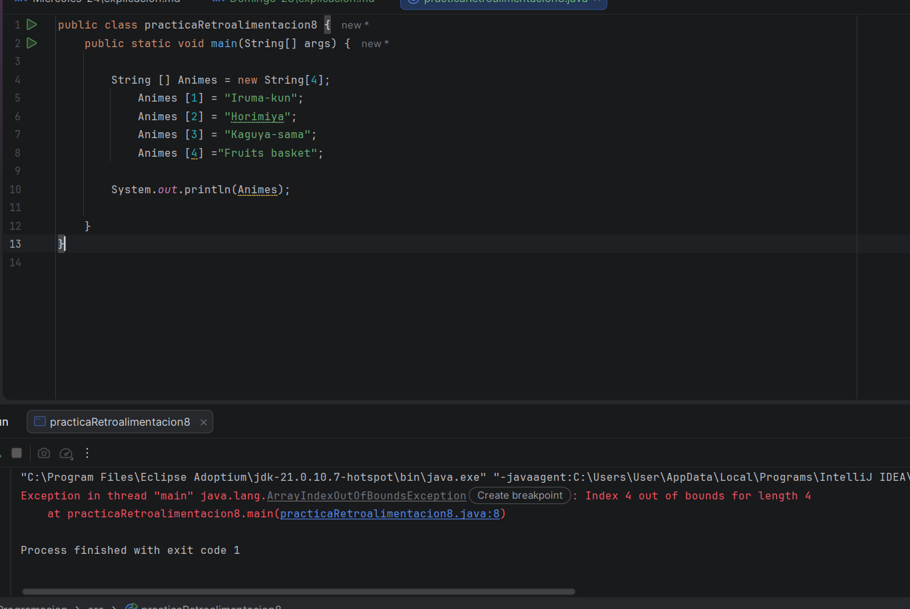
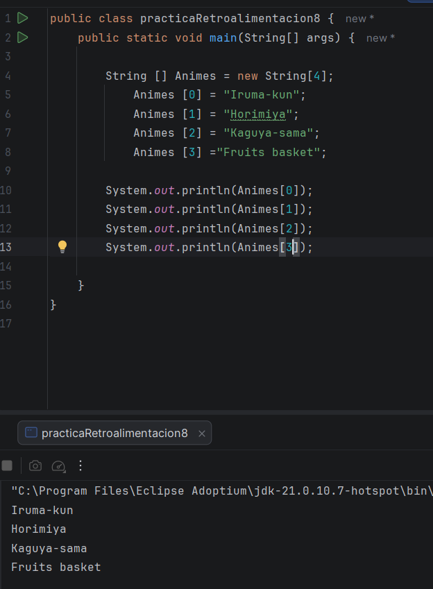
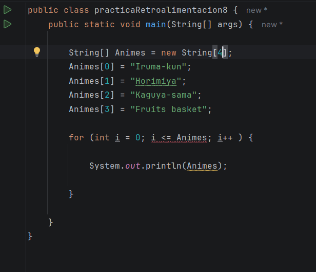
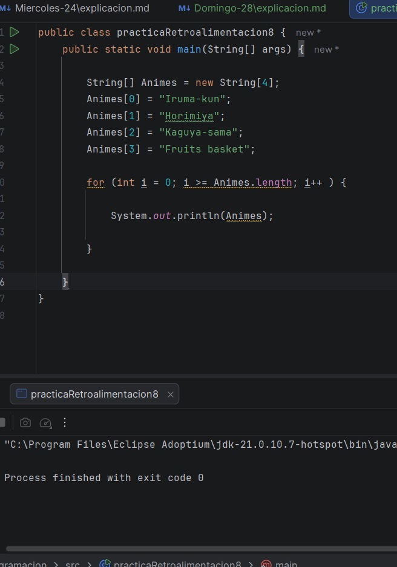
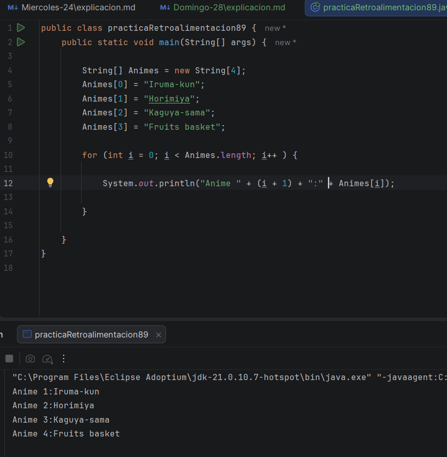

Muy bien, el día de hoy voy a continuar con más ejercicios de For, por ciento que son muy necesarios, ya que no aun no puedo
dominarlo completamente, asi que voy a hacer la misma dinámica que los otros dias: 

# Ejercicio # 8 

Ahora en este ejercicio, debo de crear un arreglo de diferentes string, sin usar el for, por lo que este fue mi primer intento 

En este primer intento, hice el arreglo como creía que debía de hacer, pero para cuando intente imprimir, por alguna razón,
no me imprimía lo que quería, luego intente otra vez, pero ahora me dio algo distinto, ya me dio un error 

Esta vez si no tenía ni idea de lo que me estaba diciendo, otra vez era algo del main, pero creo que es diferente al error
de la otra vez, pero bueno mi problema es que no imprime lo que quiero que imprima, y aun no se por que, lo intente otra vez 
de diferentes maneras, pero no le veo el sentido de POR QUE NO IMPRIMEEE 

Bueno, despues de un tiempo, por fin descubrí qeu era, como no estaba en for, entonces cuando debía de imprimir los nombres
debía de hacerlo uno a uno, entonces por eso no me daba, y tenía otro error, porque comencé por el número 1 y no por el cero 
como debería de ser, por lo qeu aquí está el resultado final

Y por fin, pude lograr mi objetivo.

# Ejercicio # 9 

Muy bien, continuaré con los demás ejercicios, en donde debo de hacer lo mismo, pero con ciclo for, asi que a ver como lo hago 

Bueno, este fue mi primer intento, pero esta ves, la variable me aparecía como si no existiera, tal vez la escribí mal, o 
hice algo mal para que pasara esto, asi que lo volví a intentar de otra manera:

Y ahora no me dio nada, se quedó completamente en blancoooo, ahora si ni idea, me toco mirar 

Y aquí, por fin lo logré, Dios, la programación es de mucha paciencia 

# Ejercicio # 10 

Ahora sí, debía de hacer lo mismo, pero que tenga como el título de cada anime, como anime 1 y asi, lo hice basado en la 
lógica que yo ya conocía antes, pero aun asi, me faltaba algo y eran los números que aún no sabía como colocar, pero basándome
en los ejemplos pude lograrlo 

