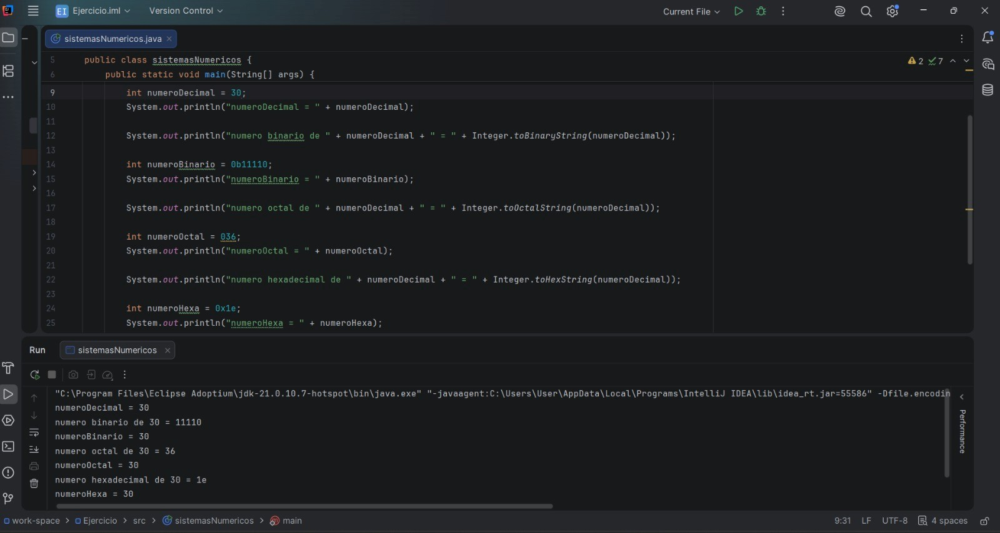
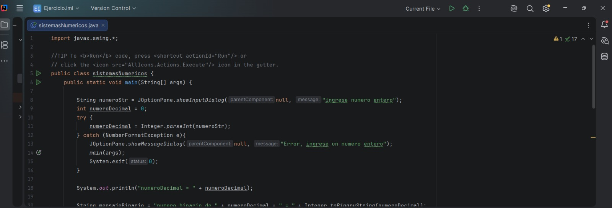
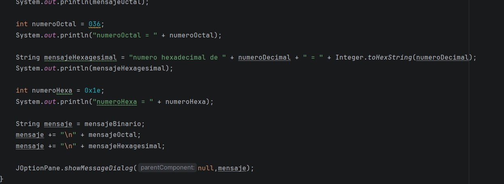
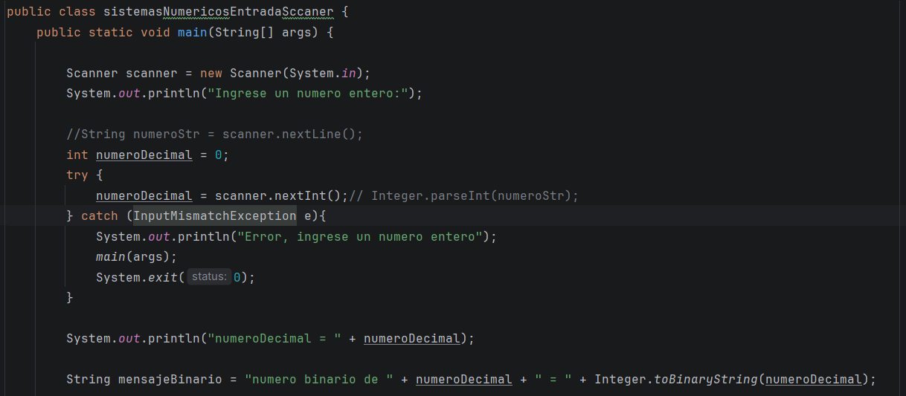
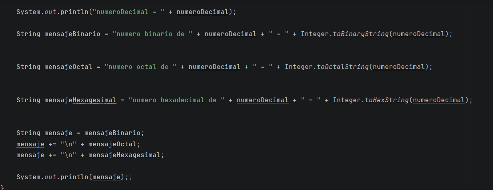

Primer video:En esta sección del curso, vimos como pasar de un número decimal a un número binario, octal y hexagesimal
usando Integer, como se ve en la imagen 

Aquí, se puede observar como el código se realizó, para que el usuario pueda observarlo de mejor manera, cúal es el 
número decimal usado, y como esta cambio en los diferentes números del sistema. 

Segundo video: el instructor nos enseñó de a poco como usar las entras de datos desde las ventanas de diálogo, por lo que 
usamos diferentes parámetros como JOptionPane, para que el usuario escribiera el número de su preferencia 

También nos enseñó a usar try y catch, en caso de que el usuario escribiera un número incorrrecto 
try, es el que trata de ejecutar código, y si llega a pasar algo malo, catch se activa para manejar el error 
Además, reducimos líneas incesarias de código, para que este sea mas organizado 

Tercer video: En este video, sigue siendo la misma temática, pero esta vez usamos Scanner, para preguntarle al usuario 
desde la terminal, usamos diferentes métodos como new, el cual es usado en POO, como también otros comandos para continuar
con la estructura.

