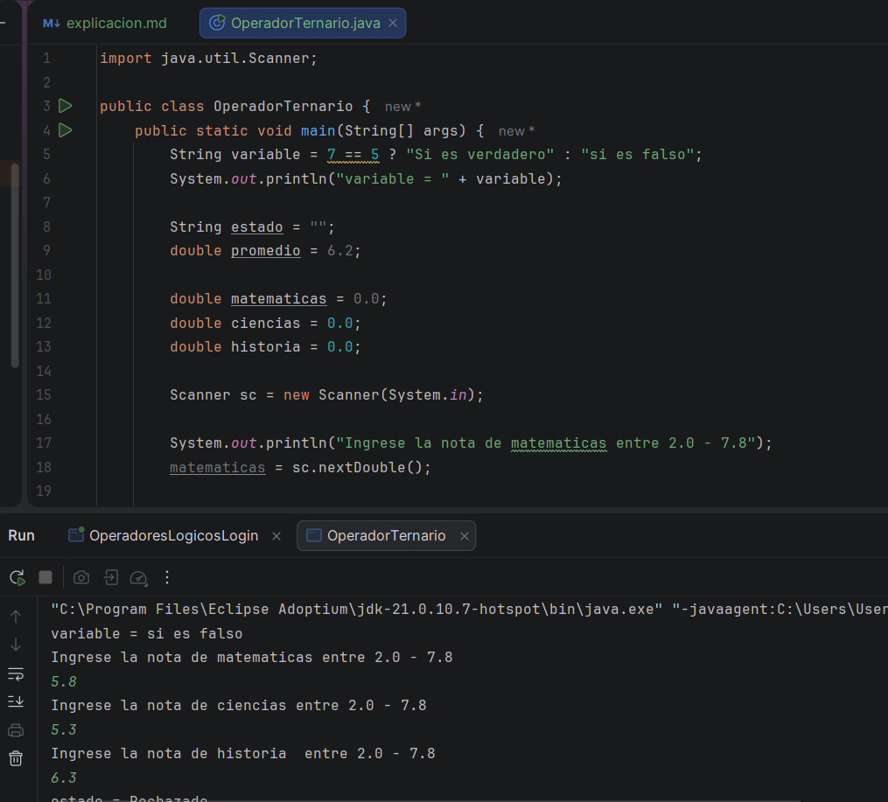
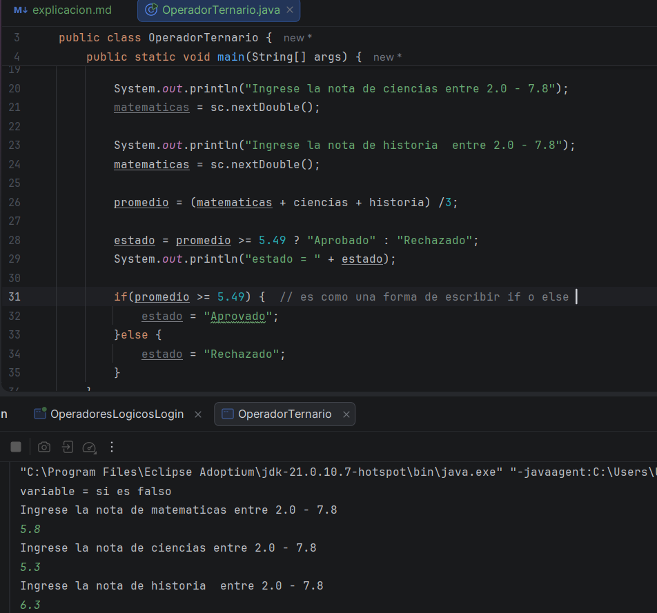
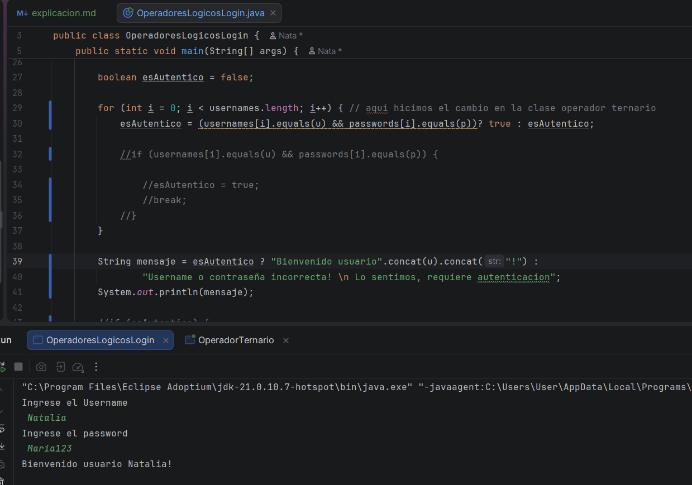
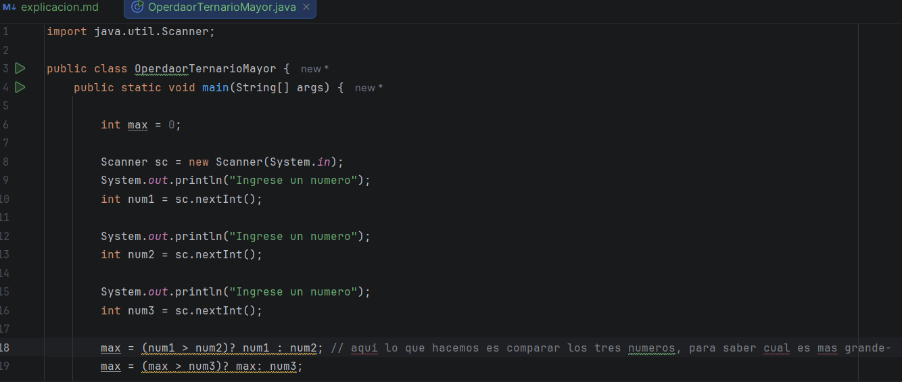
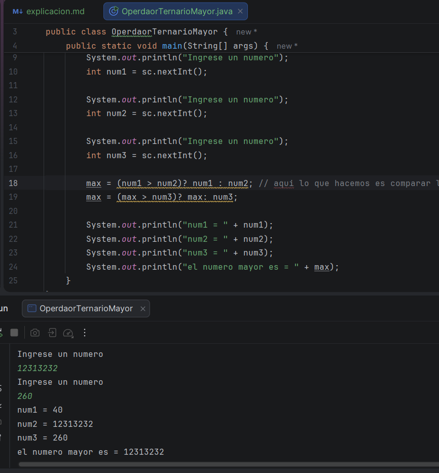

# Primer video: 

Esta clase vimos un nuevo tipo de operador, el ternario, que está formado por tres partes que evalúan una expresión booleana,
la cual se si cumple la condición, da un valor, y si no da otro, este es como una forma abreviada del if, donde tiene una 
condición, de acuerdo a que esta sea falsa o verdadera, lanzará un resultado, como se muestra en el ejemplo

# Segundo video: 

En esta clase vimos el mismo tipo de operador, pero esta vez usando el ejemplo de login, que habíamos visto en clases anteriores,
usamos el código que ya teníamos, pero ahora sin implementer el if, si no usando el operador ternario, no se eliminó la clase 
if que se tenía anteriormente, pero si se le puso en comentario, para que sea una comparación de ahorro de código usando este 
operador 

# Tercer video

En esta clase, vimos el mismo operador, pero ahora con diferente manera, para calcular el número mayor de tres, que con el if
sería mucho más complicado y con muchas líneas de código innecesarias 

