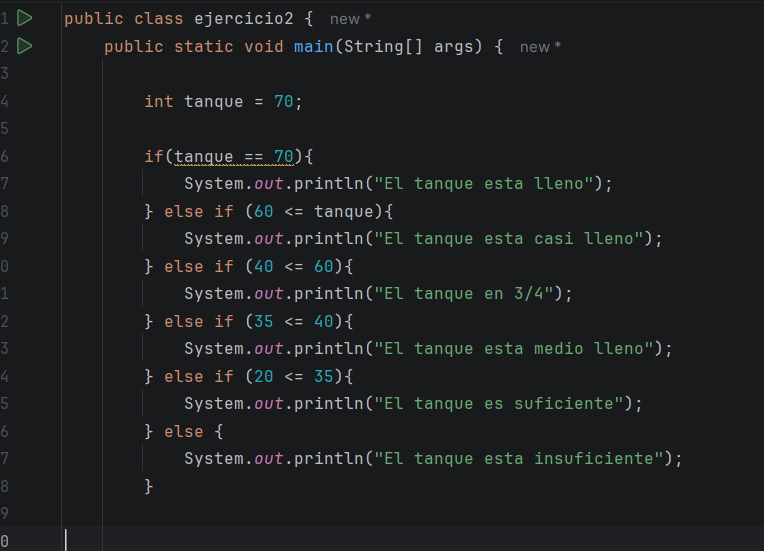
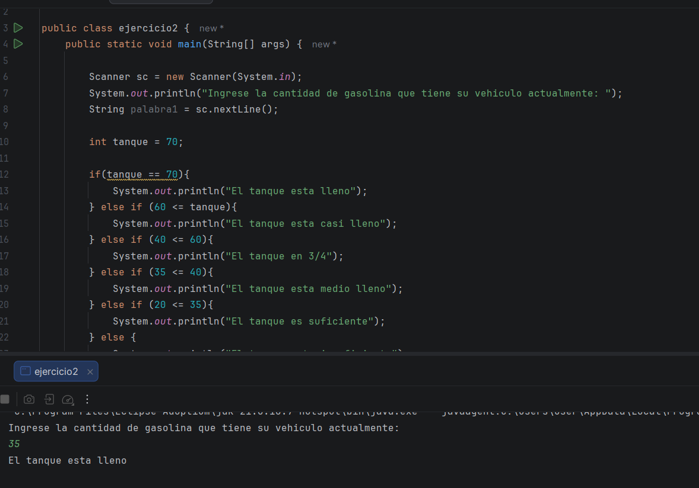
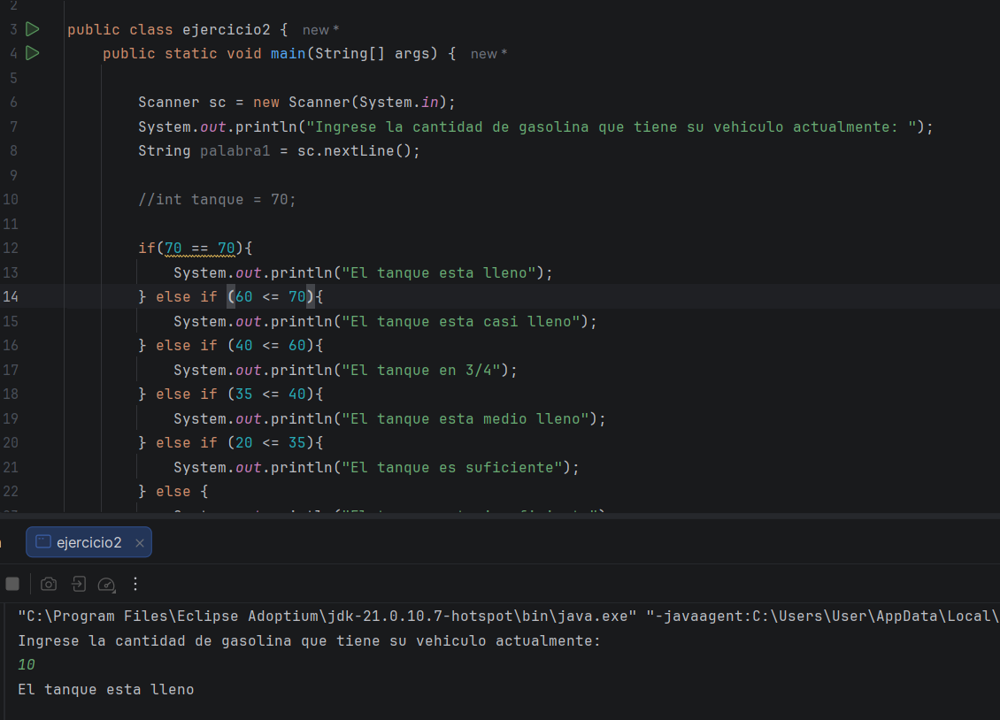
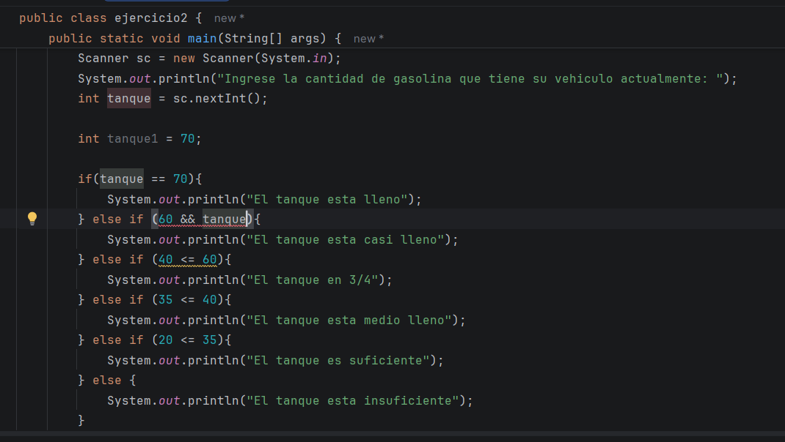
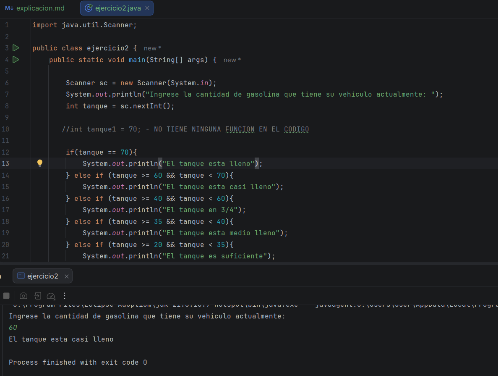

Muy bien, el día de hoy ya continuaré el curso, es decir, los videos como se debe, en este caso, me faltaban dos ejercicios,
que no habia terminado de hacer, 

### Aquí esta la dirección del ejercicio que hare hoy

Suponiendo un estanque de gasolina (gas) con capacidad 70 litros, se requiere un programa que pida la medida actual en litros 
y mostrar el resultado de la forma: Insuficiente, suficiente, Medio...

La medida o capacidad actual del estanque puede ser en tipo double, para una mejor precisión, pero tambien puede ser del tipo int.

    Si la capacidad actual es 70 litros: imprimir Estanque lleno

    Si está entre 60 y menor a 70: imprimir Estanque casi lleno

    Si está entre 40 y menor a 60: imprimir Estanque 3/4

    Si está entre 35 y menor a 40: imprimir Medio Estanque

    Si está entre 20 y menor a 35: imprimir Suficiente

    Si está entre 1 y menor a 20: imprimir Insuficiente

### Primer intento: 

Al principio pense en usar un for, pero luego pense en como carajo hago para comprar con for, no tenía ni idea, entonces
primero intente haciendo la estructura, pero algo no me cuadraba, no me parecia normal, también pensaba en usar las condicionales,
es decir, el if, pero, en el curso casi o hemos visto el if, si lo hemos usado, pero el profe aún no nos ha enseñado bien como
usarlo, entonces viendo que realmente con for no me estaba dando, además algo de mis otas mi hizo pensar

**El for, se usa 
cuando quiere repetir una acción, y aqui no queremos repetir nada** 

Teniendo eso en cuenta, decidí irme por el if, else, while 

### Segundo intento:

Al ser un poco mala igualmente con el if, antes de continuar con la práctica, decidi hacer una pequeña invertigacion del if,
conocer su funcion y su estrcutra, además de algunos ejemplos que me ayudaran, algo que me recomendo donde busque, es primero,
debo de entenderlo en mi lenguaje, y ya luego hacerle entender al computador lo que quiero, o sea, como un pseudocodigo

if (70 litros)
Estanque lleno

else if (60 a menor que 70)
Estanque casi lleno

else if (40 a menor que 60)
Estanque 3/4

else if (35 a menor que 40)
Medio Estanque

else if (20 a menor que 35)
Suficiente

else
Insuficiente

-Este fue mi segundo intento: 

Al principio pense que ya estaba todo bien, cuando olvide una pequeña cosa, PEDIRLE AL USUARIO CUANTO LLEVA EL TANQUE, de 
que sirve que haga esto, si el usuario no me va a decir a cuanta capacidad tiene, entonces ni deje que se corriera el codigo

### Tercer intento:

Después de que ya le haya puesto el Scanner, para que el usuario pudiera escribir, describer un nuevo problema 

Como se puede ver en la imagen, aun cuando le pongo un número bajo, siempre dice que "El tanque está lleno", lo cual no 
debería de ser asi, por lo que quise mirar que podría pasar, intentándolo una vez más 

### Cuarto intento: 

Tenía la teoría, que podría ser la variable int, que use, que ta ves sea el problema que estaba obstruyendo, asi que la quite,
a ver que pasaba 

Como se puede observar, esto tampoco funciono, pues aunque lo haa quitado, el problema sigue allí, por lo uqe debía de buscar,
que era eso que me estaba faltando, intente volviendo a leer el enunciado, a ver sise me pasaba algo y decía esto 

**"La medida o
capacidad actual del estanque puede ser en tipo double, para una mejor precisión, pero también puede ser del tipo int."**

### Quinto intento: 

Muy bien, descubrí, algo clave, otra vez use un string, cuando debía de usar un int, pero bueno al menos me di cuenta,
luego, (esto si me costó mucho mas darme cuenta) es que estaba comparando el 70 con el 70, obviamente siempre dará que el tanque está 
lleno, y la segunda comparación, también está muy mal, asi que lo correjí y asi me quedo 

pero ahora tampoco funciono, entonces revise el ejemplo que el profesor nos dejó, a ver que era eso que me faltaba, y creo 
que ya lo entendí, por lo que el sexto (yeso espero) es mi último intento

### Sexto intento: 

Ahora si me quedo bien, no estaba comparando correctamente con la variable y la condición de AND, es por eso que no me daba 
como debería en el código, pero pude corregirlo y ya quedo completo 
