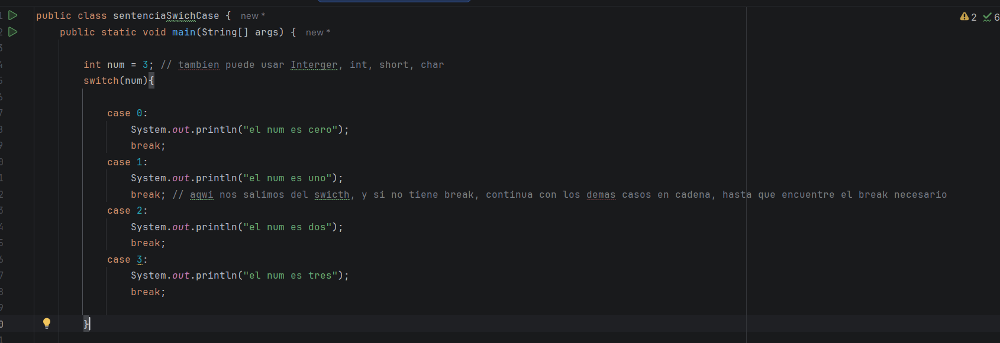
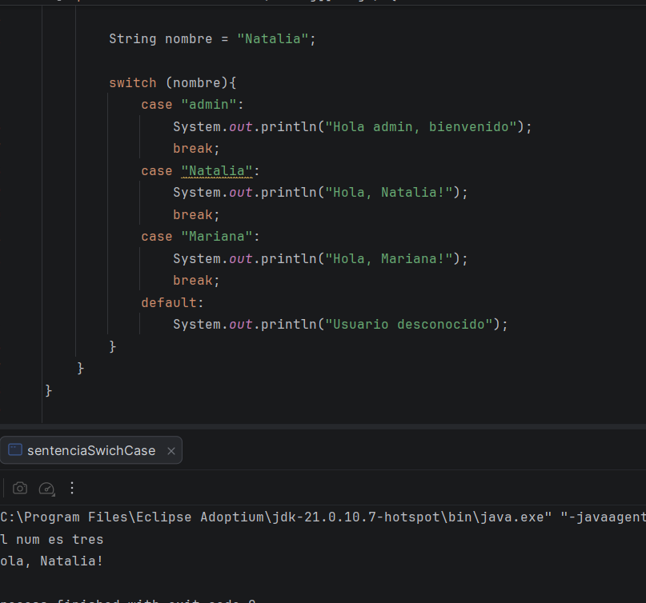
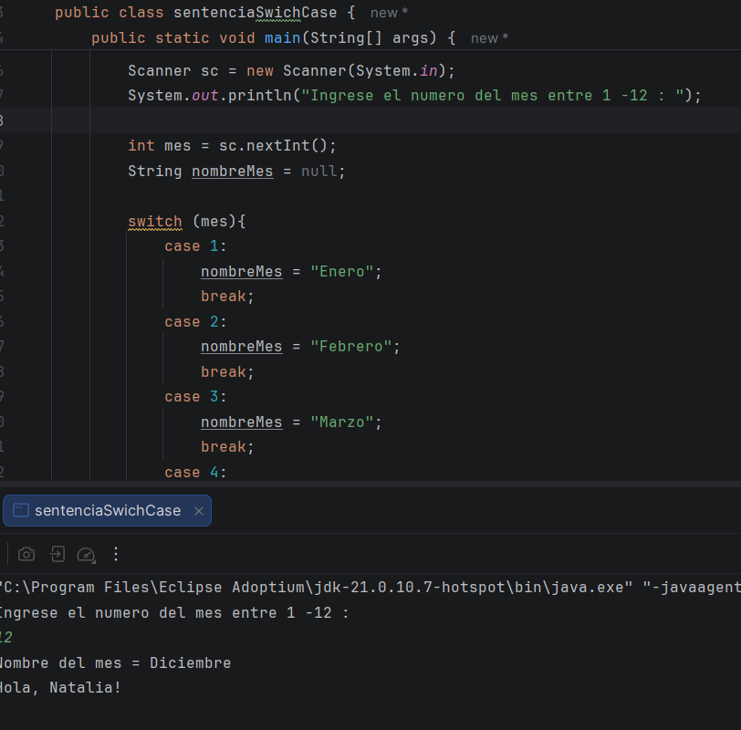
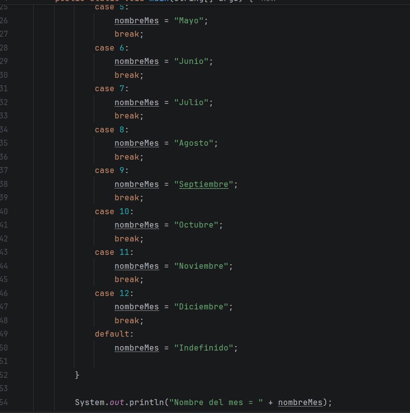
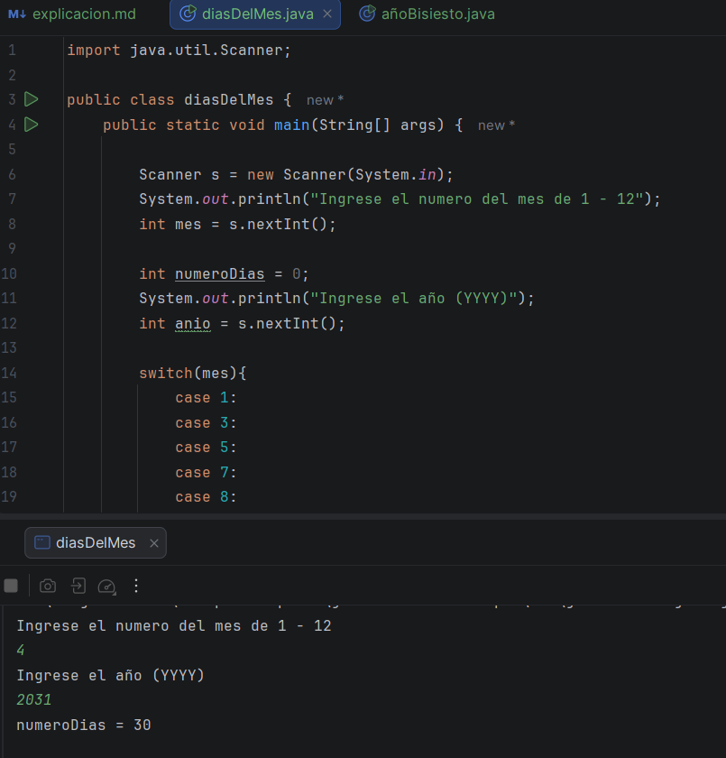
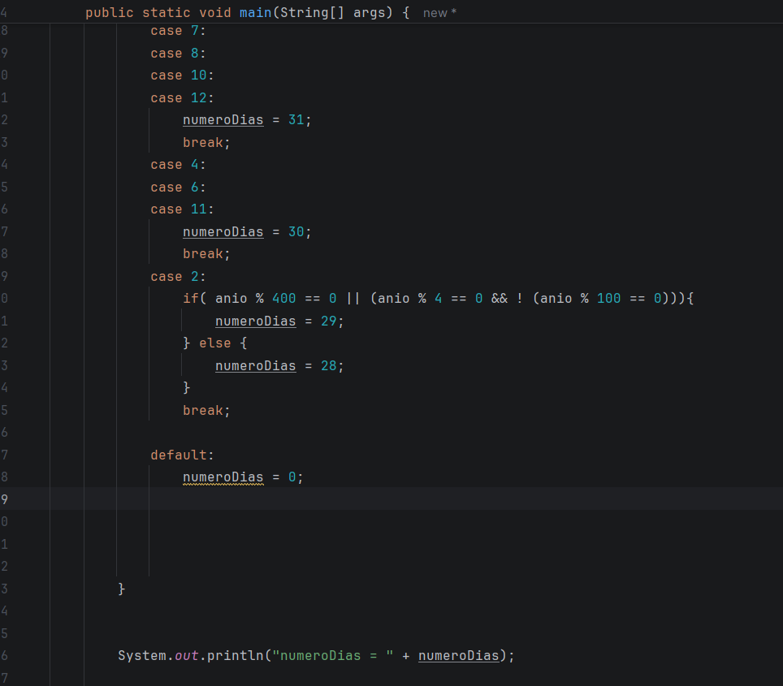

Bueno, pues que te digo, a sido una semana bastante complicada, no solo en mi vida si no tambien en Colombia, no puedo perder los animos
pero es que la verdad ayer si estaba bastante triste de que no hayan eliminado, ademas de que incluo ayer se me paso el dia pero tan rapido, que 
yo no lo podia creer, de verdad, puedo ser opor que ayer tuve que salir todo el dia, a hacer una vueltas todas raras, pero bueno,
aun asi, de verdad senti que el dia salio volando, jejej, aqui yo comentando todo lo que pasa en mi vidaaa, ya que no solo 
es un reporte de como me va en java y mi progreso, si no tambine para actualizar mi vidaaa ;D 

Como sea, continuando con la clase anterior de switch case, que en el último documento, hice lo que es el resume de lo que es 
el switch case y aqui termino es de ver el video (antes de la tragedia de colombia) 

## Video # 1

En esta clase vimos el flujo de control swich case, nos explicaba como funcionaba y sus deiferentes funciones con un ejemplo de codigo

## Video # 2

En esta clase continuamos con el switch case con otro ejemplo completamente diferente, del nombre de los meses del año,
a partie del número de mes del año 

## Video # 3 

En esta clase, nuevamente usamos la sentencia de Switch case, per ahora para los numeros del dia del mes, pero en este caso,
usando el ejemplo que ya teniamos de la sentencia if else de l año bisiesto para que sea mucho mas estricto y actualizado, tneiendo
eso en cuenta este es el codigo

y eso fue todo :D