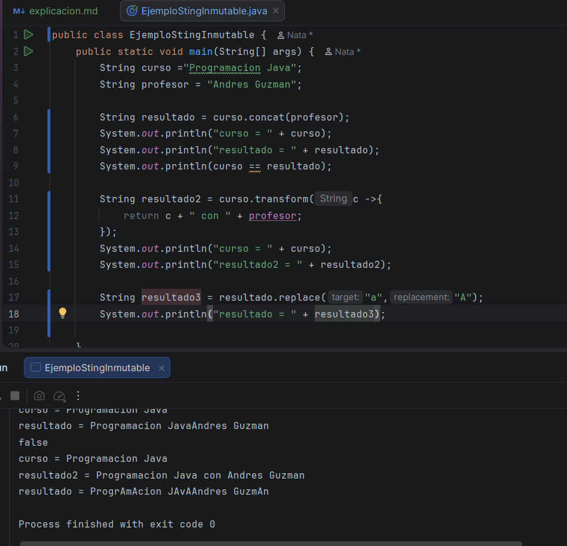
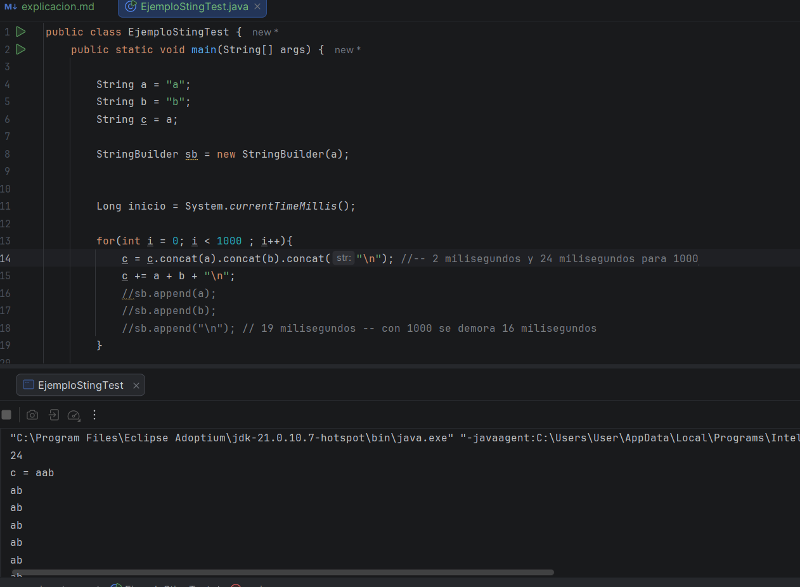
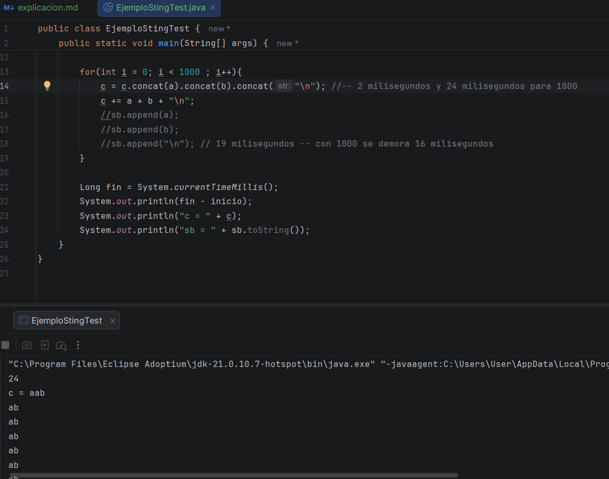
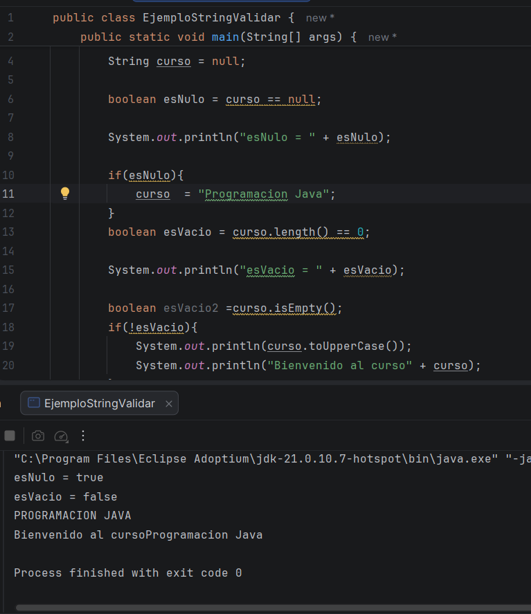

# Primer video:

Otras maneras de concatenar con String, que puede ser el concat que vimos la clase anterior, pero también, el transform 
que sirve para concatenar, no enfatizó mucho en ese, ya que vamos a enfatizar en él más adelante, luego usamos el método 
replace, para reemplazar alguna letra en el código, primero lo hicimos sin una variable diferente a las demás, y cuando 
corrió el código no paso nada, pero al usar una variable distinta ahi ya se vio el cambio.

# Segundo video: (largo)

En esta clase hicimos una prueba de las diferentes maneras de concatenar con el método String, y cuál es la más efectiva 
o la de mejor rendimiento como el operador +, concat, y un nuevo método que no habíamos visto StringBuilder
usamos una función de Sistem, en la cual podemos tener el tiempo real

Están las pruebas de quien es más rápido, no sé por qué a mí el StringBuilder me apareció que se demoraba mucho, como los 19 
milliseconds, sabiendo que al profe se demoró mucho menos que a mí, pero lo revise más de una mi código y el del profe, y 
era igual, entonces no sé qué podría ser 

# Tercer video: 

En esta clase, vimos como poder validar un String, nos enseñó que concat solo se usa cuando el método String que vamos a 
concatenar tiene una estancia, no que sea null, también usamos el if, pero no muy a fondo, pues el profe dice que lo veremos 
luego más a fondo, lon usamos para validar diferentes Strings, además nos enseñó un atajo para no hacer todo ese código que 
es con isEmpty(); porque ese método evalúa si la variable es vacía, que es lo que queremos validar 

