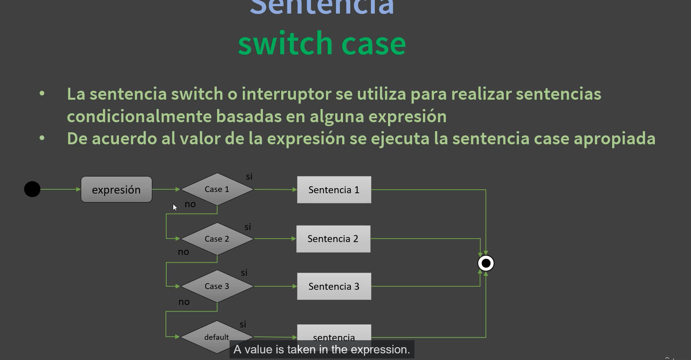
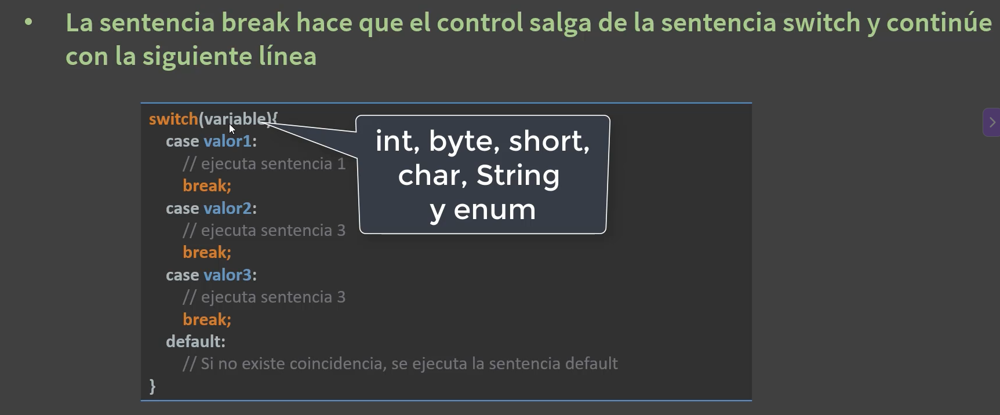
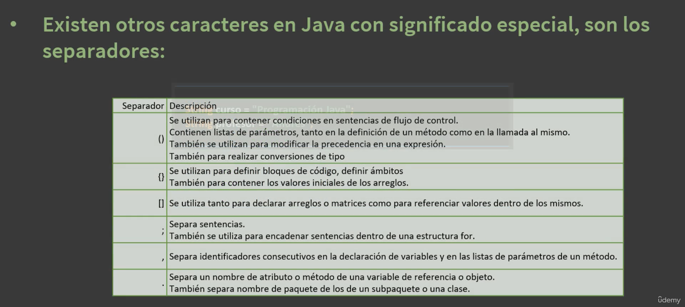
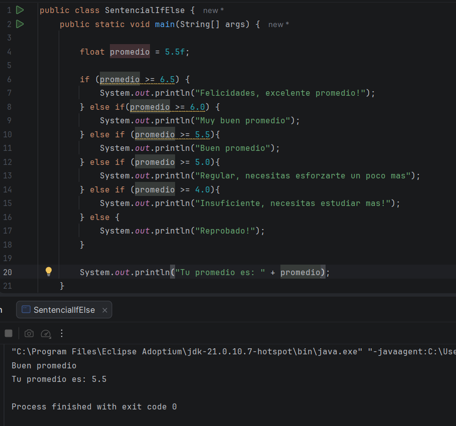

La verdad, el dia de hoy estuve un poco afectada con las perdidas de mi familia, además de tener que ir a un funeral, que
simplemente a nadie le da ganas de hacer nada, pero la verdad quiero aprender, asi que aqui estamos al menos hare algo 
para que no me afecte 

El dia de hoy, ya toca nuevamente clase

## Video # 1

En este video, comenzamos con un nuevo módulo, el cuales es de condicionales o flujos de control, el profe comienza con una 
intro de como funcionan estos y cuando debo de usarlos, su estructura y demás cosas, aquí fotos 

Ya también nos explicó como funcionan todos los separadores necesarios para el flujo de control y otras partes de los códigos

## Video # 2

en esta clase vimos un ejemplo de como funciona el if, y el if else, con un ejemplo de promedios y como los estudiantes 
pueden pasar con el, como ya tengo algo de conocimiento con el if, bueno, este ejercicio me sirvió como un repaso de este
flujo de control 

Y asi fue como termine mi dia, ya que debia de irme, y vi un poquito del partido de portugal, que lamentablemente perdieron 
