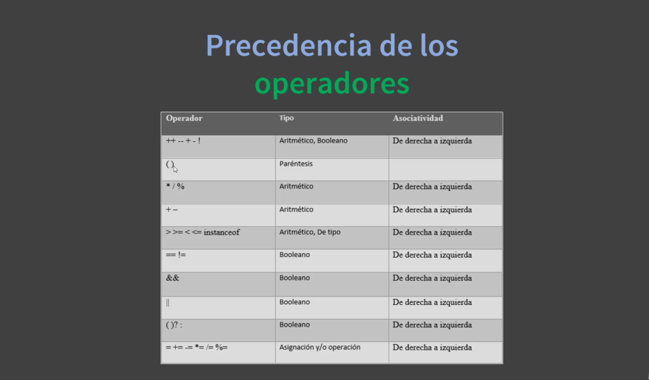
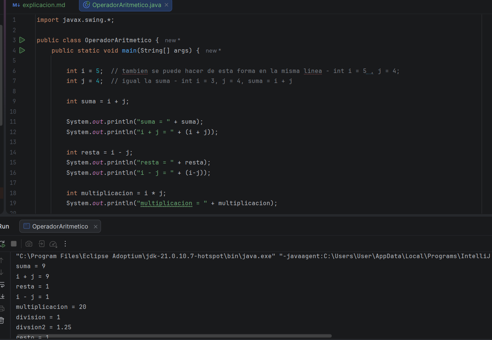
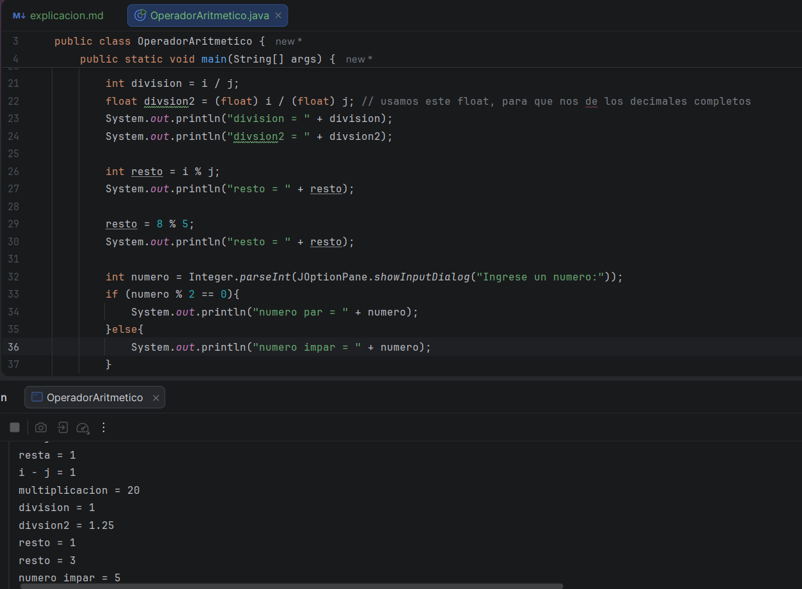
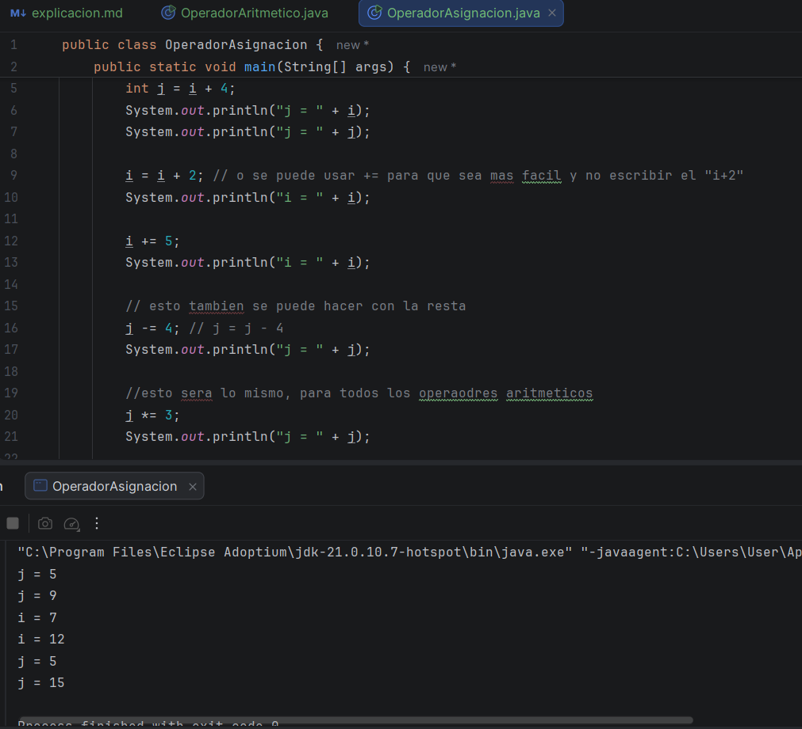
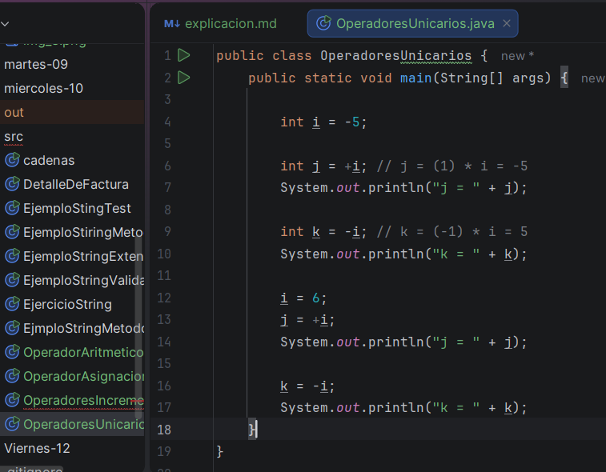
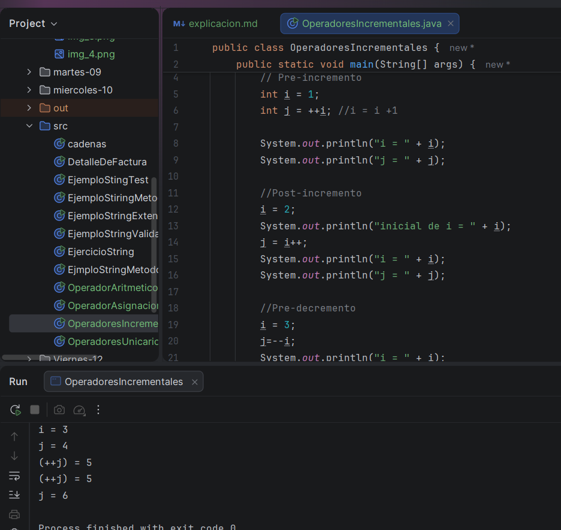
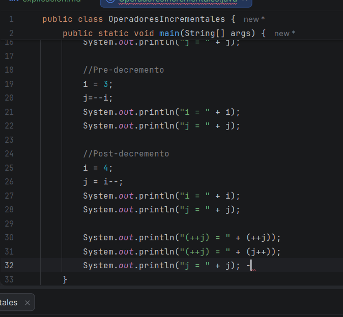
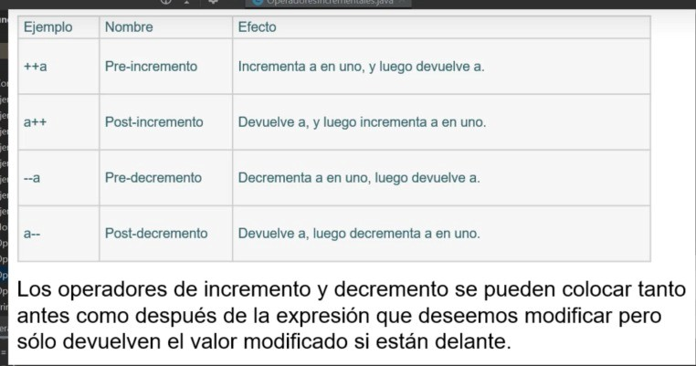

# Primer video: 

Este video es de introducción al nuevo módulo, que son los operadores, en el video el profe hace una pequeña introducción 
a los diferentes operadores, como son: 

* **Aritmético:** Se utiliza para hacer operaciones simples
* **Combinado**: estos serían como =-, /=, *=, entre otros 
* **Incremento y decremento**: se usan para
  sumar o restar exactamente una unidad al valor de una variable
* **Ternario o condicional:**toma decisiones en una sola línea de código, y el condicional permite evaluar una condición 
booleana y devolver un valor u otro dependiendo de si esta es verdadera o falsa
* **relacionales:** los que son mayor que o menor que, que se usan para comparar sobre todo tipo de variables 
* **Lógicos**: como son el and, or, not, los cuales se usan en las tablas de verdad 

# Segundo video: 

En este video, vimos los operadores aritméticos, como la suma o la resta, en este hacemos algunos ejemplos de la misma, 
usando también otros operadores como la multiplicación, y esta vez usando el if, para analizar si un número era par o no con
el operador %, el cual es usa para 

# Tercer video:

En este video, vimos los operadores de asignación, los cuales como su nombre lo dicen, asignan un valor a alguna variable 
en este caso, vimos algunos ejemplos de los distintos operadores

# ****Cuarto video:**** 

En este video, vimos lo que son los operadores unarios, los cuales son únicos, ya que solo operan con una unica variable
como por ejemplo (+5) o (-6), es más para invertir el valor de alguna variable 

# Quinto video:

En este video, vemos lo que son operadores de incrementos y decremento, lo cuales se usan para 
sumar o restar exactamente una unidad al valor de una variable, en la última imagen, esta el resumen de porque dan estos 
resultados (pero debo de añadir que es un enredooo)

