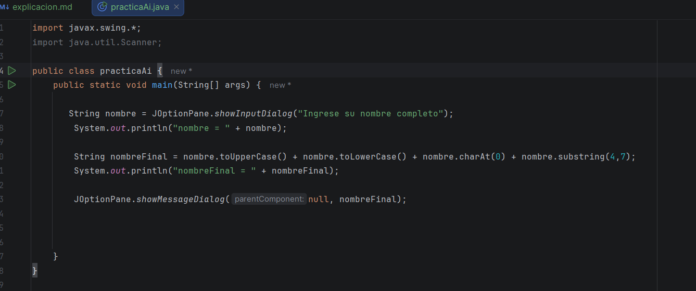
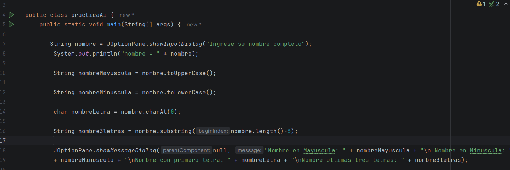
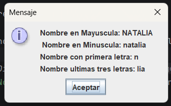
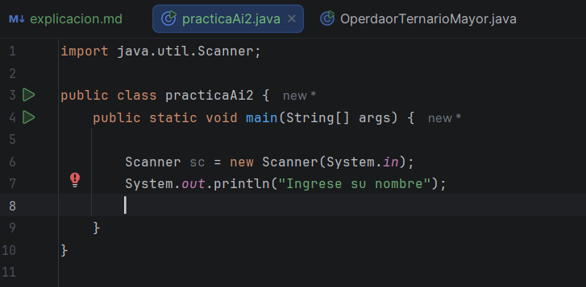

Bueno el dia de hoy decidí práctica antes de continuar con el curso, por lo que hoy le pedí a mi buen amigo la AI, que me 
algunos ejercicios para practicar, por lo que hoy me dedique al menos unas 2 horas (en lo que llegaba mariana y luego 
posiblemente usted), por lo que la AI me dio este prompt y eso fue lo que hice 

# Mini examen (5 ejercicios)

Instrucciones:

No busques la respuesta.
Intenta resolverlos por tu cuenta.
Puedes enviármelos uno por uno o todos juntos.
Yo los corregiré como un profesor y te daré retroalimentación.

## Ejercicio 1 (String)

Pide al usuario un nombre.

Debes mostrar:

El nombre completamente en mayúsculas.
El nombre completamente en minúsculas.
La primera letra.
Los últimos 3 caracteres.
Ejemplo

Entrada:

Natalia

Salida:

NATALIA
natalia
N
lia

## Ejercicio 2 (String + lógica)

Pide dos palabras.

Debes verificar:

Si son exactamente iguales.
Si la primera palabra empieza con "A".
Ejemplo

Entrada:

Andres
Andres

Salida:

Las palabras son iguales
La primera palabra comienza con A

## Ejercicio 3 (Operador ternario)

Pide una edad.

Si la edad es mayor o igual a 18:

Mayor de edad

Si no:

Menor de edad

Debes hacerlo únicamente con un operador ternario.

## Ejercicio 4 (Arreglos + for)

Crea un arreglo de 4 nombres.

Recórrelo con un for e imprime:

Posición 0: Natalia
Posición 1: Pablo
Posición 2: Tohru
Posición 3: Risa

(No uses Scanner en este ejercicio).

## Ejercicio 5 ⭐ (Nivel examen)

Pide un nombre.

Debes construir un nuevo nombre siguiendo esta regla:

Primera letra en mayúscula.
Un guion -.
Los últimos 2 caracteres.
Un guion -.
La cantidad de letras del nombre.
Ejemplo

Entrada:

natalia

Salida:

N-ia-7

Entonces, para el primer ejercicio, hice este; 

La AI me lo califico, dijo que estaba bien, pero em falta los espacios entre los mensajes, para que se entendiera mejor 
y en la última parte, lo hice mal, porque lo hice con un nombre específico, o sea el mio, si lo hubiera hecho con otro, 
la cosa sería diferente y no iba a dar, por lo que me dijo como debería de usarlo, teniendo en cuenta este cambio, asi quedo el código:

Continue con el otro ejercicio: 

esta haciendo el ejercicio, pero entonces, tuvimos un pequeño problema con la impresora y me pasé mirando como arreglarla, 
pero, pues ya es problema de la tinta, entonces me toco buscar técnico y en eso ya tenía que ir por mari, y bueno solo pude 
hacer eso, pero ya mañana continuo 
