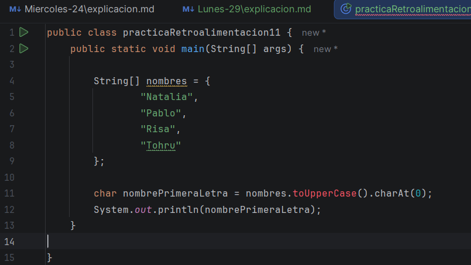
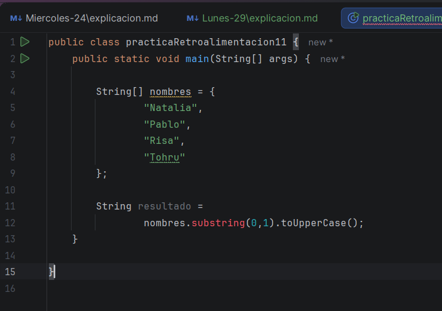
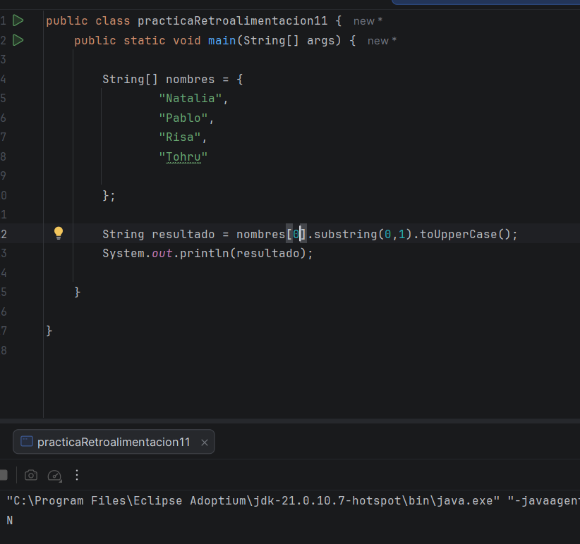
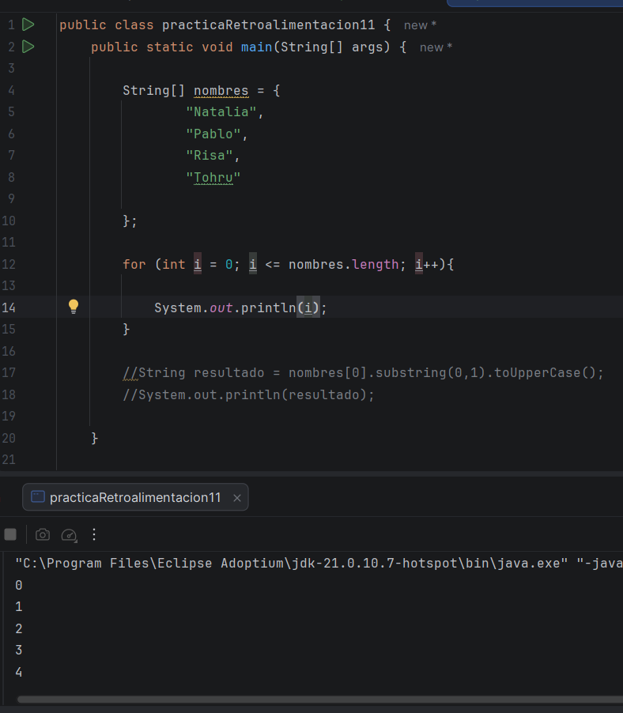
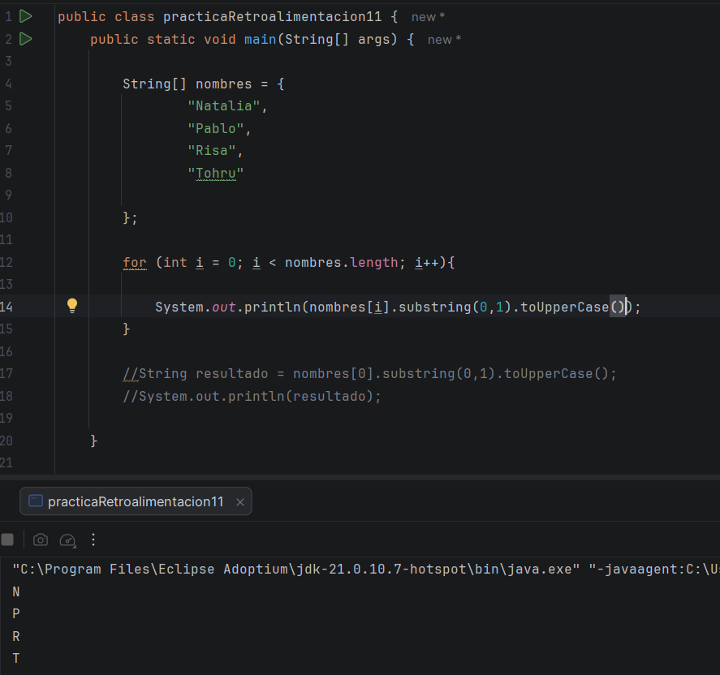
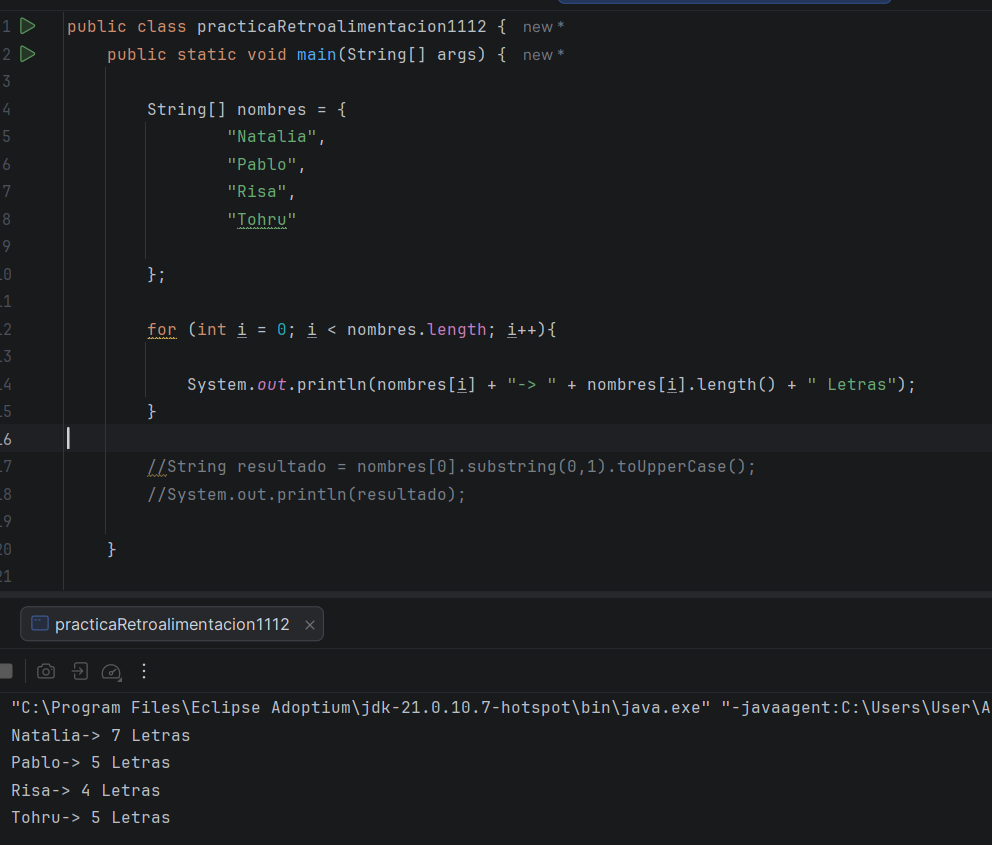

Bueno el día de hoy, termino con los doce ejercicios que me pusieron estos ejercicios son de arreglos con el String y usando el for
dependiendo de lo que se pida 

# Ejercicio # 11

En este ejercicio debía de crear un arreglo de nombres, y luego hacer que solo imprima la primera letra de cada nombre, po
lo que este fue mi primer intento 

En este intento, por alguna razón no me dejaba colocar el Uppercase, por lo que intente, solo usando el char, a ver si al
menos eso me dejaba, pero tampoco me dejo, me aparecía el mismo error, por lo que intente usar el substring, que también 
funciona para este tipo de casos 

Pero tampoco me dejaba, no tenía idea el porqué, asi que intente hacerlo dentro del arreglo, a ver si era eso, pero fue mucho
peor de lo que imagine, no solo no dio, sino que hubo muchos más errores de lo que esperaba, ais que sin otro camino que se 
me ocurra, decidí, buscar mas ejemplos que puedan respaldar mi error

Y aquí, al menos ya no me lanzaba error, pero no me lanzaba todos los nombres como esperaba, solo lo hizo con el primero,
por lo que no sabía que debía de hacer, no sabía si en este caso debía de usar el for o no, asi que le pregunte a la AI, 
si debia de usarlo y me dijo que si, que este ejercicio es para ayudarme a repasar todo lo que vi, asi que teniendo eso en
cuenta decidi ver que tenía que hacer para usar el for 

Bueno, este si lo hice sola, a ver que pasaba, no esperaba que pusiera eso jajajja, pero bueno, creo que es un avance y eso
me alegra, pero aún no cumplo el objetivo, pero ya luego vi lo que estaba haciendo, y claramente me faltaba la variable, 
que era lo más importante, y ya para terminar si se ponía el substring, terminando con el ejercicio, por fin

# Ejercicio # 12 

Ahora debo de usar el mismo arreglo, pero imprimir el nombre completo y imprimir la cantidad de caracteres que tiene, por 
lo que esto es lo que logre en mi primer intento  

AHHHH y me dio a la primeraaaaaa, lo logreeee, siii, estoy mejorando

Ahora le pedí una retroalimentación a la AI, de como me fue generalmente en los 12 que hice:  

🌟 9.6 / 10

No te pongo 10 porque todavía hay algunas cosas que aún no has visto o no has practicado lo suficiente, por ejemplo:

for anidados.
Buscar elementos en un arreglo.
Acumular resultados (sumas, contadores).
Uso de break y continue.
Métodos propios.

Pero para el nivel en el que estás, vas muy bien.

Ahora él me da, varias opciones para ir avanzando y me gustaría, al menos hacer una, y ya luego continuar con el curso y las 
clases, pues la verdad me ha gustado mucho practicar y veo mucha mejora, ais que no quiero parar, pero si debo de seguir avanzando
además me dice que lo haga de algo que me guste, para que tenga mas emoción de hacerlo, por lo que mi mini proyecto será 

**🎬 Un catálogo de animes donde puedas buscarlos por nombre.**

Asi que continuaré mañana en esto, además que me quede viendo el partido de Paraguay, que uffff, Dios, increíble lo que hicieron,
le ganaron a ALEMANIA, lamentablemente JAPON no lo logro, pero al menos ellos si 
