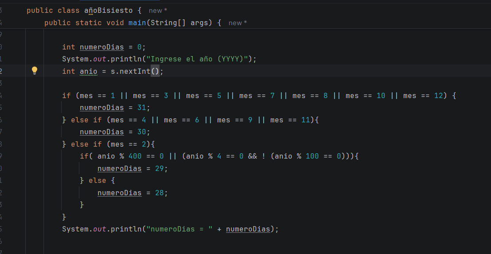
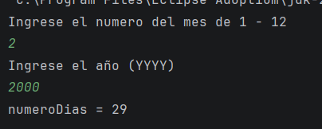

Muy bien, como bien sabes el dia de hoy es partido de colombiaaa, nuestra sele va a ganar, yo se que si, por ello hare lo
que mas pueda en el poco tiempo que tengo, ya que y escribo hora actual 12 del dia, Argentina va perdiendo, no puedo ser 
mas feliz, por lo que debo de apoyar a la sele pero de egipto JAJAJA 

Como sea, comienzo 

## Video #1 

En esta clase, vamos a hacer un ejercicio de lo añobisiesto con el if y if else, nos explica 
como usarlo de otra manera mas practica y como puede ayudarnos en cosas cotidianas como esas cuando no sabemos cuando es
el año bisiesto, pues ahora con este programa es más fácil 

## Video #2 

Muy bien, en esta clase se iba a comenzar a ver el switch case, pero algo que note es que yo no tenia idea como usarlo y 
que debia de hacer, por lo que en este tiempo me dedique mas a lo que es que es el switch case y como funcionaba para poder hacer 
mi respectivo resumen, siendo etste lo que realizo por notion 
