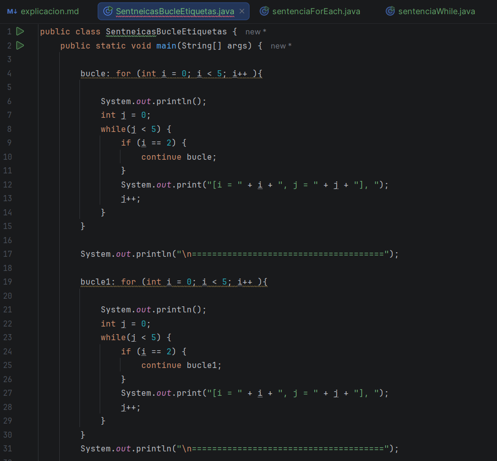
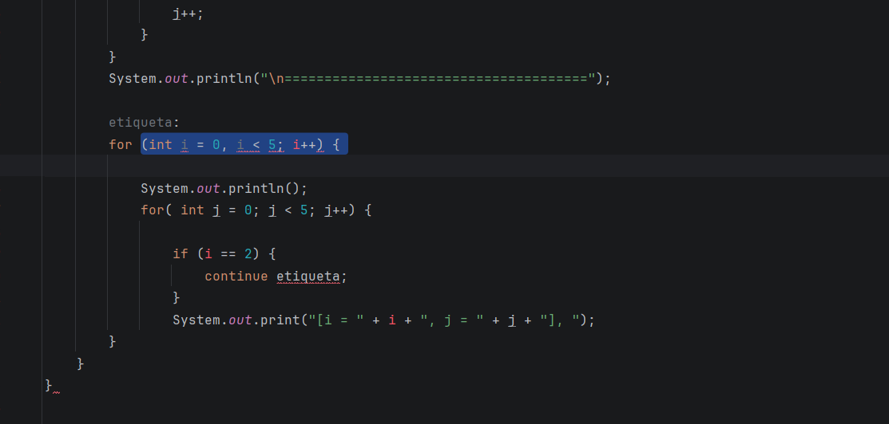
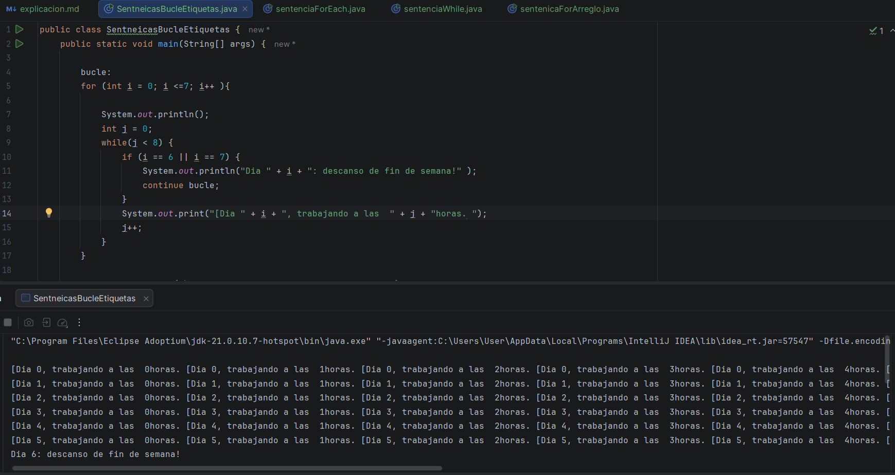
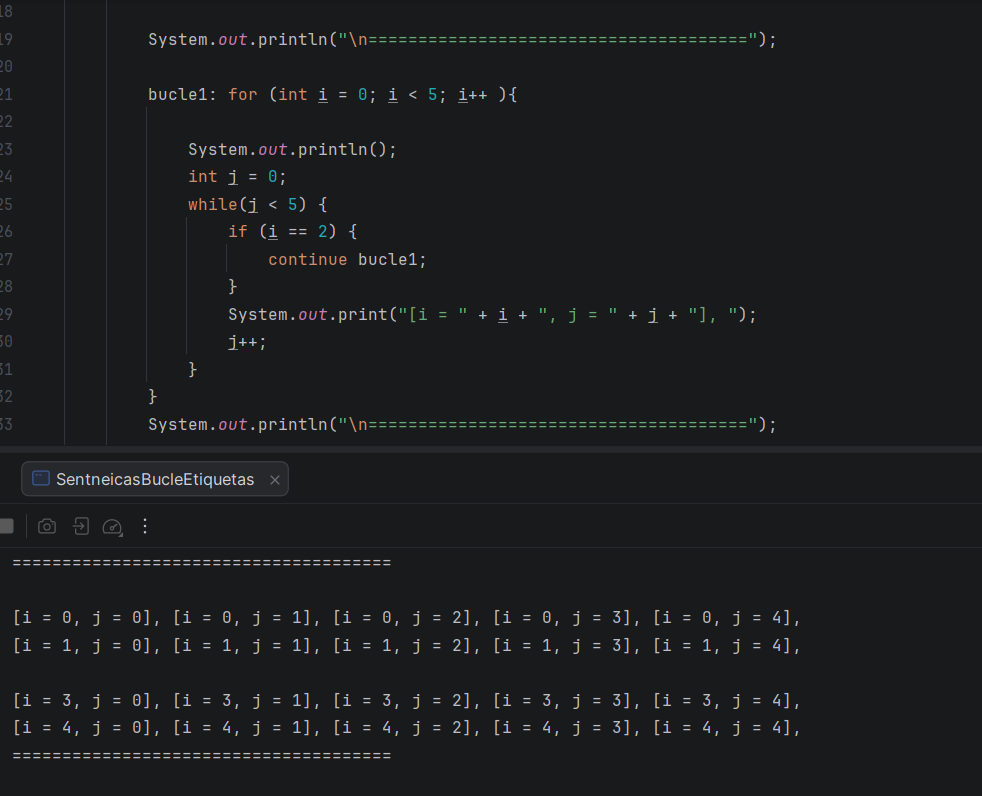
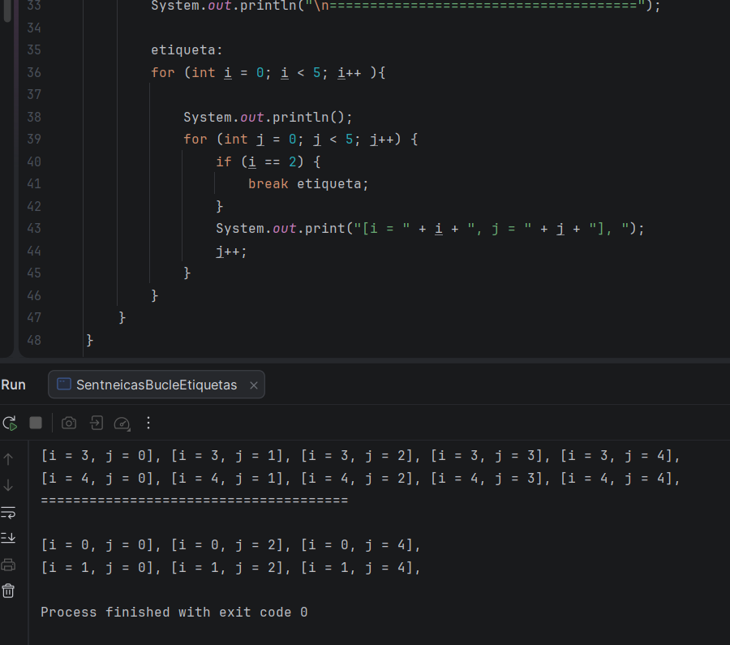
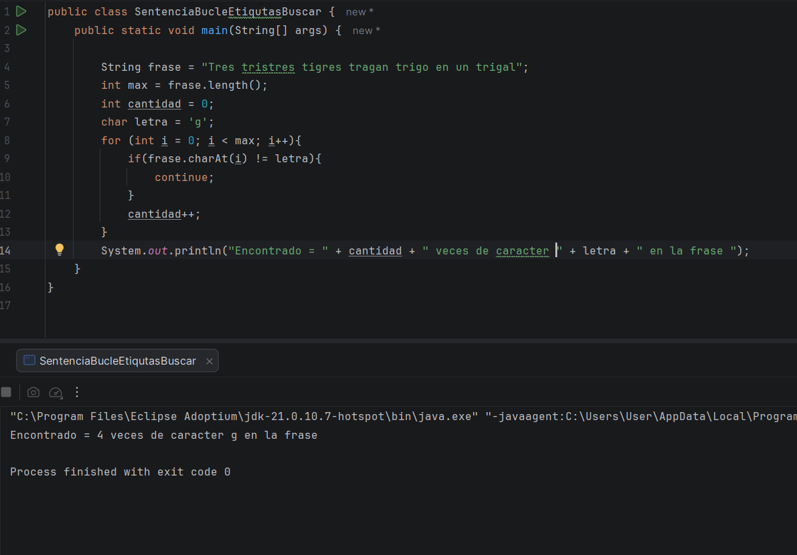
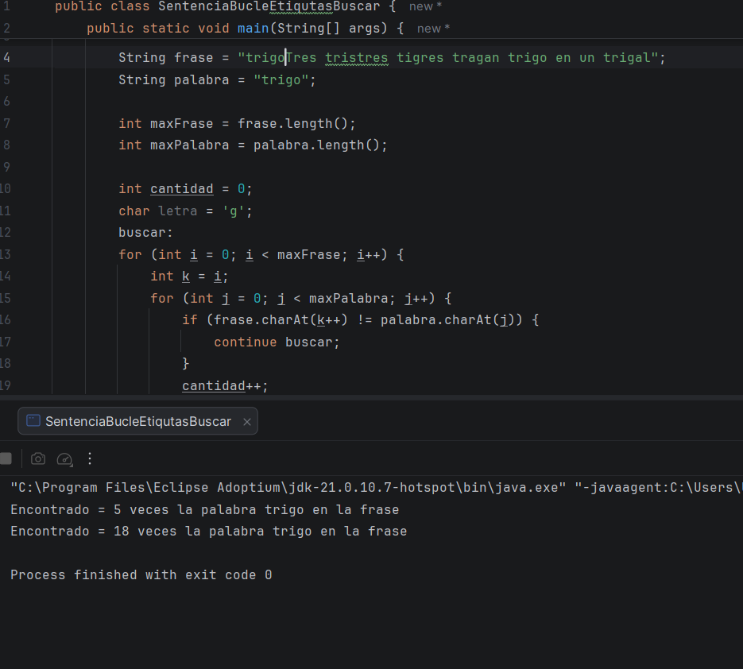
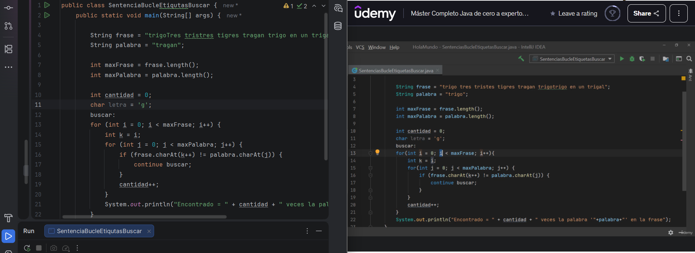
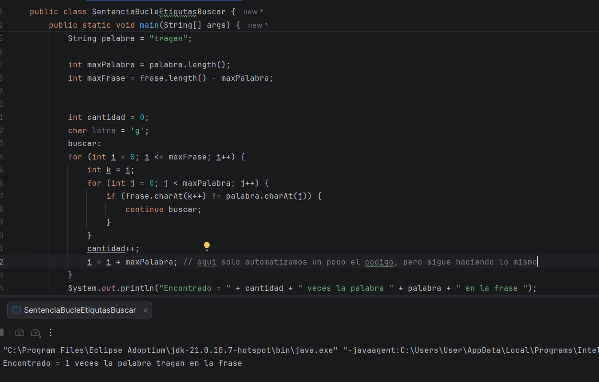

Muy bien el dia de hoy voy a ver dos clases, ya que los videos son un poco largos y contarían con mis horas diarias de clase

## Video # 1

En esta clase vimos etiquetas en las sentencias for y while, se aplica tanto para continue, como para 
break, nos enseñan como dar etiquetas a los bucles, el bucle siempre debe de ir pegado al for y luego etiquetarlo, estas son importantes,
ya que dan a entender cuál es el bucle que desea continuar o salir 

Realizando la clase, hay algo del código que no lograba entender por qué me quedo mal o que pasaba, ya que me estaba marcando un 
error que desconocía la razón, por lo que me toco, volver a repetir la clase para entender el significado de esto 

Bueno, era solo copiar el ejemplo anterior igual, pero no lo había copiado bien y yo intentando modificar el código porque
pensé que era eso lo que estaba mal 

Terminando ya con el código, el cual su propósito era dar a entender los días dela semana en los cuales se trabaja, y los 
días que se descansa, dejando asi el bucle, pero dando a entender el propósito de la clase

etiqueta es simplemente un nombre que le das a un bloque de código o a un ciclo y permiten indicar a qué ciclo quieres afectar

## Video # 2 

EN esta clase, lo que vimos fue un ejemplo mucho más detallado de lo que son las sentencias for anidadas y las etiquetas,
la idea del código es buscar un carácter o letra dentro de la frase, que se pueda repetir carias veces y con un contador saber 
cuantas veces está repetida esta frase

En este caso lo hicimos, para que encontrara una letra repetida 

Ahora para una frase, pero en esta me ocurre algo extraño y no se porque, ya que el código del profe es igual al mio, además
que em imprime dos frases cuando solo pedía una 

Evidencia de que estaba igual al del profe:

Hasta que descubrí la diferencia, que aunque sea muy pequeña, lamentablemente asi es la programación

y asi quedo el código final de la clase 

