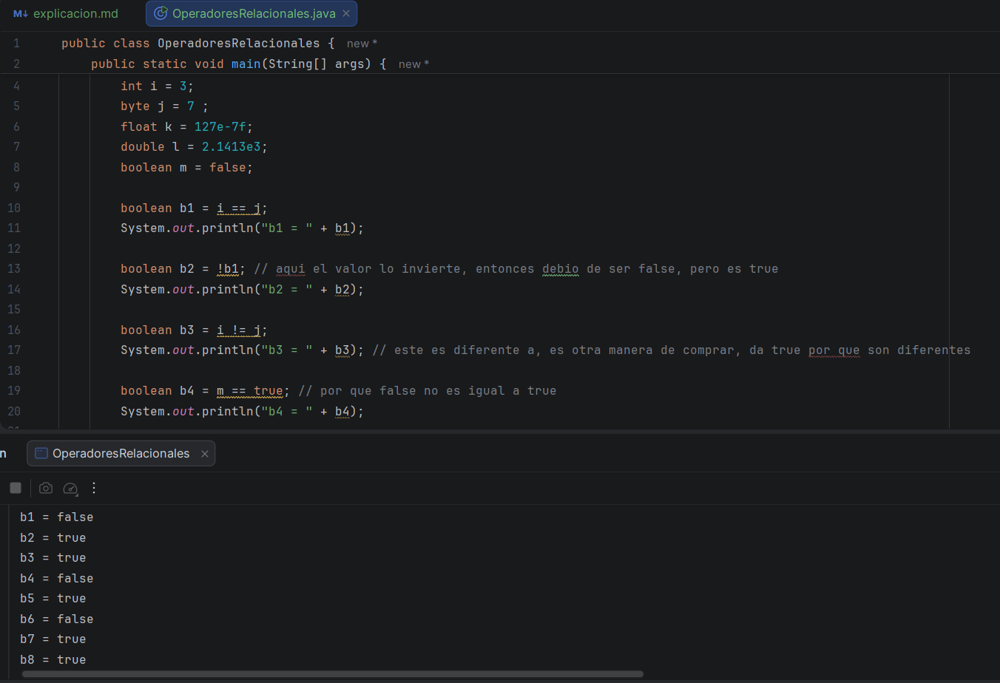
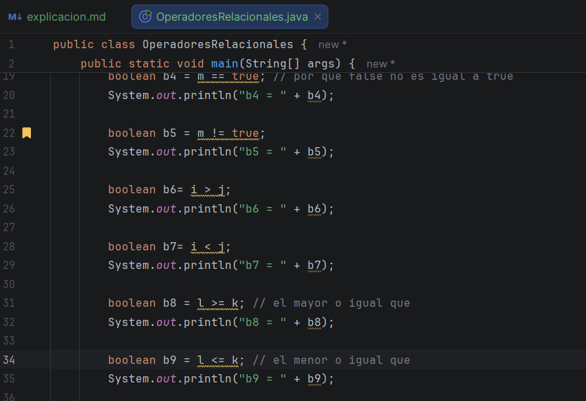
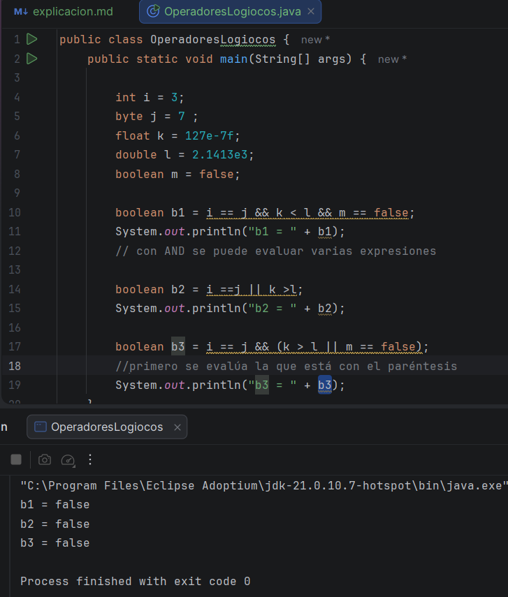
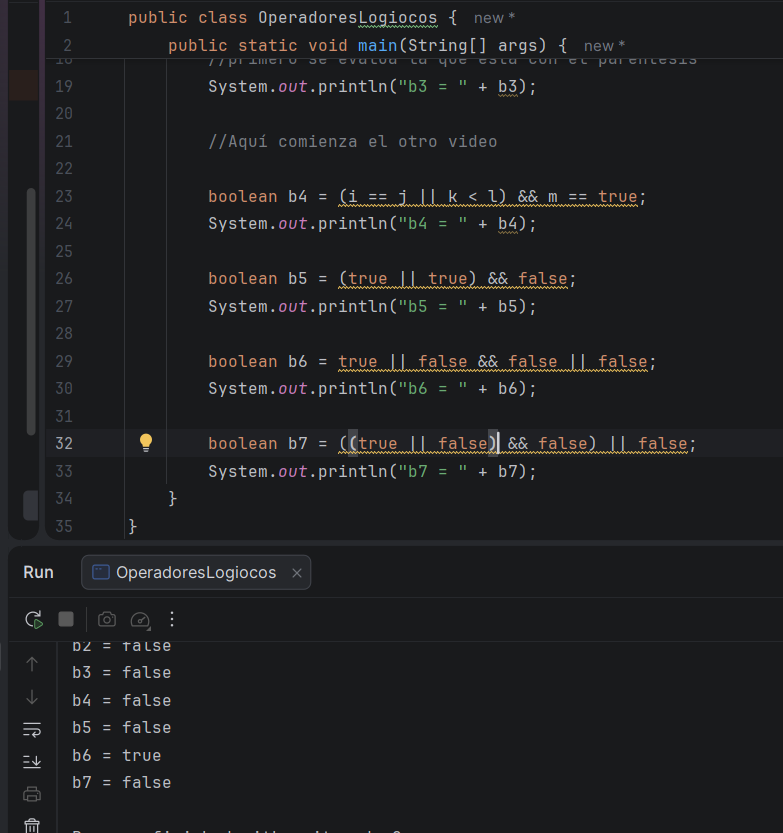
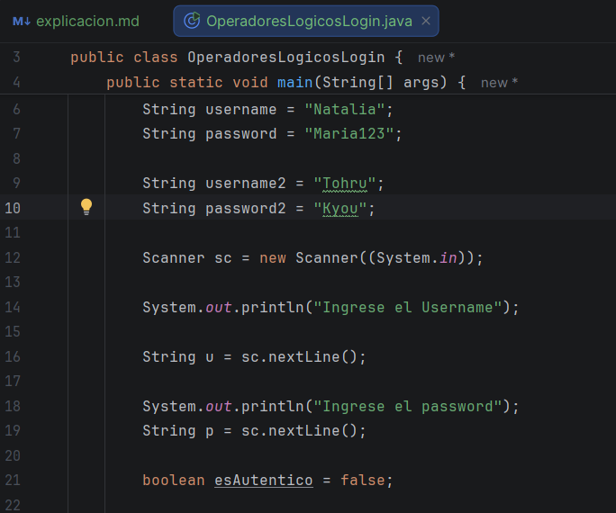
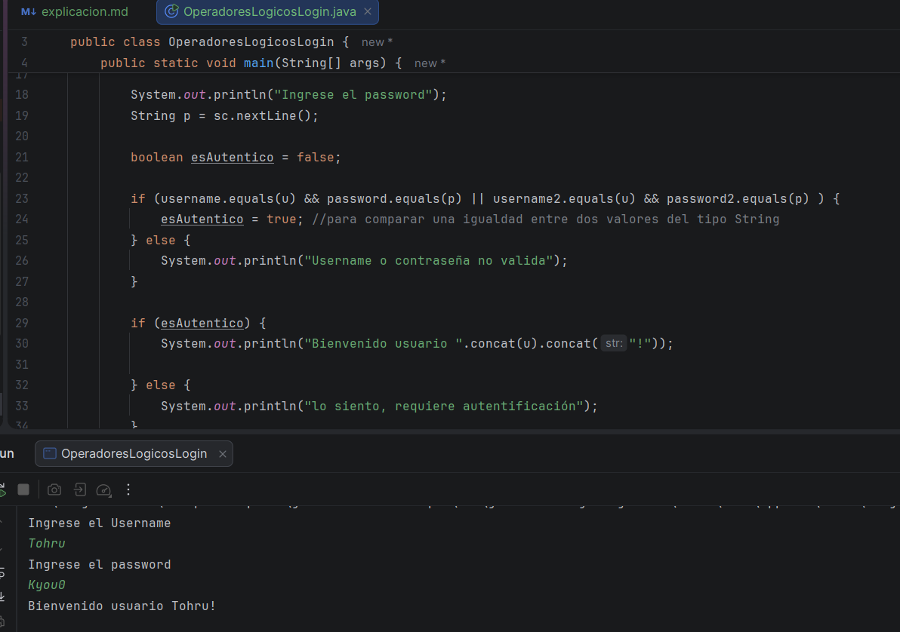

# Primer video:

En este video, estamos viendo un nuevo tipo de operador, el cual es el relacional, que se usa para comparár valores, donde
estos dan como resultado un número booleano (true or false), en este video, vimos algunos de los mas usados

# Segundo video: 

Ahora en este video, veremos lo que son los operadores lógicos, los cuales son OR, AND, NOT - los cuales se usan las tablas de verdad
en este ideo, veremos como los usaríamos con las diferentes variables, teniendo en que cuenta que AND da como resultado true 
si ambas expresiones son verdaderas, y OR si al menos una es verdadera, también que al momento de usar un paréntesis, se le da 
prioridad a esa expresión

# Tercer video: 

En este video aplicamos la precedencia de los operadores lógicos, en esta clase fue mas de la importancia de los paréntesis
y desarrollar el pensamiento lógico, pues hubo algunas expresiones, que no se esperaba su resultado y todo fue gracias a
los paréntesis o incluso a solo pensar en el posible resultado de los mismos 

# Cuarto video: 

En este video, vimos más ejemplos de los operadores lógicos, con un ejemplo de login, de un usuario con una contraseña, vimos 
como podrías usar los operadores lógicos en cualquier tarea de programador, como es el caso de que si el usuario o la contraseña
estuviera mal no sería válido, o cuando se usa el OR para poder tener más de un usuario en la lista 

