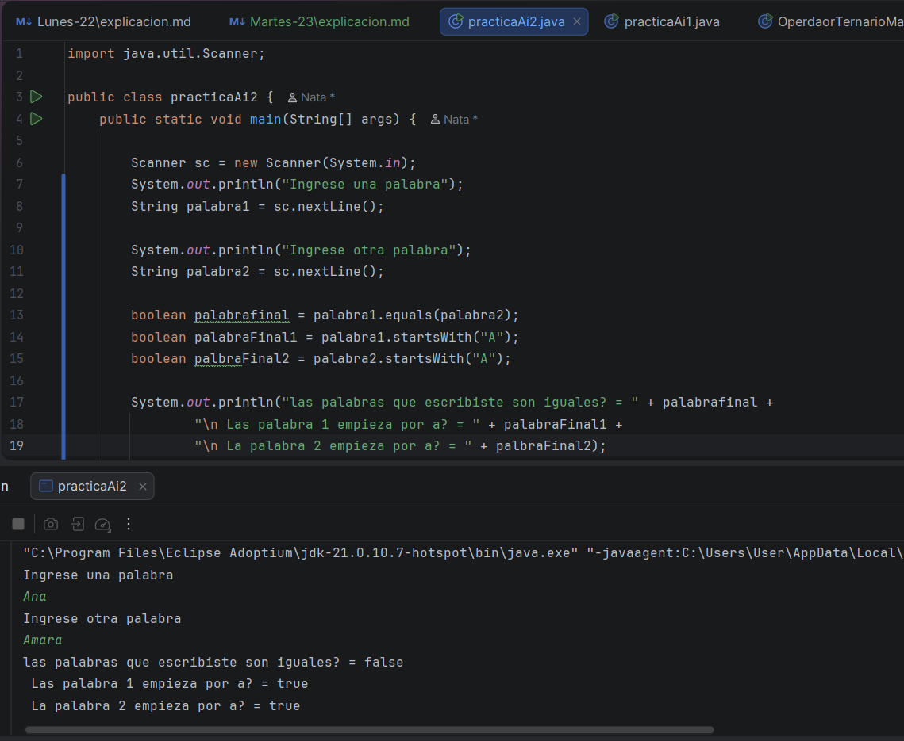
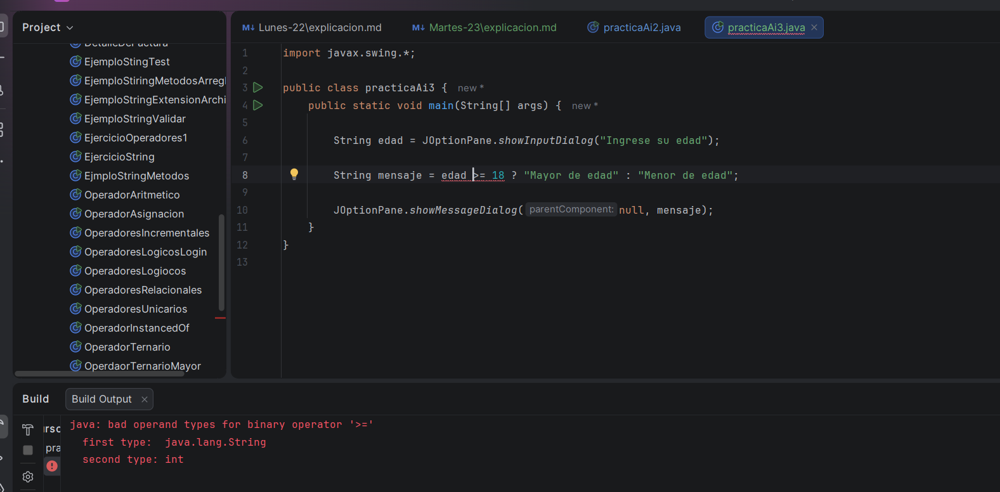
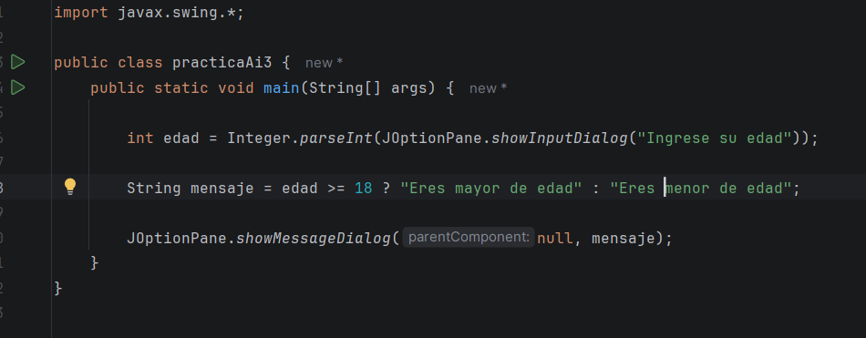
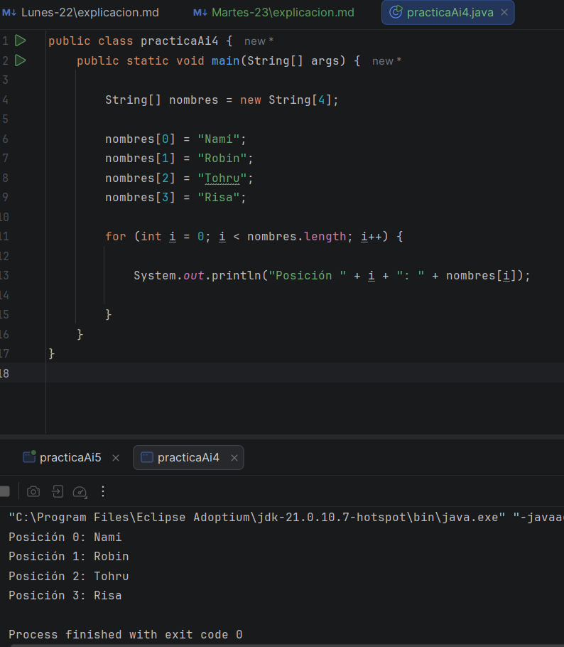
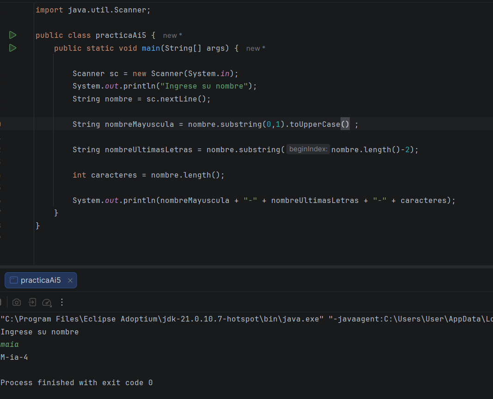

# Ejercicio #2 (Continuación)

En este día, continue con los ejercicios que se me habían dado el día de ayer, en este me pedían que compare el contenido 
de dos palabras pedidas al usuario, y luego observar si una de esas comenzaba con la letra "a" 

Asi me quedo el código final, la ai me dijo que estaba bastante bien, solo que ella me pidió que la primera palabra mirara 
si empezaba con "a", **no ambas** 

# Ejercicio #3

En este ejercicio, debo de pedirle al usuario que me dé su edad, y mandarle un mensaje diciendo que es o mayor de edad o menor
de edad, pero solo usando el operador ternario 

Asi estaba haciendo el ejercicio, pero algo que no entendí, fue el error que me dio, diciendo que el operador que estaba usando,
pues está mal, y que debe de ser int, lo cual no tiene sentido si el resultado será en String, por lo que considero, que debe 
de estar asi 

Bueno, pues en esto estaba, mirando como carajo arreglarlo, y bueno, use bien el operador ternario, lo único que me falto, es 
que, yo tengo entendido que siempre para usar JOption, se debe de hacer con string, pero al usar int, claramente no los puedo 
combinar, entonces debo de usar Interger para cambiarlo de string a int, quedándome asi el otro ejercicio

# Ejercicio #4

Bueno, en este ejercicio es usando for o if, pero primero debía de crear un arreglo y la verdad no tenía ni idea de que era eso,
por lo que investigue que era, y es como, un conjunto de variables, que con tan solo nombrar una, las nombro a todas, por 
lo que eso cree, luego debía de "recorrerlo", no tenía ni idea que quería decir con esta expresión, si soy sincera, asi que le 
pregunte que era eso,

Recorrer significa:

Ir pasando por cada elemento, uno por uno, para hacer algo con ellos. (eso depende del ejercicio)

por lo que asi me quedo el ejercicio 

# Ejercicio #5

Para este ejercicio, debía de pedir un nombre, y de ese nombre dar, la mayúscula de él, las dos últimas letras y la cantidad de 
caracteres del nombre, este si me quedo muy bien y lo hice un poco rápido porque ya lo había hecho antes uno parecido, pero 
la parte de la mayúscula no la había hecho, por lo que me costó solo un poco 

