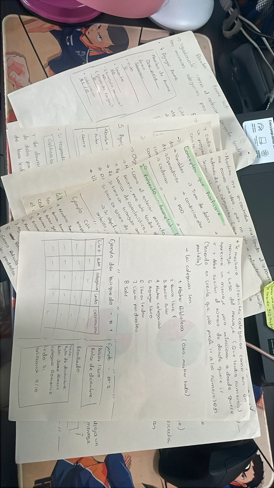

El dia de hoy, gracias a Dios me siento mucho mejor y con mas energia, no pude continuar con lo que queria hacer ayer, por que 
me sentia muy mal, asi que lo compensare el sabado, para no perder tanto tiempo 

Ahora como estaba haciendo ayer con mi proyecto, como quiero organizarlo los ejemplos y demas que yo misma diseñe: 

# Proyecto en Java y Python

## ¿Cuál es el objetivo del proyecto?

El objetivo principal es fortalecer conocimientos en programación mediante el desarrollo de dos aplicaciones relacionadas
con intereses personales. Cada proyecto será desarrollado en un lenguaje diferente:

* Biblioteca personal: Desarrollado en Python.  
* Anime list: Desarrollado en Java. 

## 1º Proyecto: Biblioteca Personal

En esta aplicación se podrán registrar todos los libros leídos y los que se espera leer.  El programa podrá organizarlos
por Nombre, Autor, categoría (Romance, fantasía, etc.) y calificación.  

Su objetivo es ser un programa que ayude a organizar futuras lecturas.  

### Ejemplos (Bocetos):

Al principio del programa, aparecerá un "índice" titulado "Mi biblioteca personal". Mostrará las diferentes categorías 
mediante un mensaje con números; luego, aparecerá un mensaje solicitando al usuario que seleccione a dónde quiere ir
escribiendo el número correspondiente (teniendo en cuenta que solo puede elegir los números en pantalla).

Las categorías son: 

1. Mostrar Biblioteca (mostrar todo).  
2. Buscar libro.  
3. Buscar Autor. 
4. Mostrar categorias.  
5. Agregar libro.  
6. Libros leídos.  
7. Libros pendientes.  
8. Salir.  

#### Ejemplo de Búsqueda:

Si se busca el libro "Antes de diciembre", el resultado mostraría la siguiente ficha:

* Título: Antes de diciembre. 
* Autor: Joana Marcus.  
* Categoría: Romance. 
* Leído: Si. 
* Calificación: 9/10.  

### Conceptos que practicaré (Python)

* Variables
* Operadores
* Cadenas
* Tipos de datos
* Condicionales
* Programación Orientada a Objetos (POO),
* Entrada de datos
* Colecciones e Interfaz gráfica. 

# 2º Proyecto: Anime List (Java)

Al igual que el proyecto anterior, es un catálogo personal, pero enfocado en Anime. 
Tendrá información básica de características pensadas en gustos personales, respondiendo a preguntas como: 
¿tiene un triángulo amoroso?, ¿es de peleas o comedia?, ¿tiene un grupo de amigos o es más individual?.

Su objetivo es el mismo del proyecto anterior: organizar futuros animes.  

## Ejemplo:

Tendrá su propio índice con las siguientes categorías:  

1. Mostrar Animelist
2. Buscar Anime
3. Buscar genero
4. Animes vistos
5. Animes pendientes
6. Animes Favoritos
7. Agregar Anime
8. Peliculas Anime 
9. Genero Pelicula
10. Peliculas pendientes
11. Peliculas favoritas
12. Agregar pelicula
13. Salir

#### Ejemplo de Búsqueda:

Si se busca "Boku no hero academia", el resultado mostraría:

* Nombre: My hero academia
* Género: shounen 
* Visto: Si
* Favorito: No
* Triángulo amoroso: No.
* Grupo de amigos: Si
* Calificación: 8.5/10

#### Ideas Adicionales y Mejoras

Se pensó en agregar detalles de categorías más específicas (shoujo, seinen, shounen),
estudios de animación y actores de voz (Seiyuus). Sin embargo, por ser demasiada información,
se decidió que esta idea se retomará cuando el proyecto esté más avanzado.  

En el formato "Agregar", se planea implementar una validación: si se introduce un anime o libro que ya estaba 
en la lista, el programa debe notarlo, enviar un mensaje al usuario avisándole y mostrarle la "ficha" de lo que
buscaba.  

## Conceptos que practicaré (Java)

Variables
Operadores
Arreglos
Tipos de datos
Scanner
Programación Orientada a Objetos (POO)
Condicionales
Ciclos e Interfaz gráfica

## ¿Dónde y cómo trabajaré los proyectos?

Se desarrollarán en editores de código: Visual Studio Code para Python 
IntelliJ para Java. 

#### Control de versiones:

Cada vez que haya progreso, los proyectos se registrarán en **GitHub.**, allí contarán con la explicación del proyecto y sus respectivos códigos. 

#### ¿Cuándo pienso hacerlo? 

La idea es dedicar al menos dos horas a la semana a cada proyecto (o una hora dependiendo de los horarios), 
utilizando el tiempo destinado para el curso de Java para practicar.  

## Objetivo final del proyecto:

* Mejorar la lógica de programación
* Aprender a desarrollar proyectos
* Reforzar Java y Python mediante la práctica
* Entender las diferencias entre ambos lenguajes
* Utilizar Git y GitHub como herramientas

Evidencia que lo hice a mano 

Ahora, lo que terminaré haciendo por hoy, son los proyectos, creando los repositorios y tener en cada uno de los editores 
de código 

Biblioteca personal: https://github.com/NataliaLozano56/Biblioteca-personal--py.git
AnimeList: (este lo voy a enviar luego, por que voy a crear un nuevo proyecto en este editor de codigo)