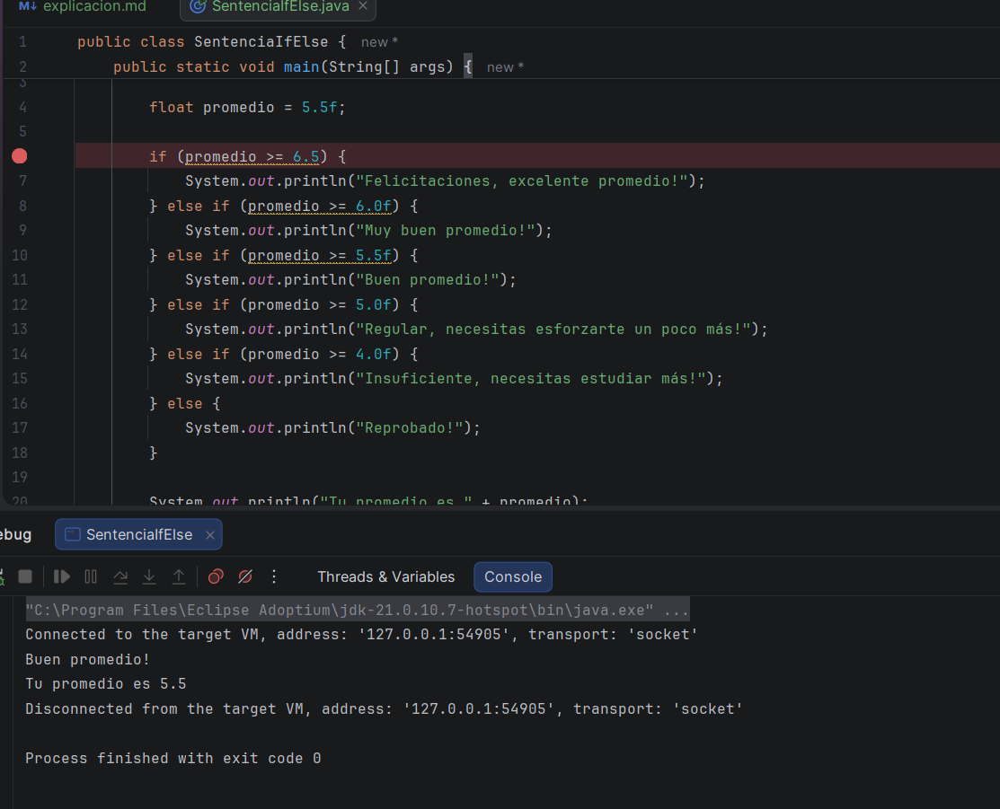
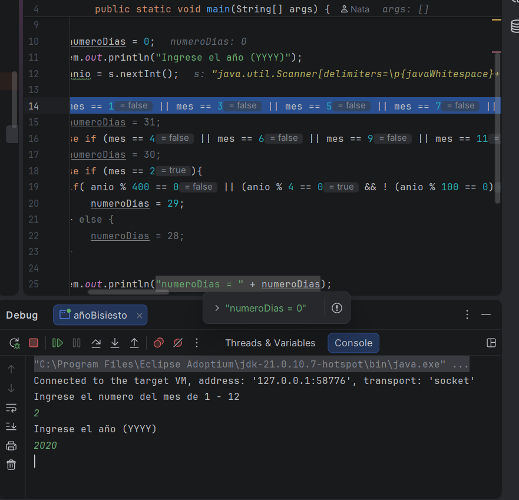
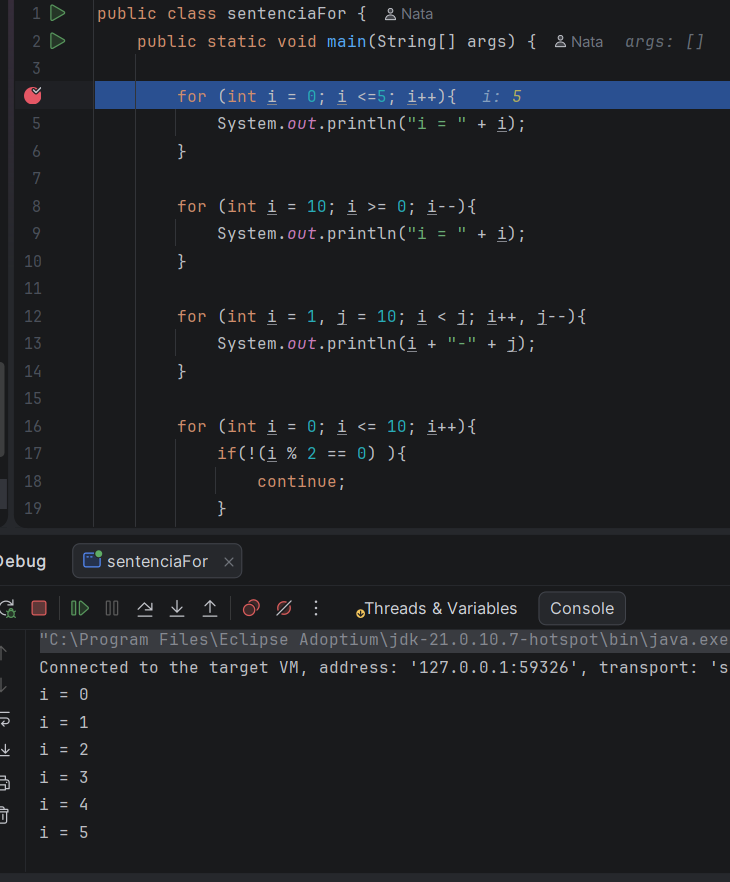
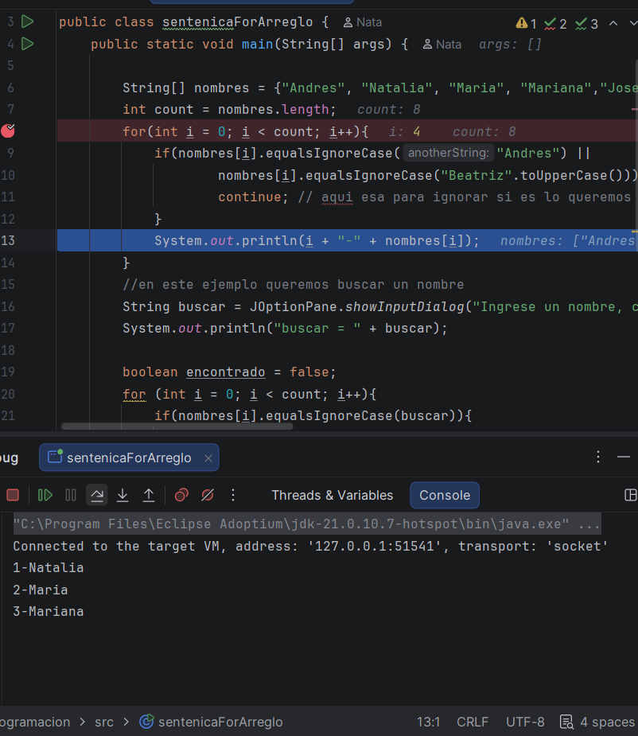
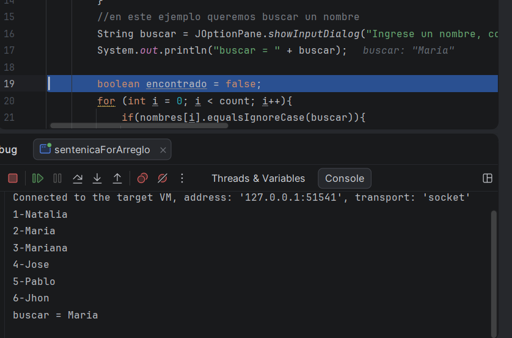
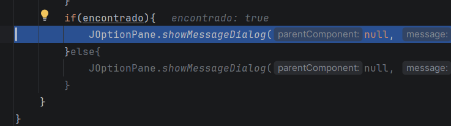

El día de hoy, tendremos dos clases un poco largas, además que ayer olvidé hacer mi respectivo resumen de las etiquetas
aunque se que no es mucho, se que es muy necesario 

## Video # 1

Vamos a ejecutar los ejemplos uqe ya hemos viso antes, pero ahora en modo depuración, un modo que ya habíamos visto en 
anteriores clases, pero tuve un problema, el profe eligió un código que no tengo idea porque no lo tenía, y es que algo que 
él suele hacer es que en la misma sentencia de donde está un código le da por cambiarlo, y yo tan bonita, pues no lo copio y pego 
y cambio de hoja, sino que sigo en la misma y bueno eso fue lo que paso, afortunadamente no era un código muy largo y eso 
ayudo mucho a que pueda volver a escribirlo, uno vez escrito volví a la clase 

Aquí observamos en una línea de código como el debug con el step over este no se ejecuta si la afirmación es falsa, hasta que encuentre
la correcta, cuando eso ocurra se va a ejecutar en consola 

Luego elegido otro ejemplo que gracias a Dios ese si lo tenía 

aquí podemos observar como el programa, va analizando si las sentencias o número que les estoy dando son false o true, y asi hasta que yo le diga a la consola que termine el proceso
este fue el mismo procedimiento con dos ejercicios más, donde más explicaba y detallaba la manera en la que el progrmaca trabaja 
para depurar en el if e if else 

## Video # 2 

Muy bien en esta clase continuamos con la depuración del código, pero esta vez diferentes sentencias, lo haremos el for 
y el for each, y otra vez tenía el mismo problema, Dios mio, horrible, entonces otra vez me toco escribirlo que me faltaba,
no era mucho eso es algo bueno también 

Bueno continuamos con la clase, y va imprimiendo igual, pero la diferencia del for, es que debemos de ejecutar línea por linea 
hasta que termine de repetir el ciclo que ya estaba dado en su sentencia 

Ya luego continuamos con otro ejemplo, pero este caso, el de los arreglos, para observar la diferencia a la hora de ejecutar 
los arreglos 

Igualmente evalúa cada línea de código, hasta que encuentre la que necesita 

Incluso también al buscar el nombre, se pone como un comentario que debe de buscar a maria, y asi lo hace, hast que termina 
de ejecutar el código 

También dice cuando encontró el nombre, en este caso, escogí uno de la lista, por lo que es true, lego me lanza el mensaje 
de que fue encontrado y termina 

Muy bien en est caos, croe que me demore más de lo que pensé, pero bueno al menos logre con el objetivo que es lo importante 
para luego mañana comenzar a con el ejercicio, y luego, comenzamos nuevo modulo

