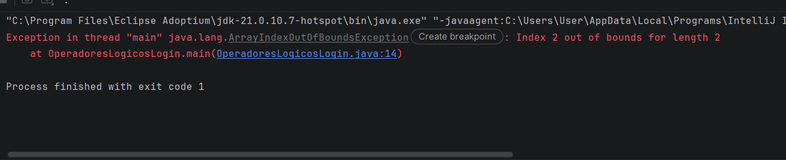
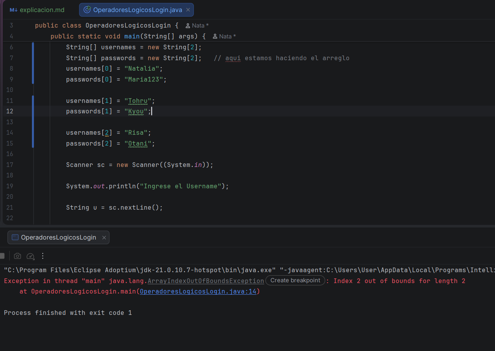
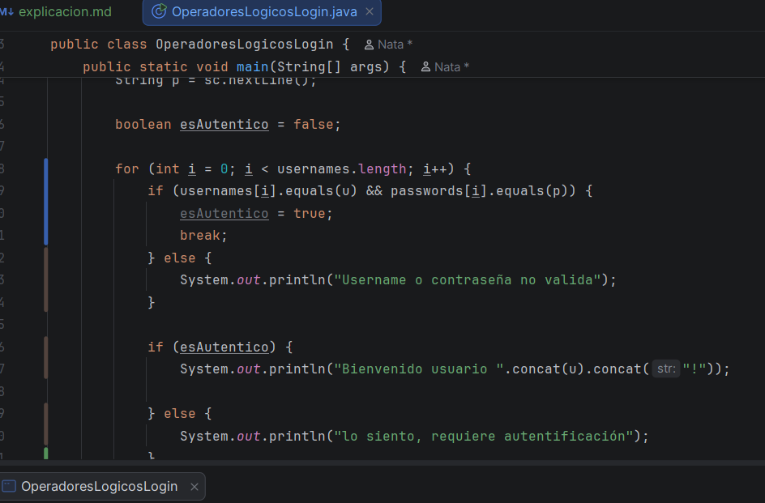
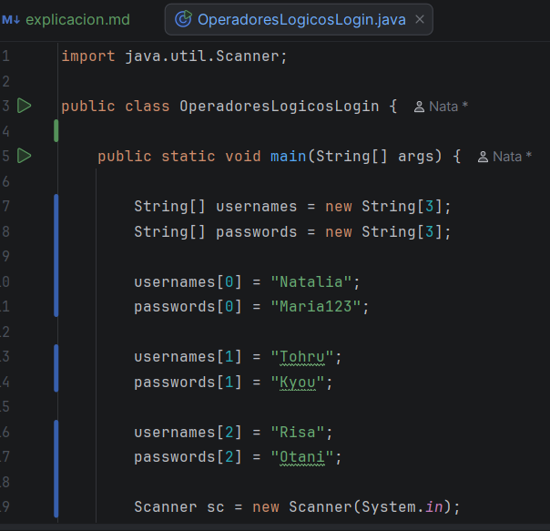
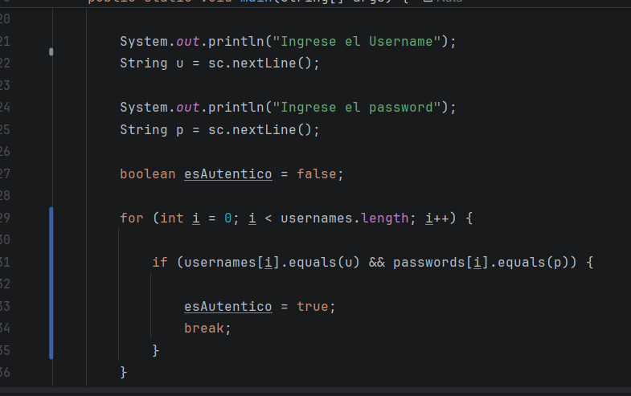
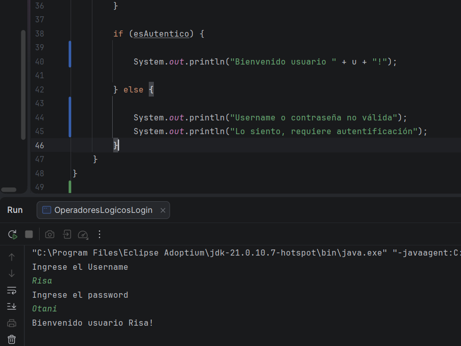

# Primer video:

Esta clase vimos el mismo ejemplo de la clase anterior donde usamos el login, pero esta vez usando los arreglos, lo cuales 
son nos permite guardar objetos, o almacenar variables o tipos de datos, luego estábamos haciendo el código y me dio un error 
el problema es que revisando el error no era algo de sintaxis, el error de la imagen, pensé que era de sintaxis, porque decía 
main 

asi que me toco investigar y ver que era ese problema y resolverlo, pero aunque buscara, no tenía ni idea que carajo era,
había bastantes páginas de foros donde las personas preguntan por los errores en sus códigos, EL PROBLEMA ES QUE ESTÁN EN INGLÉS 
ES COMO VER OTRO ESTUPIDO IDIOMA, Dios no se porque me parece tan raro, pero de verdad era dificil de entender y me demore
mucho más de lo esperado para resolver ESOS problemas porque no fue más de uno, me toco volver a ver el video

Este es al antes: 

Este es el después:

En esta clase si me demore más de lo que esperaba, pero no fue tan malo, además que estaba cansada del ejercicio físico de ese día 
y estaba cansada, por lo que me tome un siesta 

