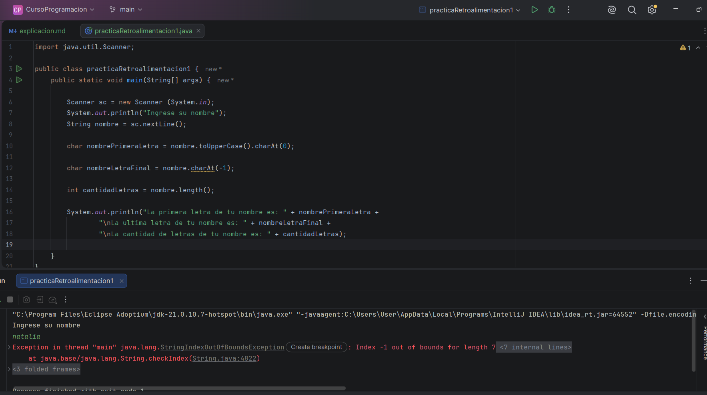
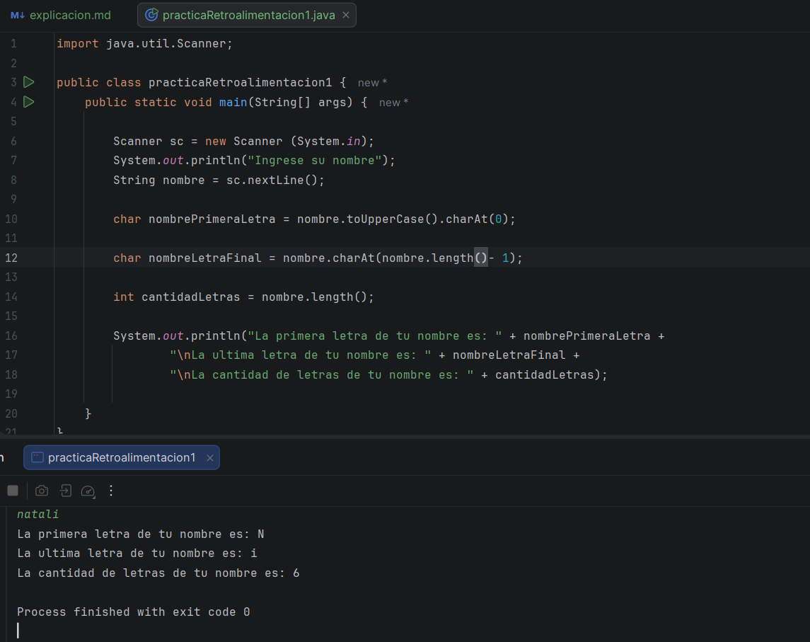

El día de hoy fue más de retroalimentación, para ya mañana continuar a los ejercicios del curso para no quedarme, en este caso, 
la retroalimentación que la ai me dio de los ejercicios que me dio, en mi opinion, realmente el que más se me complica es 
el uso del for, porque aún no sé muy bien su función, siempre me he perdido a la hora de usarlo, pero aquí está lo que me dijo: 

## Tus fortalezas
1. Aprendes muy rápido

Esto es algo que he notado varias veces.

Cometes un error, te lo explico y rara vez lo vuelves a cometer.

Ejemplo:

Antes:

substring(4,7)

Ahora:

substring(nombre.length()-2)

Eso demuestra que entiendes la lógica detrás del método y no solo lo memorizas.

Calificación: 9.5/10

## 2. Ya entiendes bastante bien los String

Diría que este es tu punto más fuerte.

Dominas:

✅ length()

✅ substring()

✅ charAt()

✅ toUpperCase()

✅ toLowerCase()

✅ equals()

✅ startsWith()

Y empiezas a entender cuándo usar cada uno.

Calificación: 9/10

## 3. Tu sintaxis es bastante buena

Rara vez escribes cosas como:

Llaves mal puestas.
Paréntesis sin cerrar.
Variables inexistentes.

Tus errores suelen ser de lógica.

Y eso es buena señal.

Calificación: 8.5/10

# 🟡 Cosas que debes mejorar

### 1. Traducir el enunciado a pasos

Este es tu principal punto a mejorar.

Por ejemplo, en vez de lanzarte a programar, acostúmbrate a escribir esto:

Ejercicio:
Pedir un nombre.
Mostrar la primera letra.
Mostrar los últimos dos caracteres.
Mostrar la longitud.

Antes de escribir código.

Haz una mini lista:

1. Pedir el nombre.
2. Obtener la primera letra.
3. Obtener los últimos dos caracteres.
4. Obtener la longitud.
5. Mostrar el resultado.

Esto te ayudará muchísimo.

Calificación: 7/10

### 2. No intentes usar todo lo que sabes en un mismo ejercicio

Esto me pasó mucho con el primer ejercicio.

A veces piensas:

"Conozco estos métodos, voy a usarlos todos."

Pero un programador piensa:

"¿Cuál necesito realmente?"

## 3. Debes practicar for

Aquí sí eres principiante todavía, y no pasa nada.

Pero quiero que entiendas algo:

No te cuesta el for, te cuesta la idea de repetir procesos automáticamente.

Eso se arregla con práctica.

Calificación: 6.5/10

Teniendo en cuenta lo que él me dijo, me pude dedicar haciendo ejercicios de lo que más mal me está llenado, y asi se lo pedí:

Sí. Y como ya vi tus puntos fuertes y débiles, no te voy a dar ejercicios aleatorios. Te voy a dar ejercicios diseñados específicamente para mejorar:

Traducir enunciados a pasos lógicos.
Usar for con naturalidad.
Entender arreglos.
Elegir el método correcto en lugar de usar muchos.

# 📝 Nivel 1: Lógica (sin for)

### Ejercicio 1

Pide un nombre.

Muestra:

Primera letra: N
Última letra: a
Cantidad de letras: 7

Métodos a practicar:

charAt()
length()

### Ejercicio 2

Pide una palabra.

Indica si:

Empieza con "A"
Contiene la letra "e"

Ejemplo:

Empieza con A: true
Contiene e: false

Métodos:

startsWith()
contains()

# 📝 Nivel 2: Elegir el método correcto

### Ejercicio 3

Pide una palabra.

Reemplaza todas las letras "a" por "*".

Ejemplo:

casa

Resultado:

c*s*

Método:

replace()

### Ejercicio 4

Pide dos palabras.

Indica:

Si son iguales.
Cuál va primero alfabéticamente.

Métodos:

equals()
compareTo()

# 📝 Nivel 3: Introducción al for

### Ejercicio 5

Imprime:

1
2
3
4
5

usando un for.

### Ejercicio 6

Imprime:

5
4
3
2
1

usando un for.

Aquí empezarás a entender que el contador no siempre aumenta.

### Ejercicio 7

Pide un número.

Si escribe:

4

Debe mostrar:

Hola
Hola
Hola
Hola

Aquí entenderás que el for sirve para repetir acciones.

# 📝 Nivel 4: Arreglos

### Ejercicio 8

Crea:

String[] animes = {
"Iruma-kun",
"Horimiya",
"Kaguya-sama",
"Fruits Basket"
};

Imprime solamente:

Iruma-kun
Horimiya
Kaguya-sama
Fruits Basket

Sin for.

### Ejercicio 9

Ahora imprime lo mismo, pero usando un for.

Aquí es donde normalmente ocurre el "clic".

### Ejercicio 10

Usando el arreglo anterior, imprime:

Anime 1: Iruma-kun
Anime 2: Horimiya
Anime 3: Kaguya-sama
Anime 4: Fruits Basket

# 📝 Nivel 5: For + String (muy importante)

### Ejercicio 11 ⭐

Crea un arreglo de nombres.

String[] nombres = {
"Natalia",
"Pablo",
"Risa",
"Tohru"
};

Recórrelo e imprime:

N
P
R
T

Pista:

charAt(0)

### Ejercicio 12 ⭐⭐

Con el mismo arreglo imprime:

Natalia -> 7 letras
Pablo -> 5 letras
Risa -> 4 letras
Tohru -> 5 letras

Pista:

()

# Ejercicio #1 

Algo que noto siempre de estos ejercicios, es que hya veces en las que usan charAt(), pero al usarla, simplemente no me deja 
usarla me marca como error,

String nombrePrimeraLetra = nombre.toUpperCase().charAt(0);

Bueno, me puse a buscar en otras páginas a ver si les pasaba lo mismo, y me di cuenta la Estupidez que estaba haciendo, 
Estaba USANDO CHAR Y ESO NO ES UN STRING, si quiero que me funcione debía de usar la variable char, o usar el substring que 
siempre he usado, por lo que asi em estaba quedando el código

Pero me apareció ese error, que sinceramente no tenía idea de que era, mi suposición es que era del char, para la última
letra, pues suelo usar el subString, pero esta vez decidí usar el charAt () 

Y otra vez, mi estupidez es increíble, pero al menos mi suposición era correcta, otra vez no sabía como usar el char y lo estaba
usando mal, lo cual me parece increíble, pero bueno, debía de usar el leght, porque no reconoce él -1 que puse en el char, 
pero como lenght es el que sabe la cantidad de caracteres 

Hoy no pude hacer mucho, porque me tocaba salir, a hacer una vuelta, de lo que te comentaba que se dañó la impresora, entonces
me tocaba llevarla y mirar que le hicieron, y asi, entonces por eso fue jejeje, pero siempre comprometida y viendo en que estoy 
fallando 
