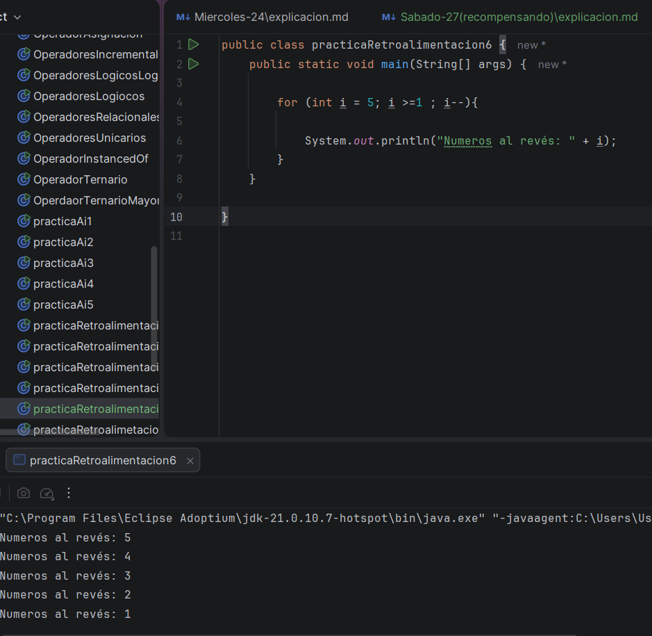
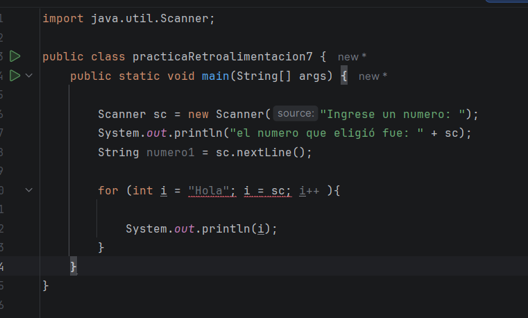
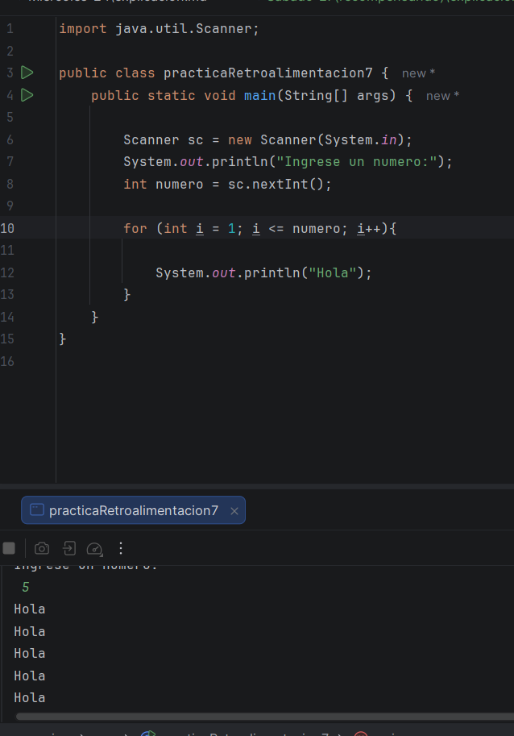

Bueno, el día de hoy fue más de recompensar lo que no pude hacer el jueves, pero este día normalmente hacemos aseos y demás, 
entonces no es muy comodo escribir siquiera aqui, pero haciendo mi mayor esfuerzo.

Teniendo en cuenta que ayer, estuve viendo que no sé cómo usar el for, es porque simplemente no sé cómo funciona, que es lo que hace 
cuál es el objetivo del for, y si no tengo esa base, pues mucho menos voy a poder hacerlo, asi que el dia de hoy me dedique 
a buscar ino del for, como funciona, que hace y algunos ejemplos para tener una base 

Encontré esta página, que me daba casi todo lo que necesitaba, y lo demás lo busque en otras:
https://www.programarya.com/Cursos/Java/Ciclos/Ciclo-for

De ahi, saque todos mis resúmenes que tengo aparte de esta documentación, donde tengo de los demás temas que ya había visto 

(Aquí dejo la página donde lo tengo por si acaso:https://www.notion.so/Curso-de-Java-3728610afed880ea8721c94ee86f927e?source=copy_link )

Un pequeño resumen es que for es una estructura que sirve para repetir una acción un número determinado de veces.
Este tiene una estructura, junto con diferentes ejemplos para entender la i, y como sta puede incrementar y decrementar 

# Ejercicio # 6

Continuando con los ejercicios, debo de hacer lo contrario al ejercicio 5, que cuenta de 5, pero para atrás y ya entendiendo, 
como funciona, el código me queda asi: 

Al principio, no me quería imprimir el i, y no tenía ni idea porque, revisando los ejemplos, es que se me olvido por completo colocar 
el corchete {}, entonces por eso no me daba, pero al menos supe que paso y pude cambiarlo 

# Ejercicio # 7 

Muy bien, ahora en este ejercicio, tenía que pedir cualquier número, y dependiendo del número que eligiera, se imprimiría 
esa cantidad con uno hola, es decir, si ponía dos, se debía imprimir dos veces hola, asi que asi hice el código:

Este fue mi primer intento, intente seguir la estructura como creía que era, pero como supuse, me salía un error, la verdad
no tenía una idea de como hacerlo, asi intente guiarme por la estructura, tal vez eso me iba a ayudar, pero bueno, como ya no
sabía como continuar decidí buscar una segunda opción en los ejemplos, y por fin, lo logre 

