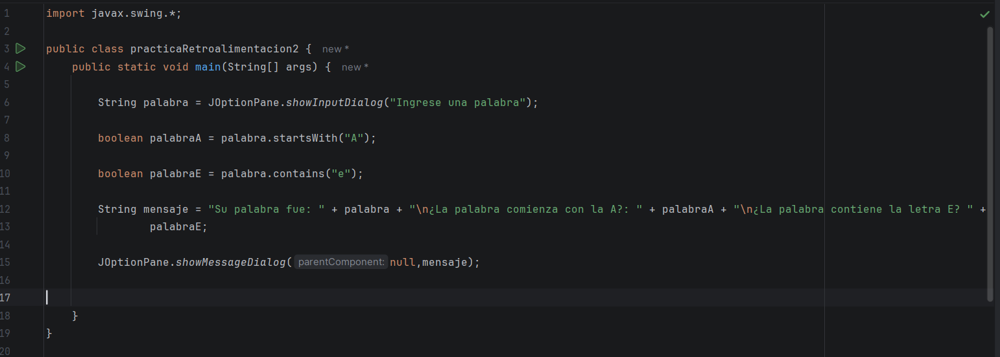
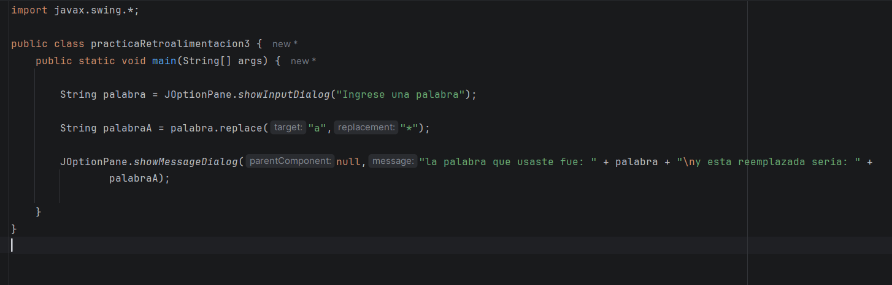
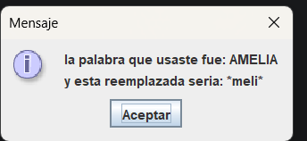
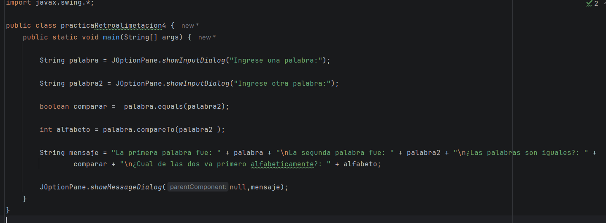
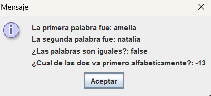
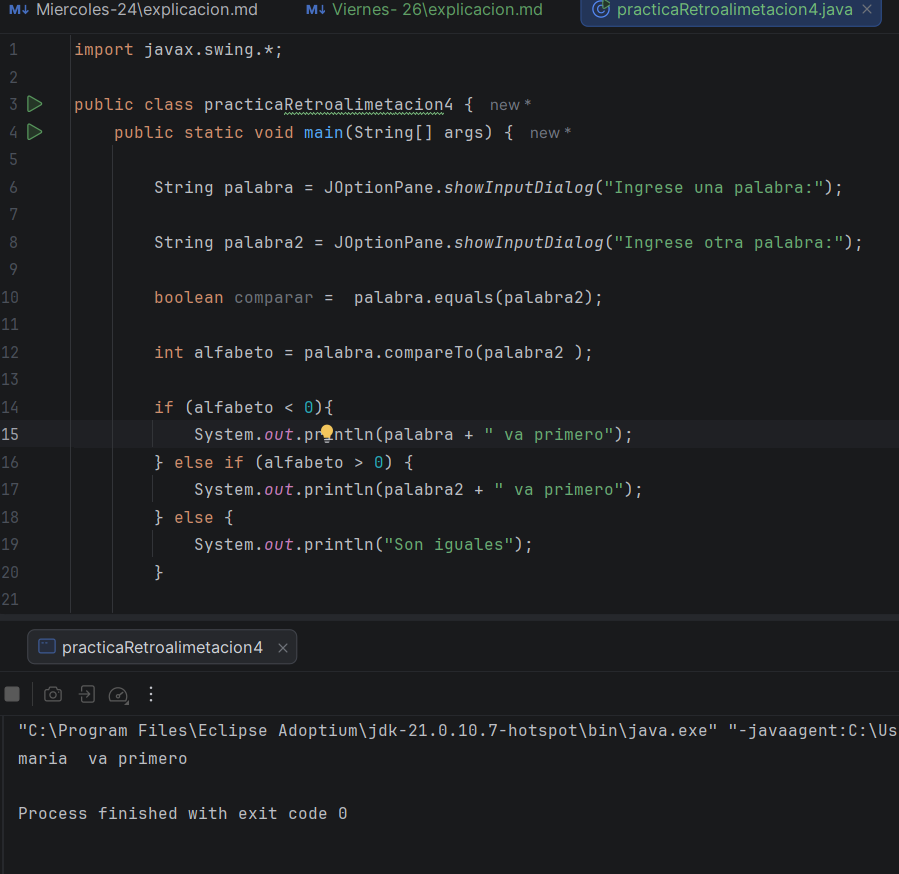
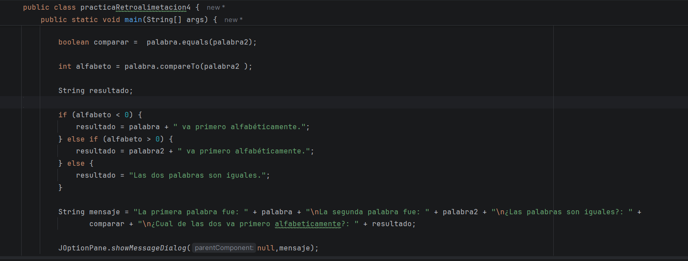
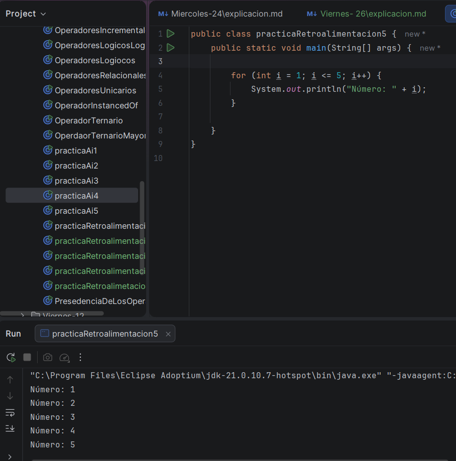

Bueno, el día de hoy continuo con los ejercicios, que me dio, para reforzar en lo que me fue mal, al menos ya se maso menos
como usar el char, y el leght de mejor forma, como sea, continuaré con los otros ejercicios

# Ejercicio # 2

Bueno, en este ejercicio debo de pedir una palabra, y decir en un mensaje, si esta empieza con la A y si contiene una "e

Aquí, ella me dijo que he mejorado a la hora de usar metodos, y que estoy usando solo los necesarios en cada caso, pero simme corrije algo
y es que, al colocar, la mayusucla, pues si el usuario decide, escribir una palabra con la letra minuscula, pero siendo correcta 
lo marcará como error, por eso me dijo que mejorara solo esa parte 

**boolean palabraA = palabra.toUpperCase().startsWith("A");
boolean palabraE = palabra.toLowerCase().contains("e");**

Y asi lo mejoré, para que cualquier palabra pudiera pasar.

# Ejercicio # 3

Me pide nuevamente pedir una palabra, pero en este caso, usando el método replace, para las letras "a" por *

No fue muy complicado, pero ahora, en este caso, intente volver a usar el mismo método, es decir, para que me funcione si se 
coloca mayúsculas o minúsculas, pero aunque lo intentara con el nuevo método que aprendí, no funcionaba

Luego vi el problema, yo estaba usando Uppercase y no se me paso por la cabeza usar el Lowercase, por eso no me funcionaba 
, pero ya luego lo arregle y mejore el código 

**String palabraA = palabra.toLowerCase().replace("a", "*");**

# Ejercicio # 4 

Para el ejercicio cuatro, también debo de pedir palabras, pero esta vez, debo de comparar si son iguales, y quien va primero 
alfabéticamente, sinceramente, la primera podía hacerla sin problema, pero quien va primero alfabéticamente, no tengo ni idea,
en el código, lo hice como creía, tengo entendido que compareTo, da un int, por solo puse con esa variable, pero realmente no sé 
si estaba bien 

Bueno, después de la retroalimentación que me da, sé usarlo, lo que no se es interpretarlo, lo cual es mucho más importante 
lo bueno es que ya entendí como usarlo, pero, al resolver el ejercicio, yo debo de decir cuál de los dos es primero y no lo hice,
realmente solo deje que se pusiera el número y ya, pero ahora que entendí como funciona, debo de cambiarlo, usando el if, 
casi no lo uso, pero aquí está como lo hice 

Pero por no me funcionaba, no aparecía en el mensaje, solo aparecía en la terminal, por lo que me puse a investigar como se hacía 
pensaba que era diferente porque usaba JOption, lo cual cambiaba todo, pero solo era cambiar el printl, sí, no lo había pensado, pero
bueno, de la práctica se aprende 

# Ejercicio # 5 

En este ejercicio, tenía imprimir con for, puede que sonara sencillo, pero la verdad es que yo he usado muy poco el for, 
y no sé cómo usarlo, pero quería intentarlo, asi que aquí está mi intento # 1 

**for (int i = 1; i = 5;);**

Intento totalmente fallido, no tenía idea de como carajo empezar ni continuar, AAA ME TOCO MIRAR COMO HACER UN FOR JAJAJA 
Asi que, en mis días de búsqueda, nuevamente mirando como resolver este caso, y bueno, no era tan difícil, pero en mi defensa, 
yo no sabía como usarlo, como sea aquí está el ejercicio:

       

