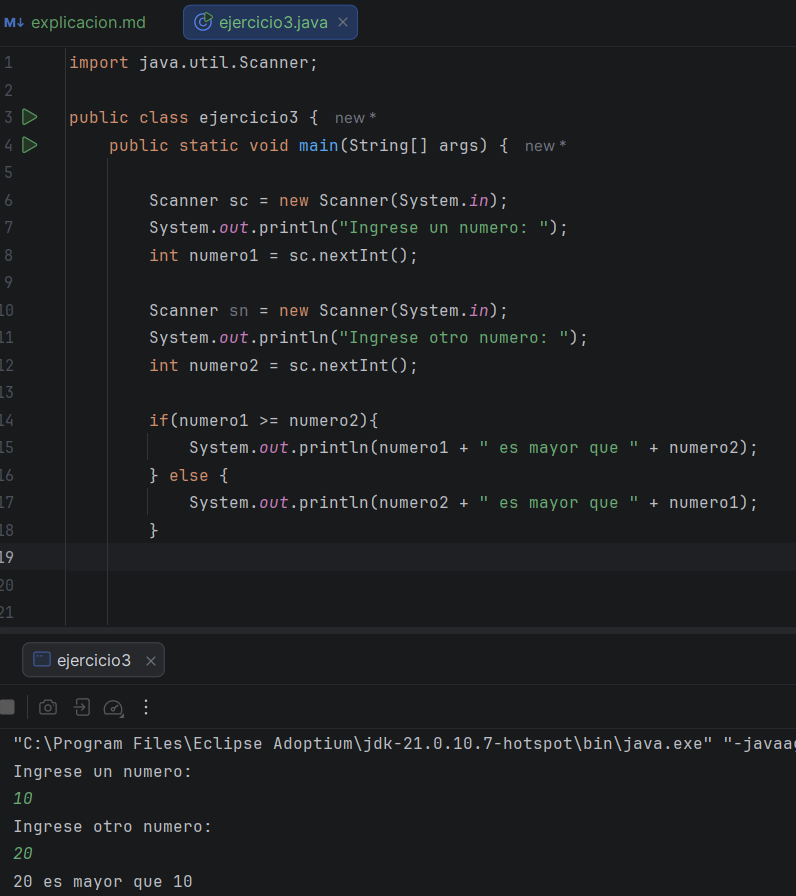
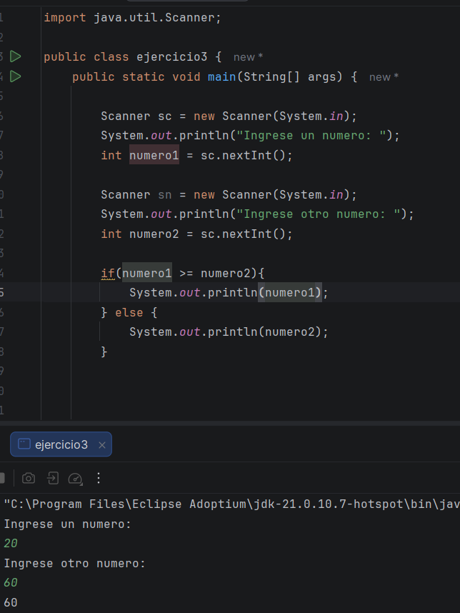
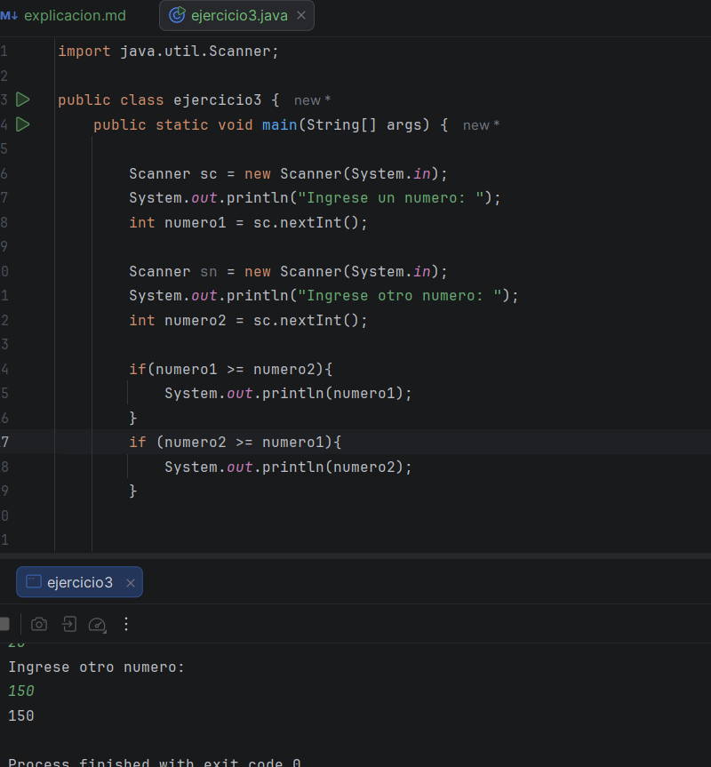
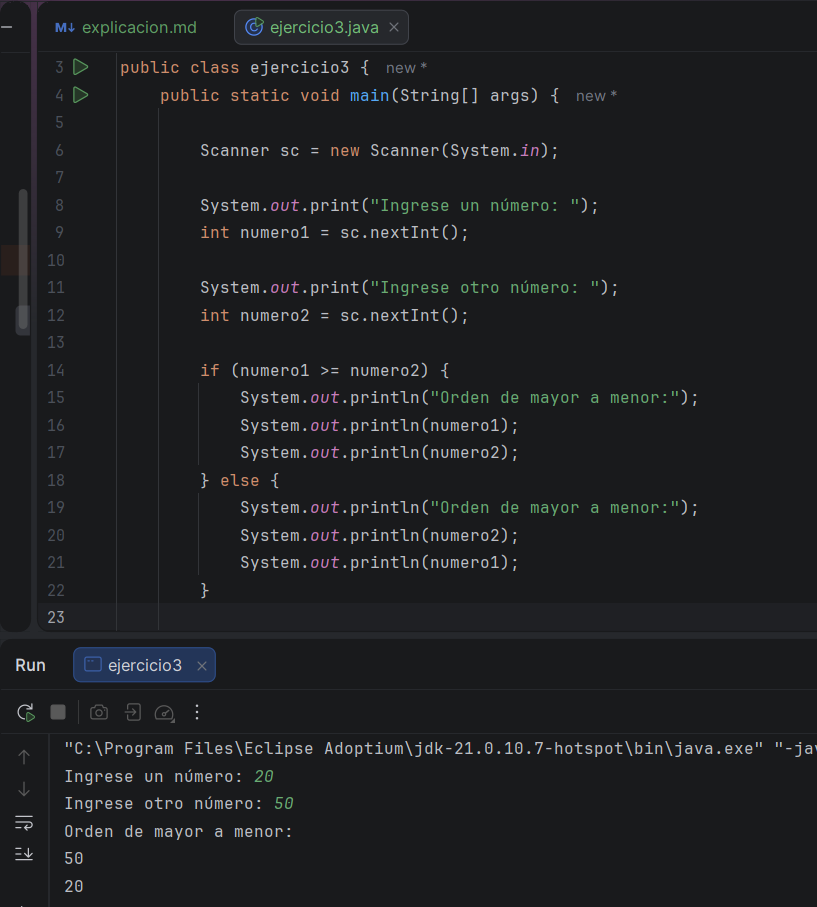
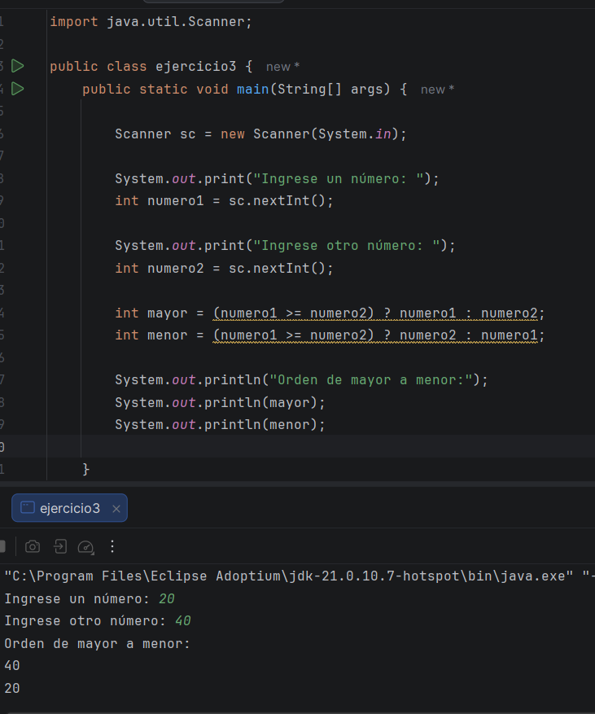

Muy bien, el día de hoy, siendo un dia importante para Colombia y el mundo, de verdad ando superansiosa, con mucho miedito,
pero bueno al menos es un partido y nada mas de otro mundo, continuando con mi curso el día de hoy hago el último ejercicio, 
que me habían pedido hacer 

## Ejercicio # 3

Las instrucciones son: 

El desafío es un programa que pida dos números y los muestre ordenados de mayor a menor.

Podría ser utilizando operador ternario.

Es una descripción bastante sencilla y espero que no sea muy complicado, teniendo en cuenta mi estudio de ayer para el uso
de if, tengo entendido que este ejercicio, se resolvería igualmente en este ciclo 

asi que voy a intentar primero pidiendo los números al usuario 

###  Mi primer intento 

Parecer mi primer intento, la verdad me encanto, ya que no me equivoque casi, solo que me pedían el orden, no decir quien 
era mayor y eso fue lo malo que hice, y creo que en la parte de scanner no lo hice bien tampoco, pero bueno, al menos lo intente,
asi que aquí está mi otro intento.

jeje, bueno, otra vez medio la embarre, solo falta que me imprima el otro, pero, ya lo he intentado de otra manera y no lo logre

Asi que revisando que estaba haciendo mal, que ya lo descubrí, lo que pasaba es que estaba imprimiendo mal, no necesitaba tantos if,
con uno bastaba, asi que asi quedo: 

y también decía que lo hiciera con el operador ternario, que no me habia dado cuenta, ese es mucho mas sencillo, siendo 
asi el ejemplo 

y eso fue todo por hoy 
