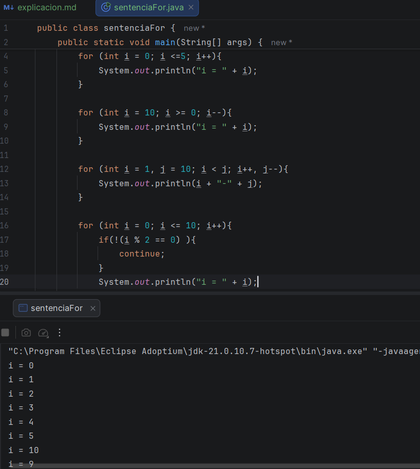

Muy bien, el dia de hoy, continuo con mis trabajos que debo de hacer en mi curso, en este caso, ya empezamos con un tema 
diferente y dejamos el switch case, empezamos con flujos de control de bucles

## Video # 1

En esta clase lo que vimos es un video de introducción de los flujos de control de bucles,

* **While**, el cual ejecuta un bloque de código mientras se cumpla la función, 
* **Do while** , similar al while, con la excepción de que la expression que se evalúa al final del bucle, se ejecuta al menos una vez
* **For**, Se utliza cuando se conocen los limites del bucle 

teniendo en cuenta que no tenia aun mi resumen de while y do while, me dedique primero que todo en mi importante resumen, ya
que suele ayudarme mucho cuando necesito hacer ejercicios 

## Video # 2

Aquí vemos ya una clase completa de for, y como usarlo en las diferentes maneras, para que sea mucho mas sencillo, debo de 
aclarar que use diferentes maneras del for, asi que este es el código que usamos, claramente esta clase fue como la primera 
en la que vimos más a fondo el for, enseñándonos la estructura y algunos ejemplos de cuando incrementa o decrementa, además 
de qye este puede ser usado también con un if y sus condicionales 

Claramente, este video fue más largo de lo que es natural, y también me demore haciendo los diferentes resúmenes necesarios, 
pero teniendo eso en cuenta, por eso se ve poquito y casi no hice nada, pero no es cierto si hice mis horas habituales 