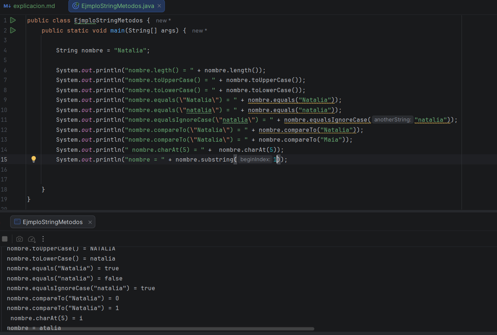
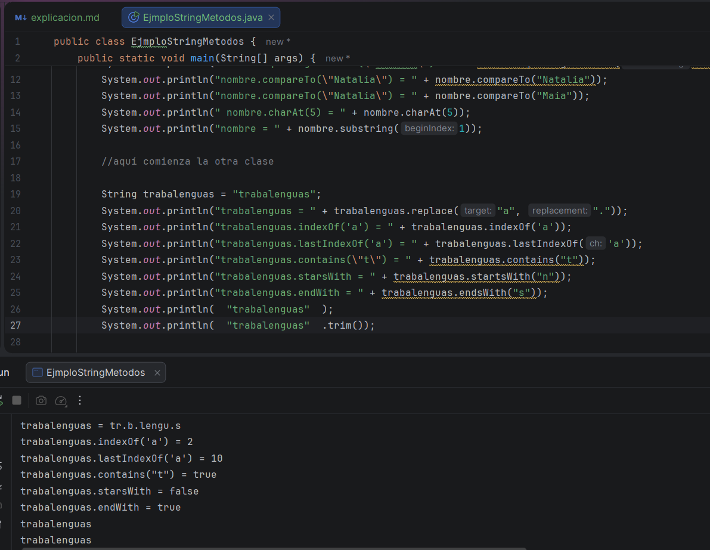
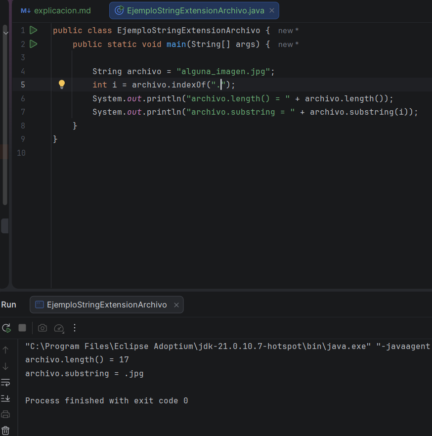
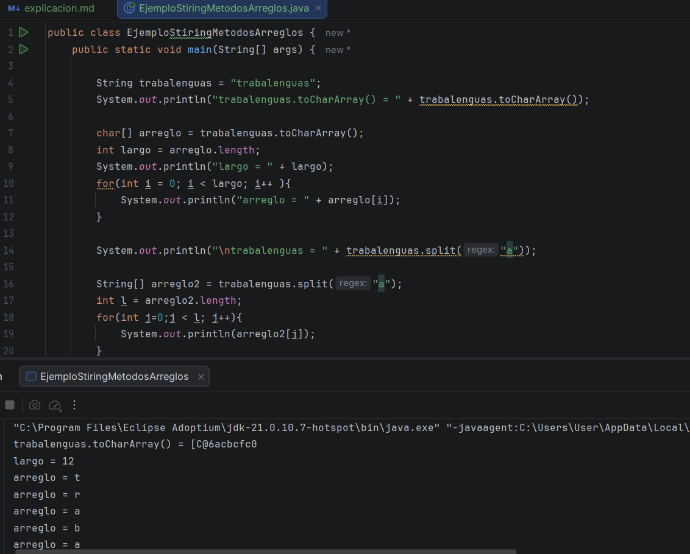
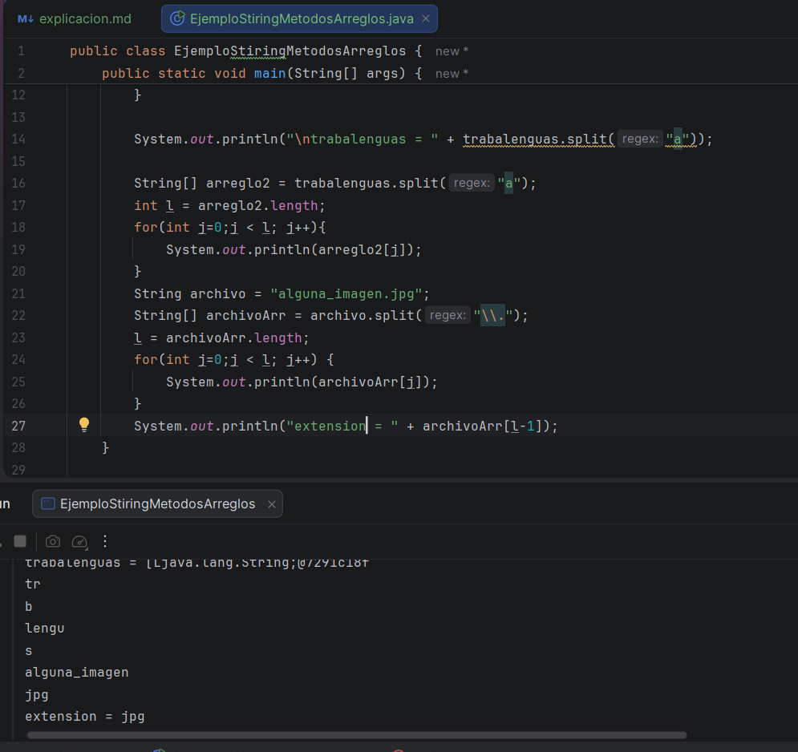

# Primer video: 

En esta clase, vimos los métodos más importantes de la clase String:
* **.length :** este es para saber el largo de la cadena.
* **toUpperCase :** para convertir en mayúscula 
* **toLowerCase :** para convertir en minúscula
* **equals :** para comparar el nivel de valor, en donde la mayúscula hace un papel importante, por lo que el ignore case de 
este ayuda a ignorar la mayúscula.
* **compareTo :** sirve para comparar caracteres, para validar si los dos valores son iguales, si da 0 es porque lo son.
* **charAt :** es como convertir un String en caracteres, tu le das un numero, de las cantidad de letras de la variable y
y el te arroja la letra que esta en la posición de ese número.
* **subString :** en este obtenemos parte del string o un fragmento, dependiendo de lo que tú le pidas 

# Segundo video: 

Es la parte dos del video anterior, por lo que continuamos viendo métodos de String:
* **replace:** es para reemplazar algún carácter de la variable.
* **IndexOf :** este permite saber la posición de la variable dentro del String, y si lo encuentra el resultado lo toma 
como valor, y con "last" devuelve la posición (índice) de la última aparición de un carácter o subcadena dentro de una
cadena de texto, y si no lo encuentra, da como resultado un número negativo
* **contains**: puede decirte si contiene una letra o una palabra de la variable, esta te arroja true o false 
* **StartsWith :** Es casi igual, te dice como comienza la variable, puede ser una letra o una palabra, y tenemos EndWith,
te dice con qué letra o palabra termina
* **trim():** es para quitar los espacios innecesarios
  **(nota: no sé si es por la version de mi java, pero cuando use ese mismo método con los espacios, la consola no me 
arrojo los espacios, sino que de una los quito ella misma)**

# Tercer video:

En esta clase, pusimos en practica lo visto en la anterior, viendo algunos métodos en practica

# Cuarto video (video largo):

En esta clase vimos más métodos, pero esta vez son para convertir un String en un arreglo:
* **toCharArray:** convierte una cadena de String en un arreglo de carácteres char 
* **split:** un arreglo del tipo string en donde divide una cadena de texto en varias partes usando un separador.
* luego usamos el for, para recorrer el arreglo, e imprimir dependiendo de lo que pediamos en el código

