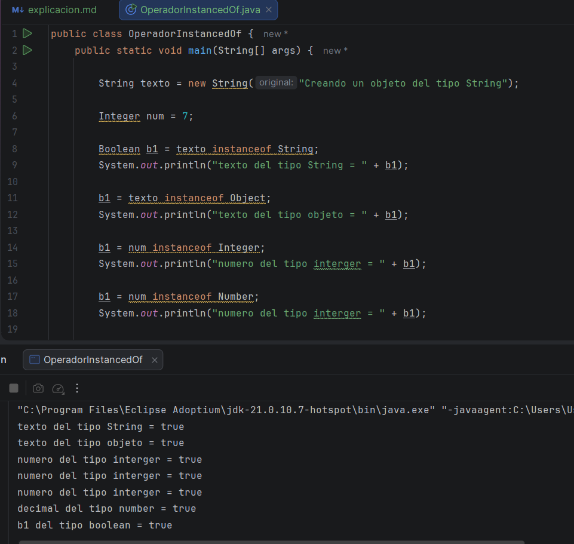
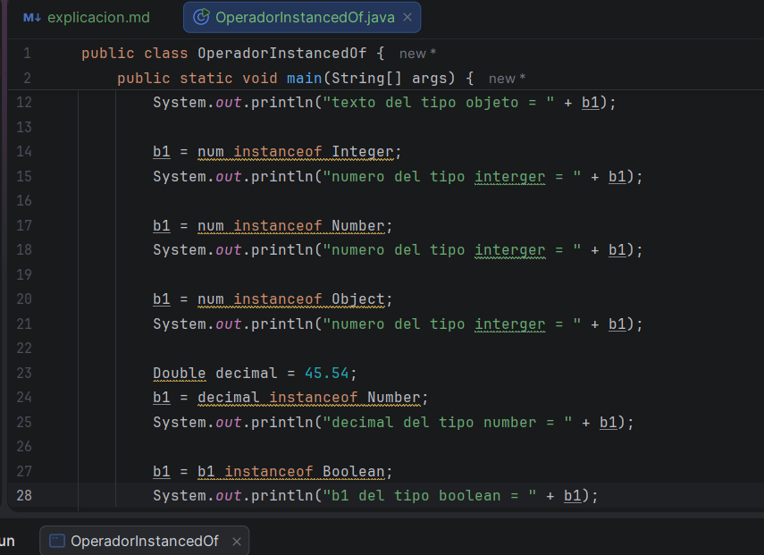
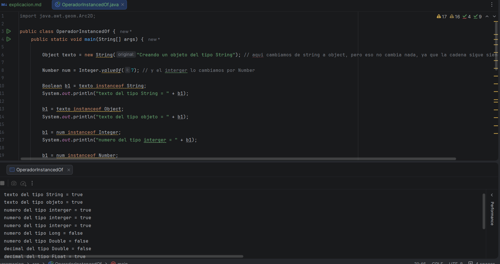
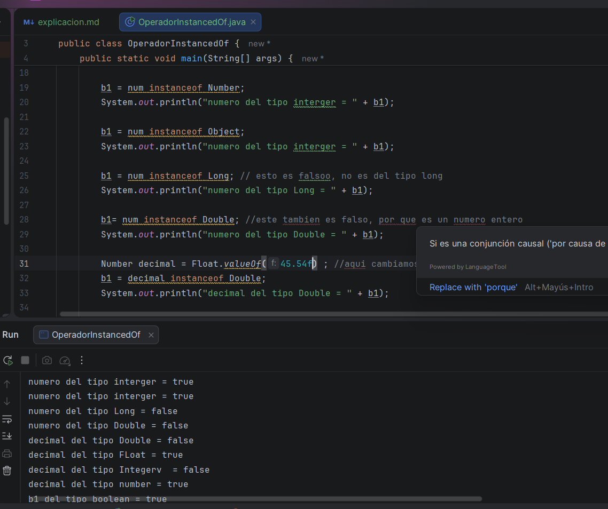
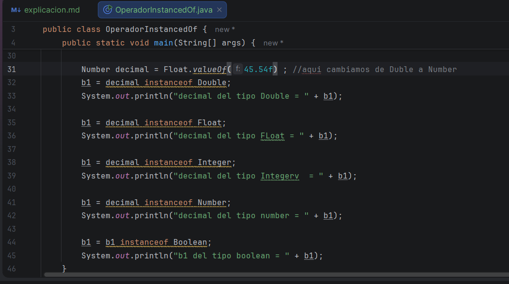
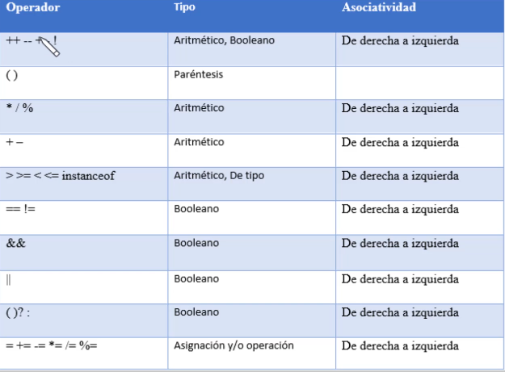
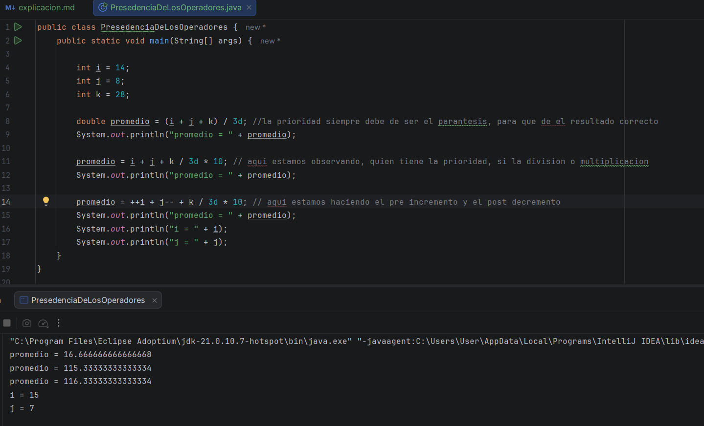

# Primer video
En est video vimos un nuevo tipo de operador, el cual tiene como objetivo, verificar si un objeto pertenece a una determinada clase o a una de sus clases padre.
y su respuesta siempre será un número booleano, como podemos ver en las diferentes circunstancias que tenía el maestro,
por ejemplo, preguntando si el objeto del tipo string es, pues de este, se le esta es pidiendo la confirmación, o si no 
sabe que tipo es, con mayor razón de usarlo 

# Segundo video
En esta clase, seguimos viendo el operador instead of, pero esta vez, con tipos abstractos, en la clase anterior, vimos 
los tipos mas comunes, en esta clase fue diferente

# Tercer video

En esta clase, vimos sl presedencia de los operadores, para saber la preioeridad de los operadores, según el tipo de operador 
es la imagen, vemos la presendencia de los operadores en java y su prioridad

Aquí, tenemos el código que se realizó en clase, teniendo en cuenta la prioridad en las operaciones 

