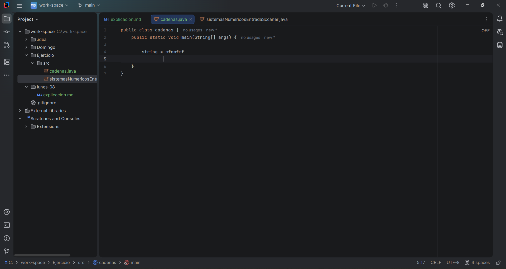
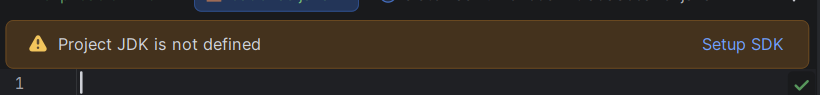
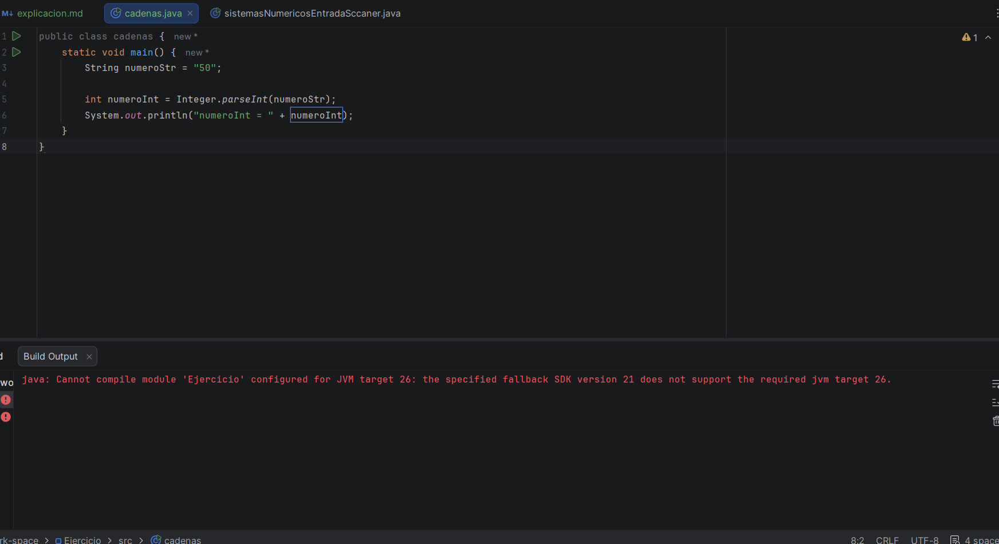
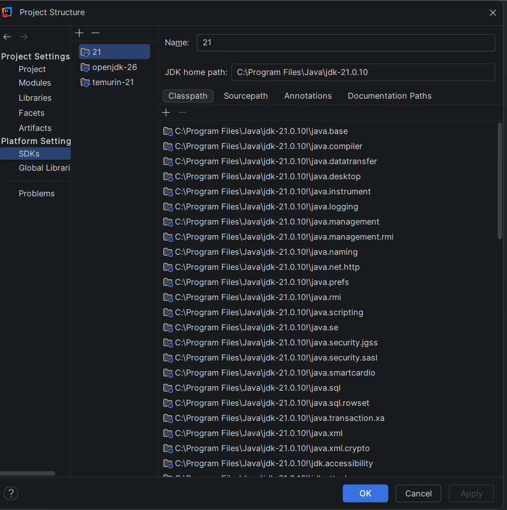

Primer video: en esta clase, vimos como cambiar de cadenas a números primitivos, estaba haciendo el código de la clase,
cuando note que el editor de código no me estaba detectando ningún error, lo cual era muy raro, me puse a mirar que era eso

 

Como por ejemplo, aquí tiene demasiados errores de sintaxis, pero no seleccionaba nada, no supe que mas hacer, por lo que
le pregunte a la AI que debia de hacer y porque no me aparece sabiendo que ayer funcionaba perfectamente

Me explico que ayer al eliminar esas carpetas directamente desde github, la configuración de IntelliJ dejo de reconocer
algunas carpetas de Java.

Por lo que arregle el problema, pero luego me apareció este anuncio

Creía que no era algo de mucha importancia, por lo que elegí la que más me parecía correcta, croe que era para la version
de java que tenía el editor de código, luego continue con mi clase como si nada, pero luego cuando tenía que hacer que el
código funcionara, me salío ahora otro anuncio

Era que estaba trabajando con una version de java que el editor de código no tenía, por lo que tenía que cambiarlo a la version
26 que es la que tengo actualmente, por lo que tuve que hacer muchas maromas y aun asi el código no pasaba, (al final deje
la version 21, pues es la que más me recomendaban en los articulos para personas que están aprendiendo)

Así se veía la configuración que tenía, pero sin mentir me quede ahi una hora intentando más de una vez que me funcionara,
Sin embargo seguía apareciendo el mismo mensaje, hasta que finalmente la AI me dio la última solución, CREAR UN PROYECTO DESDE CERO

Por lo que, luego de crear otro proyecto desde cero, pues me tocaba volver a pasar los códigos, pero como ya había enviado
el de ayer, no me pareció necesario moverlos otros códigos, por lo que solo pase el código que estaba haciendo anteriormente
y el archivo .md

Y al menos, termine esa clase, la cual estábamos convirtiendo de cadena String a número primitivo, como el int, double o
los boolean, usando los diferentes métodos que el maestro nos enseño y asi quedo el código de la clase de hoy 

