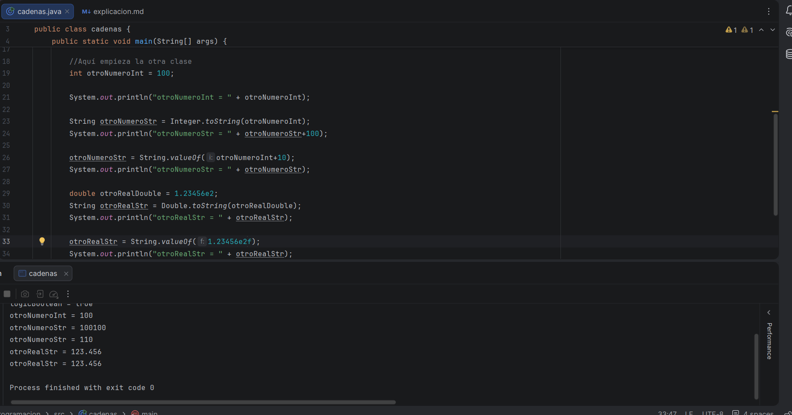
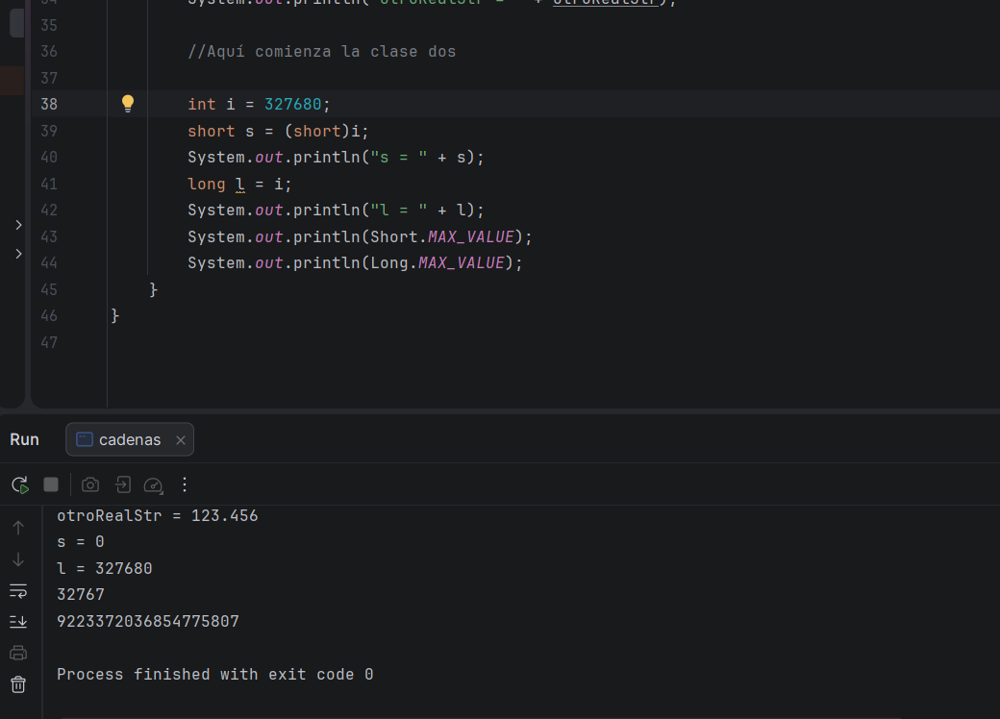
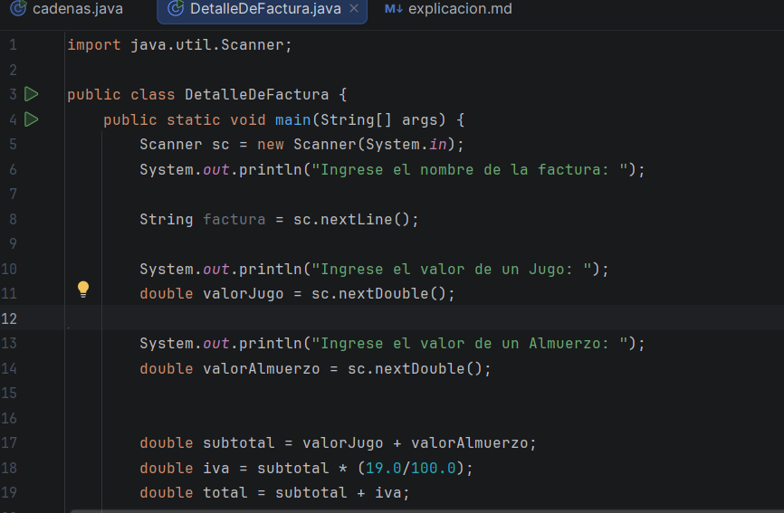
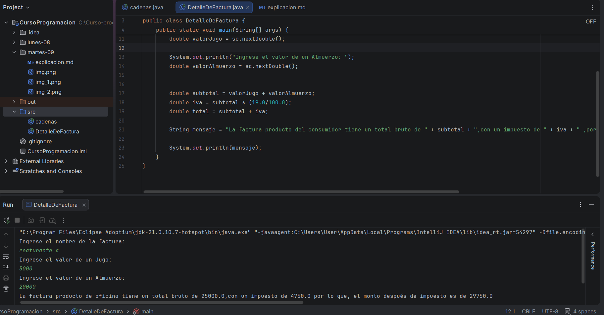

###### Primer video:

en esta clase vamos a ver todo lo contrario a la anterior, vamos a pasar de número primitivo a String
se hace con el mismo proceso de Interger pero al revés, también usamos un nuevo metodo con string, haciendo que cualquier 
número, sea reemplazado co un String

###### Segundo video:

en esa clase vimos, conversiones en los diferentes tipos de primitivos, de un int a un short o aún long,
teniendo en cuenta los bits de cada uno, y que el short soporta más que un int y el long más que el short, y aunque nos
pasáramos de esta cifra, afecta el resultado de la terminal, como vemos en la imagen
(NOTA; algo que observe es que al profe le aparecía el número en negativo, algo que a mí no me paso, no sé si sea por la 
versión de Java que tenga)

###### Primer ejercicio: 

este fue más bien un ejercicio que Udemy creo por cerrar un módulo, entonces aqui te dejo la descripción
que nos pedian:

La tarea consiste en crear una nueva clase con el método main llamada DetalleDeFactura, se requiere desarrollar un programa que reciba datos de la factura utilizando la clase Scanner de la siguiente manera:

Reciba el nombre de la factura o descripción, utilizar método nextLine() para obtener el nombre de la factura con espacios.

Reciba 2 precios de productos de tipo double, utilizar método nextDouble() para obtener precios con decimales (,).

Calcule el total, sume ambos precios y agregue un valor de impuesto del 19%

Se pide mostrar en un solo String el nombre de la factura, el monto total bruto (antes de impuesto), el impuesto y el monto total neto incluyendo impuesto.

Por ejemplo, el resultado podría ser algo así:

La factura producto de oficina tiene un total bruto de 134.78, con un impuesto de 25.6082 y el monto después de impuesto es de 160.3882

Debo de admitir que al principio me asuste y me bloquee haciendo este ejercicio, porque ni siquiera entendí el objetivo,
pero luego me calme, entendí el objetivo, realize como mi "diagrama de clase" para entender como hacerlo, y luego realize
sobre todo el primer paso bien, pero el segundo si me perdí un poco más, en este si investigue como debía de usar ese
método, y el tercero si me fue sin problema,
Me demore un poco más de lo que me hubiera gustado porque no fue algo tan 
complicado cuando vi el final, pero para ser mi primera vez haciendo código sola no me fue tan mal :D

