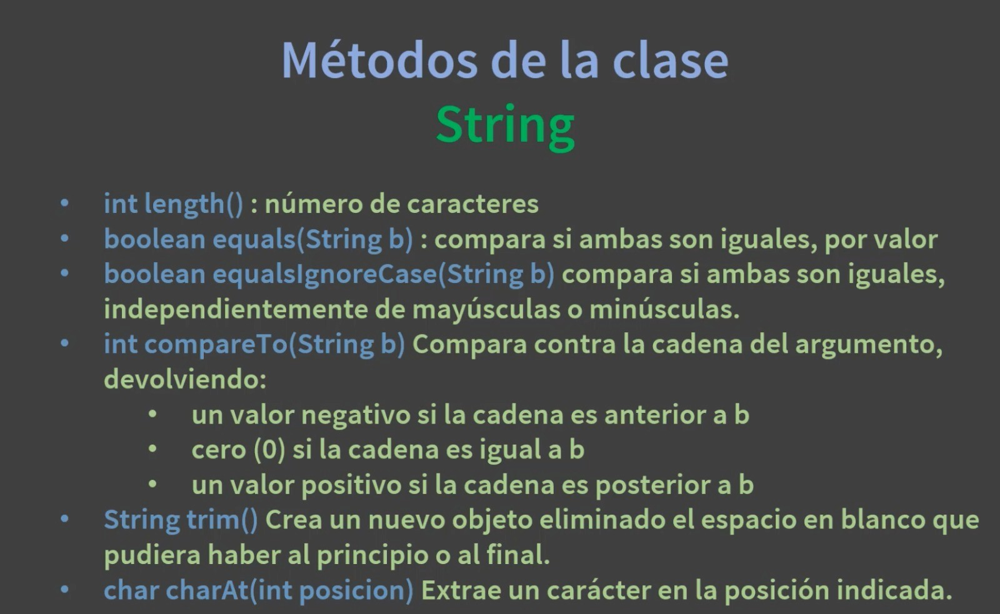
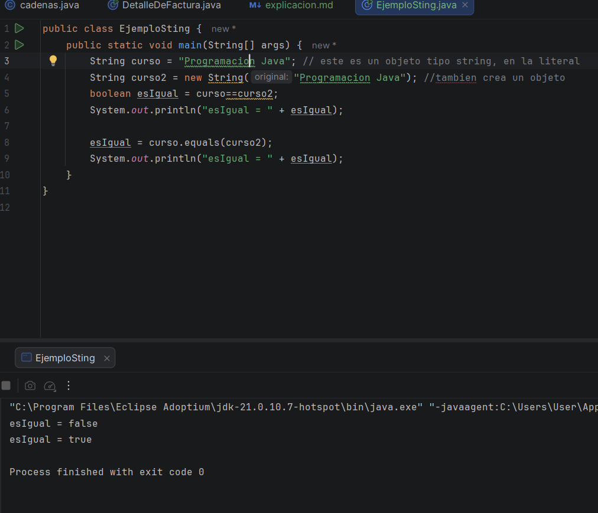
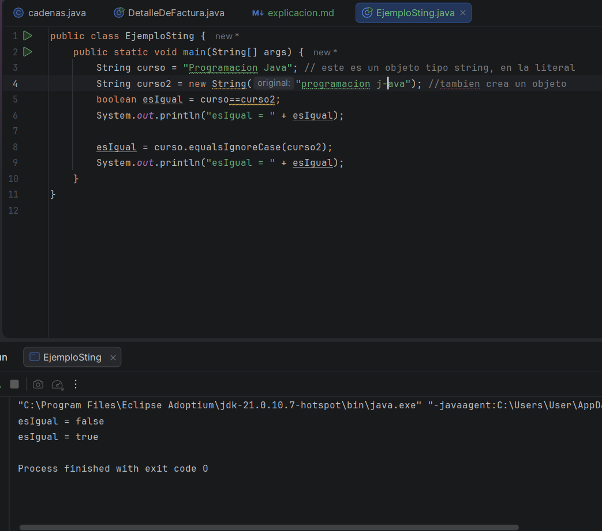
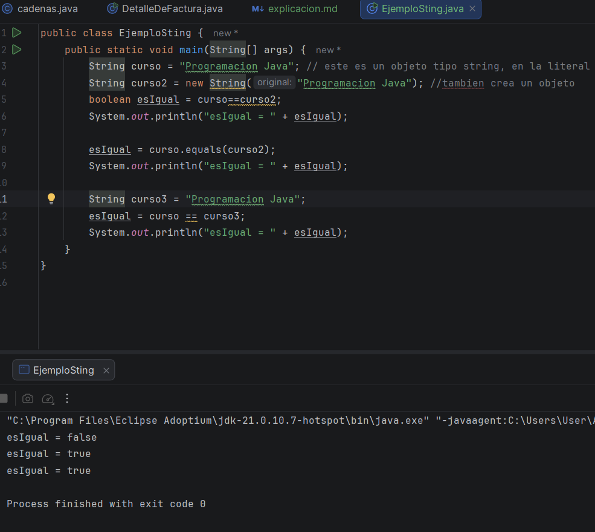
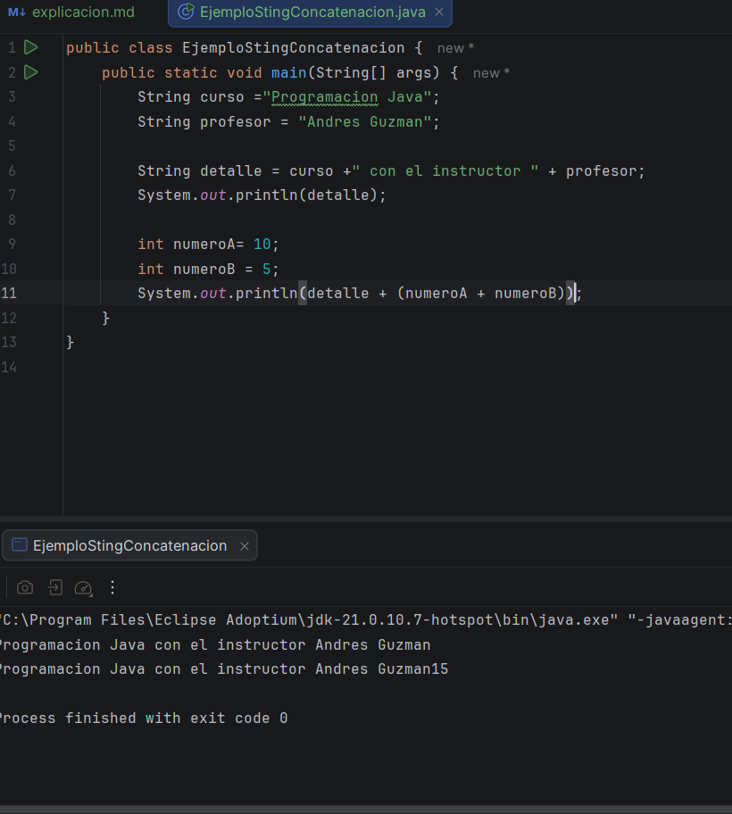
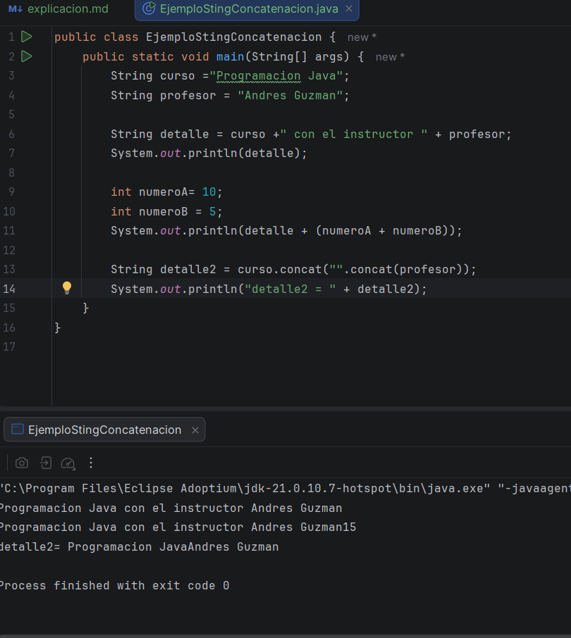

### Primer video 

Al ser un inicio de módulo, vimos teoria, en esta caso de que es un string, y el manejo explico las diferentes comillas 
como concatenar, para comprar un String se usa la igualdad == para comparar la referencia, si son los mismos, pero 
usamos equals para comprar por valor, también vimos diferentes metodos de String 

### Segundo video

En este video creamos un objeto del tipo String con diferentes parámetros com
el común que se usa en String, con el new, comparando que aunque tenga el mismo mensaje
son distintas, porque no compara el objeto si no la referencia, son diferentes objetos, pero ahora usando equals, si genera true
porque compara el valor, ahora si cambiamos cualquier cosa, como el acento o una mayúscula, este dará false, pero 
existe un método equales.ignoreCase, para ignorar las mayúsculas o minúsculas 

Ahora se agregó una tercera variable, en donde compara exactamente lo mismo que en la primera variable, y esta da una 
respuesta de true, explicando qué java reemplazo la primera variable por esta nueva, para optimizar el código 

### Tercer video:

En esta clase concatenamos de manera básica co el operador de suma, usamos dos frases distintas y las unimos, pero luego
usamos una variable de distinta, como el int, y vimos que pasaría si concatenamos estas dos variables, vimos la importancia 
del paréntesis en estos casos 

Usamos otra función llamada concat, que lo que hace es retornar, esta no cambia nada de la variable, tienen casi la misma 
función 

Hoy no pude hacer mucho yá qué tuve que salir casi toda la tarde porque tuve que hacer unas vueltas, mañana y el viernes 
también saldre porque tengo vida social, pero priorisaré mis actividades de la mañana como hice hoy para no dejar el curso 
